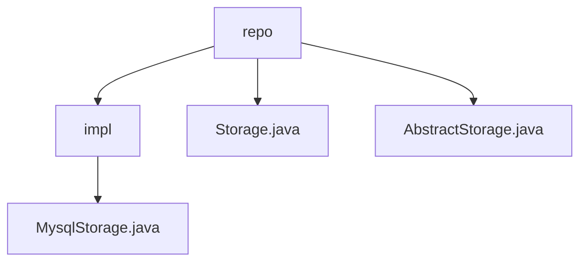

# 基础信息

|      |      |
|------|------|
| 名称 | repo |
| 编码语言 | .java |
| 代码路径 | WeFe/fusion/fusion-service/src/main/java/com/welab/wefe/data/fusion/service/repo |
| 包名 | docs.fusion.fusion-service.src.main.java.com.welab.wefe.data.fusion.service.repo |
| 概述说明 | MysqlStorage继承AbstractStorage，实现MySQL操作：建表、删表、插入、批量插入和计数，含异常处理和连接池管理。Storage定义存储抽象方法，AbstractStorage扩展功能并实现资源管理。 |

# 说明

## 概述  
该模块实现了一个分层存储系统，核心职责是提供统一的数据库操作抽象，支持MySQL和MergeTree引擎的CRUD功能。接口规范包含创建/删除表、数据插入（单条/批量）和计数查询，均需传入库名和表名参数。关键数据结构包括MergeTree引擎表结构（含eventDate、k、v、id字段）和连接池管理的DataSource。外部依赖仅涉及MySQL驱动和连接池。例如MysqlStorage通过预编译SQL实现防注入，AbstractStorage则内置表名格式化逻辑。

## 主要业务场景  
模块采用模板方法模式，抽象类定义流程而子类实现细节，类似JDBC的驱动分层设计。典型场景包括：初始化时创建分区表（例如MergeTree引擎按日期分区）、高效批量导入数据（利用批处理提升吞吐）、执行轻量级统计查询。交互模式统一通过DataSource获取连接，所有操作严格遵循"获取-执行-释放"资源生命周期。例如MysqlStorage的putAll方法将批量插入包装为事务，确保数据一致性。

### 包内部结构视图

该流程图展示了数据融合服务中存储相关的代码结构。repo目录包含抽象存储类(AbstractStorage.java)、存储接口(Storage.java)和实现子目录(impl)。impl目录下包含具体的MySQL存储实现(MysqlStorage.java)，体现了清晰的接口-抽象类-具体实现的分层架构。

# 文件列表

| 名称   | 类型  | 说明 |
|-------|------|-------------|
| [Storage.java](Storage.md) | file | 抽象类Storage定义数据库操作接口，包括创建表、删除表、插入数据、批量插入和数据统计功能。 |
| [AbstractStorage.java](AbstractStorage.md) | file | 抽象类AbstractStorage继承Storage，包含日志、数据源配置，提供节点计算、连接管理、资源释放及表名格式化功能，支持表创建检查。 |
| [impl](impl/_module.md) | package | MysqlStorage类继承AbstractStorage，实现创建表、删除表、插入数据、批量插入和数据计数功能，使用JDBC操作MySQL数据库，包含异常处理和资源关闭。 |

