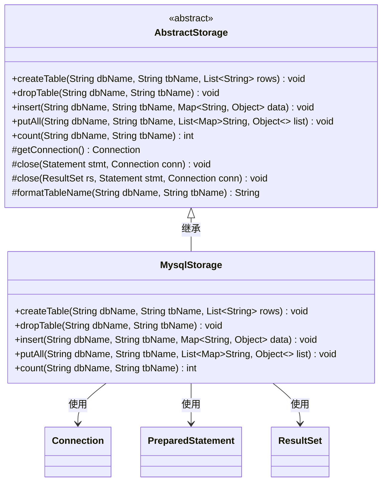
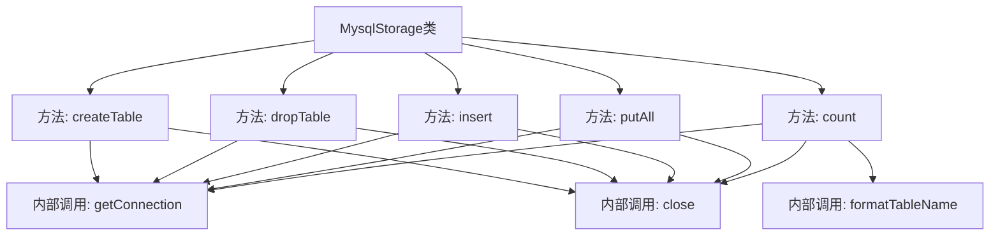

# 基础信息

|      |      |
|------|------|
| 名称 | MysqlStorage |
| 编码语言 | .java |
| 代码路径 | WeFe/fusion/fusion-service/src/main/java/com/welab/wefe/data/fusion/service/repo/impl/MysqlStorage.java |
| 包名 | com.welab.wefe.data.fusion.service.repo.impl |
| 依赖项 | ['com.welab.wefe.data.fusion.service.repo.AbstractStorage', 'org.springframework.stereotype.Component', 'java.sql.Connection', 'java.sql.PreparedStatement', 'java.sql.ResultSet', 'java.util.ArrayList', 'java.util.List', 'java.util.Map'] |
| 概述说明 | MysqlStorage类继承AbstractStorage，实现创建表、删除表、插入数据、批量插入和数据计数功能，使用JDBC操作MySQL数据库，包含异常处理和资源关闭。 |

# 说明

该代码定义了一个名为MysqlStorage的组件类，继承自AbstractStorage，实现了MySQL数据库的基本操作功能。主要功能包括：创建表（createTable），通过拼接字段名生成CREATE TABLE语句；删除表（dropTable），执行DROP TABLE语句；插入单条数据（insert），构建INSERT语句并使用预编译参数；批量插入数据（putAll），通过批处理提高效率；统计表记录数（count），执行COUNT查询。所有操作均包含异常处理和资源释放逻辑，使用连接池管理数据库连接，支持事务控制。

# 类列表 Class Summary

| 名称   | 类型  | 说明 |
|-------|------|-------------|
| MysqlStorage | class | MysqlStorage类实现数据库表操作，包括创建表、删除表、插入数据、批量插入及计数功能，使用JDBC连接MySQL并处理异常。 |

## 类 MysqlStorage

|      |      |
|------|------|
| 访问范围 | @Component;public |
| 类型 | class |
| 名称 | MysqlStorage |
| 说明 | MysqlStorage类实现数据库表操作，包括创建表、删除表、插入数据、批量插入及计数功能，使用JDBC连接MySQL并处理异常。 |

### UML类图

这段代码展示了一个MySQL数据库存储操作的实现类MysqlStorage，它继承自抽象类AbstractStorage。主要功能包括创建表、删除表、插入单条数据、批量插入数据以及统计记录数。类图中清晰地展示了继承关系和依赖的JDBC核心类（Connection/PreparedStatement/ResultSet）。所有数据库操作都遵循标准流程：获取连接->执行SQL->关闭资源，并通过预编译语句防止SQL注入。批量操作时使用事务保证数据一致性，体现了良好的数据库操作实践。

### 内部方法调用关系图

这段代码展示了一个MySQL存储类，继承自抽象存储类，实现了创建表、删除表、插入数据、批量插入和计数等数据库操作。每个方法都遵循获取连接、执行SQL、处理异常和关闭资源的流程，体现了完整的数据库操作生命周期和资源管理机制。核心方法通过字符串拼接动态生成SQL语句，并使用预处理语句防止SQL注入。

### 字段列表 Field List

| 名称  | 类型  | 说明 |
|-------|-------|------|

### 方法列表

| 名称  | 类型  | 说明 |
|-------|-------|------|
| insert | void | Java方法实现数据库插入操作，接收表名和数据Map，构建SQL语句并执行批量插入，使用事务确保数据一致性，最后关闭连接。 |
| count | int | 该方法用于统计指定数据库表的记录数，通过SQL查询获取结果，并在完成后关闭相关资源。 |
| dropTable | void | Java方法：通过JDBC删除指定表，捕获异常并记录日志，最后关闭连接。 |
| putAll | void | 方法putAll批量插入数据到指定数据库表，处理空列表，构建SQL语句，使用预编译和批处理提高效率，最后提交事务并关闭连接。 |
| createTable | void | 方法createTable用于在指定数据库创建表，接收表名和字段列表，生成SQL并执行，处理异常并关闭连接。 |

