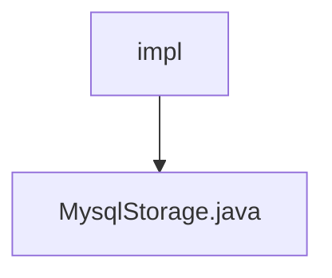

# 基础信息

|      |      |
|------|------|
| 名称 | impl |
| 编码语言 | .java |
| 代码路径 | WeFe/fusion/fusion-service/src/main/java/com/welab/wefe/data/fusion/service/repo/impl |
| 包名 | docs.fusion.fusion-service.src.main.java.com.welab.wefe.data.fusion.service.repo.impl |
| 概述说明 | MysqlStorage类继承AbstractStorage，实现创建表、删除表、插入数据、批量插入和数据计数功能，使用JDBC操作MySQL数据库，包含异常处理和资源关闭。 |

# 说明

该代码定义了一个名为MysqlStorage的组件类，继承自AbstractStorage，实现了MySQL数据库的基本操作功能。主要功能包括：创建表（createTable），通过拼接字段名生成CREATE TABLE语句；删除表（dropTable），执行DROP TABLE语句；插入单条数据（insert），构建INSERT语句并使用预编译参数；批量插入数据（putAll），通过批处理提高效率；统计表记录数（count），执行COUNT查询。所有操作均包含异常处理和资源释放逻辑，使用连接池管理数据库连接，支持事务控制。

### 包内部结构视图

该流程图展示了WeFe项目中fusion-service模块的存储实现结构。impl文件夹作为根节点，包含一个具体的数据库存储实现文件MysqlStorage.java。这种结构体现了典型的仓储层实现模式，其中impl目录存放具体存储实现类，而MysqlStorage.java则是针对MySQL数据库的具体实现类。

# 文件列表

| 名称   | 类型  | 说明 |
|-------|------|-------------|
| [MysqlStorage.java](MysqlStorage.md) | file | MysqlStorage类继承AbstractStorage，实现创建表、删除表、插入数据、批量插入和数据计数功能，使用JDBC操作MySQL数据库，包含异常处理和资源关闭。 |

