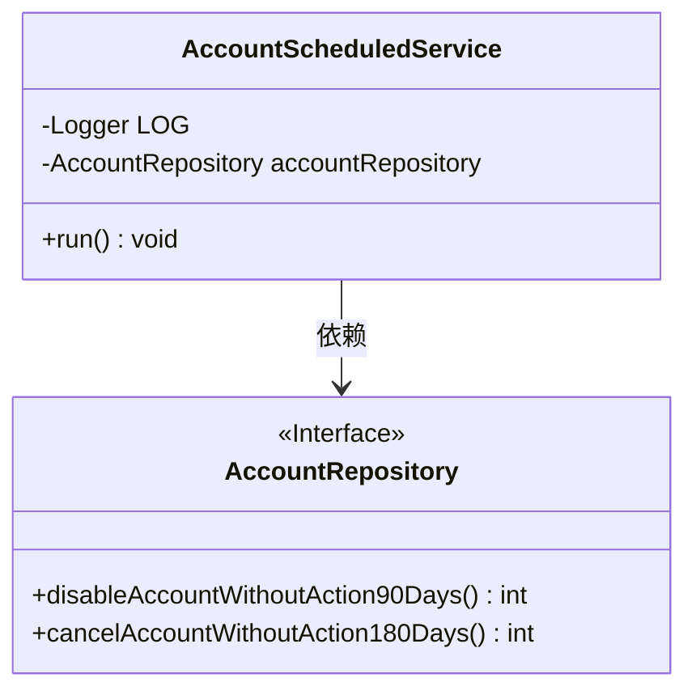
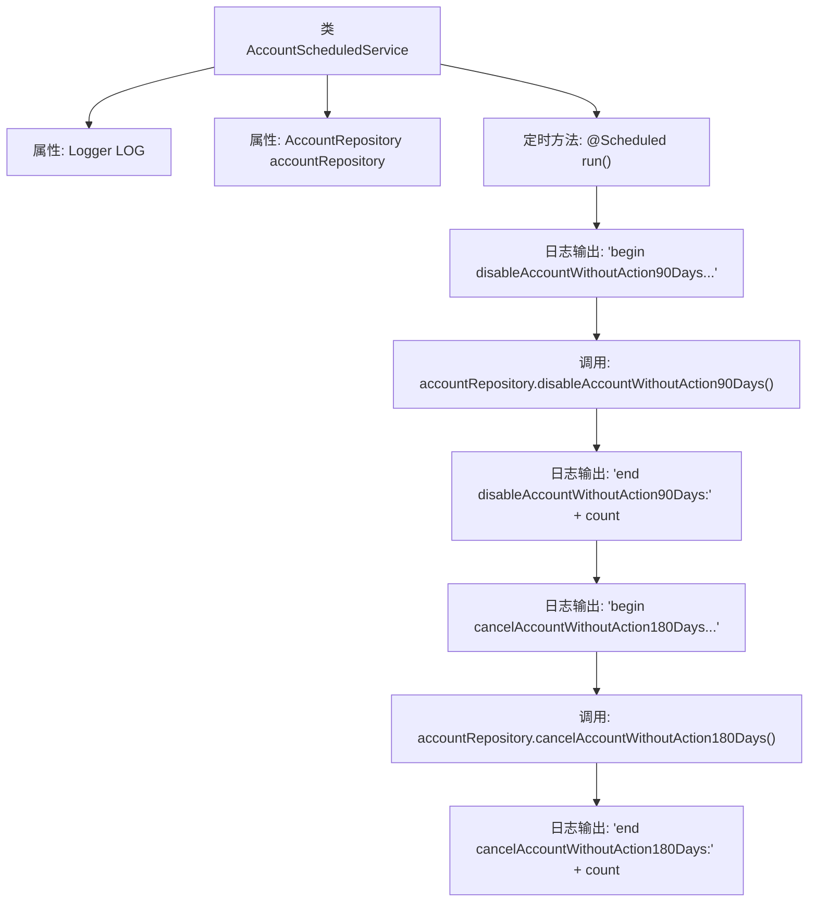

# 基础信息

|      |      |
|------|------|
| 名称 | AccountScheduledService |
| 编码语言 | .java |
| 代码路径 | WeFe/fusion/fusion-service/src/main/java/com/welab/wefe/data/fusion/service/scheduled/AccountScheduledService.java |
| 包名 | com.welab.wefe.data.fusion.service.scheduled |
| 依赖项 | ['com.welab.wefe.data.fusion.service.database.repository.AccountRepository', 'org.slf4j.Logger', 'org.slf4j.LoggerFactory', 'org.springframework.beans.factory.annotation.Autowired', 'org.springframework.context.annotation.Lazy', 'org.springframework.scheduling.annotation.Scheduled', 'org.springframework.stereotype.Component'] |
| 概述说明 | AccountScheduledService定时任务类，每10分钟执行一次，自动禁用90天未活跃账户和注销180天未活跃账户，并记录日志。 |

# 说明

这是一个名为AccountScheduledService的Spring组件类，用于执行定时任务。该类被标记为非延迟初始化，包含一个自动注入的AccountRepository实例。通过@Scheduled注解配置了两个定时任务：一个在启动后10秒首次执行，之后每10分钟执行一次；另一个被注释掉的配置是5秒间隔的测试方案。主要功能是定期检查并处理长时间未活动的账户：先禁用90天未活动的账户，再注销180天未活动的账户。所有操作都通过日志记录开始和结束状态，并统计处理数量。

# 类列表 Class Summary

| 名称   | 类型  | 说明 |
|-------|------|-------------|
| AccountScheduledService | class | 定时任务类AccountScheduledService，非懒加载，每10分钟执行一次，自动禁用90天未活动账户和注销180天未活动账户。 |

## 类 AccountScheduledService

|      |      |
|------|------|
| 访问范围 | @Component;@Lazy(false);public |
| 类型 | class |
| 名称 | AccountScheduledService |
| 说明 | 定时任务类AccountScheduledService，非懒加载，每10分钟执行一次，自动禁用90天未活动账户和注销180天未活动账户。 |

### UML类图

类图描述：该图展示了AccountScheduledService类与AccountRepository接口的关系。AccountScheduledService是一个Spring组件，包含定时任务方法run()，通过依赖注入使用AccountRepository接口来执行账户禁用和取消操作。AccountRepository作为接口定义了具体的数据库操作方法，体现了依赖倒置原则。

### 内部方法调用关系图

这段代码展示了一个Spring定时任务类AccountScheduledService，通过@Scheduled注解实现定期执行账户清理任务。流程图清晰描述了执行顺序：先记录开始日志，调用90天无操作账户禁用方法并记录结果，再执行180天无操作账户注销方法并记录结果。整个过程通过Logger输出详细执行日志，便于监控任务执行情况。

### 字段列表 Field List

| 名称  | 类型  | 说明 |
|-------|-------|------|
| LOG = LoggerFactory.getLogger(this.getClass()) | Logger | 定义当前类的日志记录器实例，用于输出日志信息。 |
| accountRepository | AccountRepository | 使用@Autowired自动注入AccountRepository实例。 |

### 方法列表

| 名称  | 类型  | 说明 |
|-------|-------|------|
| run | void | 定时任务：每10秒后启动，每600秒执行一次。功能：禁用90天无活动账户，注销180天无活动账户，并记录执行数量。 |

