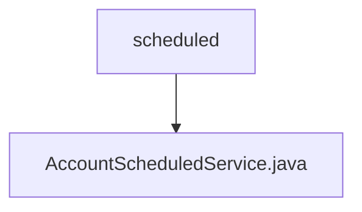

# 基础信息

|      |      |
|------|------|
| 名称 | scheduled |
| 编码语言 | .java |
| 代码路径 | WeFe/fusion/fusion-service/src/main/java/com/welab/wefe/data/fusion/service/scheduled |
| 包名 | docs.fusion.fusion-service.src.main.java.com.welab.wefe.data.fusion.service.scheduled |
| 概述说明 | AccountScheduledService定时任务类，每10分钟执行一次，自动禁用90天未活跃账户和注销180天未活跃账户，并记录日志。 |

# 说明

这是一个名为AccountScheduledService的Spring组件类，用于执行定时任务。该类被标记为非延迟初始化，包含一个自动注入的AccountRepository实例。通过@Scheduled注解配置了两个定时任务：一个在启动后10秒首次执行，之后每10分钟执行一次；另一个被注释掉的配置是5秒间隔的测试方案。主要功能是定期检查并处理长时间未活动的账户：先禁用90天未活动的账户，再注销180天未活动的账户。所有操作都通过日志记录开始和结束状态，并统计处理数量。

### 包内部结构视图

该流程图展示了WeFe项目中scheduled目录与AccountScheduledService.java文件的层级关系。scheduled作为父节点，包含一个子节点AccountScheduledService.java，表示这是一个定时任务服务类文件位于scheduled目录下的简单结构。

# 文件列表

| 名称   | 类型  | 说明 |
|-------|------|-------------|
| [AccountScheduledService.java](AccountScheduledService.md) | file | AccountScheduledService定时任务类，每10分钟执行一次，自动禁用90天未活跃账户和注销180天未活跃账户，并记录日志。 |

