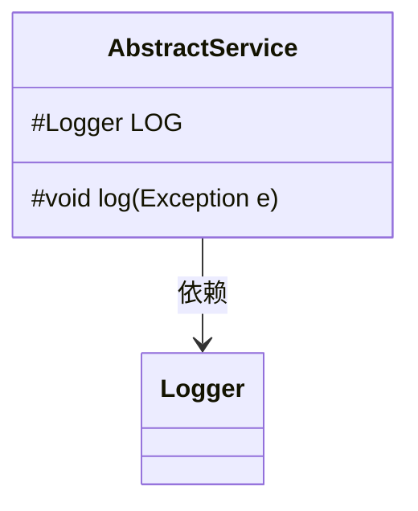
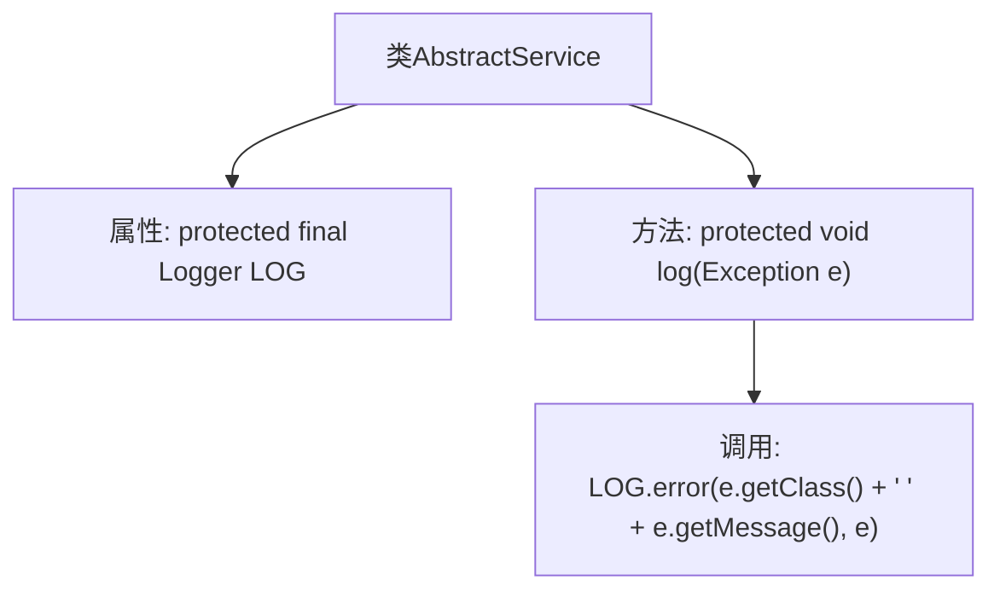

# 基础信息

|      |      |
|------|------|
| 名称 | AbstractService |
| 编码语言 | .java |
| 代码路径 | WeFe/fusion/fusion-service/src/main/java/com/welab/wefe/data/fusion/service/service/AbstractService.java |
| 包名 | com.welab.wefe.data.fusion.service.service |
| 依赖项 | ['org.slf4j.Logger', 'org.slf4j.LoggerFactory'] |
| 概述说明 | 抽象服务类提供日志记录功能，包含日志对象和异常日志方法。 |

# 说明

这是一个名为AbstractService的抽象类，包含两个核心组件：一个受保护且不可变的Logger实例，通过当前类名初始化；一个受保护的log方法，用于统一处理异常日志记录。该方法会记录异常类型、异常消息，并将完整异常堆栈输出到错误日志。这种设计提供了可复用的日志功能，便于子类继承使用。

# 类列表 Class Summary

| 名称   | 类型  | 说明 |
|-------|------|-------------|
| AbstractService | class | 抽象服务类提供日志记录功能，包含受保护日志对象和异常记录方法。 |

## 类 AbstractService

|      |      |
|------|------|
| 访问范围 | public |
| 类型 | class |
| 名称 | AbstractService |
| 说明 | 抽象服务类提供日志记录功能，包含受保护日志对象和异常记录方法。 |

### UML类图

这段代码展示了一个抽象服务类AbstractService，它包含一个受保护的Logger成员和一个记录异常的方法。类图清晰地表示了类结构，其中LOG字段使用#表示protected修饰符，log方法同样标记为protected。AbstractService与Logger之间存在依赖关系，表明该类需要使用Logger的功能来记录日志。这种设计常用于作为其他服务类的基类，提供统一的异常日志记录能力。

### 内部方法调用关系图

这段流程图展示了AbstractService类的结构，包含一个受保护的Logger属性和一个异常日志记录方法。类初始化时通过LoggerFactory.getLogger动态获取当前类对应的Logger实例。log方法封装了统一的异常处理逻辑，调用LOG.error输出异常类型、消息及完整堆栈信息。该设计实现了日志功能的复用，便于子类继承使用统一的错误记录方式。

### 字段列表 Field List

| 名称  | 类型  | 说明 |
|-------|-------|------|
| LOG = LoggerFactory.getLogger(this.getClass()) | Logger | 定义当前类的日志记录器实例，使用protected修饰确保子类可访问，final防止被修改。 |

### 方法列表

| 名称  | 类型  | 说明 |
|-------|-------|------|
| log | void | 该方法用于记录异常日志，包含异常类型和消息，并通过日志系统输出错误级别日志。 |

