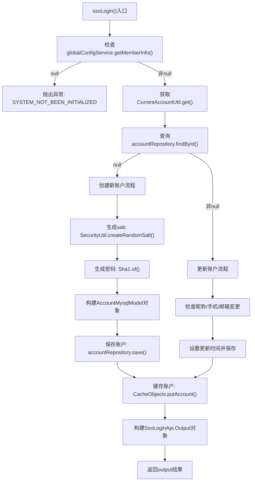

# 基础信息

|      |      |
|------|------|
| 名称 | AccountService |
| 编码语言 | .java |
| 代码路径 | WeFe/fusion/fusion-service/src/main/java/com/welab/wefe/data/fusion/service/service/AccountService.java |
| 包名 | com.welab.wefe.data.fusion.service.service |
| 依赖项 | ['com.welab.wefe.common.SecurityUtil', 'com.welab.wefe.common.StatusCode', 'com.welab.wefe.common.exception.StatusCodeWithException', 'com.welab.wefe.common.util.Sha1', 'com.welab.wefe.common.util.StringUtil', 'com.welab.wefe.common.web.service.account.SsoAccountInfo', 'com.welab.wefe.common.web.util.CurrentAccountUtil', 'com.welab.wefe.common.wefe.enums.AuditStatus', 'com.welab.wefe.data.fusion.service.api.account.SsoLoginApi', 'com.welab.wefe.data.fusion.service.database.entity.AccountMysqlModel', 'com.welab.wefe.data.fusion.service.database.repository.AccountRepository', 'com.welab.wefe.data.fusion.service.service.globalconfig.GlobalConfigService', 'org.springframework.beans.factory.annotation.Autowired', 'org.springframework.stereotype.Service', 'java.util.Date', 'java.util.UUID'] |
| 概述说明 | AccountService处理SSO登录，检查系统初始化，查询或创建账户，更新信息并返回登录结果。 |

# 说明

AccountService类中的ssoLogin方法实现了单点登录功能。首先检查系统是否初始化，未初始化则抛出异常。获取当前账户信息后，若账户不存在则创建新账户并设置随机盐值和SHA1加密密码，同时初始化账户属性；若账户存在则检查并更新昵称、手机号和邮箱等字段。最后将账户信息存入缓存并返回包含ID、令牌、手机号和昵称的输出对象。

# 类列表 Class Summary

| 名称   | 类型  | 说明 |
|-------|------|-------------|
| AccountService | class | AccountService处理SSO登录，检查系统初始化后，查询或创建账户信息，更新必要字段并返回登录结果。 |


## 类 AccountService

|      |      |
|------|------|
| 访问范围 | @Service;public |
| 类型 | class |
| 名称 | AccountService |
| 说明 | AccountService处理SSO登录，检查系统初始化后，查询或创建账户信息，更新必要字段并返回登录结果。 |


### UML类图

```mermaid
classDiagram
    class AccountService {
        -AccountRepository accountRepository
        -GlobalConfigService globalConfigService
        +ssoLogin() SsoLoginApi$Output
    }

    class AccountRepository {
        <<Interface>>
        +findById(Long id) Optional~AccountMysqlModel~
        +save(AccountMysqlModel entity) AccountMysqlModel
    }

    class GlobalConfigService {
        <<Interface>>
        +getMemberInfo() MemberInfo
    }

    class AccountMysqlModel {
        -Long id
        -String phoneNumber
        -String nickname
        -String email
        -String password
        -String salt
        -boolean superAdminRole
        -boolean adminRole
        -boolean enable
        -AuditStatus auditStatus
        -Date lastActionTime
        -Date updatedTime
        +setter/getter methods
    }

    class SsoAccountInfo {
        -Long id
        -String phoneNumber
        -String name
        -String email
        +getter methods
    }

    class SsoLoginApi$Output {
        -Long id
        -String token
        -String phoneNumber
        -String nickname
        +setter/getter methods
    }

    class CurrentAccountUtil {
        <<Utility>>
        +get() SsoAccountInfo
    }

    class CacheObjects {
        <<Utility>>
        +putAccount(AccountMysqlModel account) void
    }

    AccountService --> AccountRepository : 依赖
    AccountService --> GlobalConfigService : 依赖
    AccountService --> CurrentAccountUtil : 使用
    AccountService --> CacheObjects : 使用
    AccountService ..> SsoLoginApi$Output : 创建
    AccountRepository ..> AccountMysqlModel : 操作
    GlobalConfigService ..> MemberInfo : 返回
```

类图描述：该图展示了AccountService的核心类关系，它依赖AccountRepository和GlobalConfigService接口进行数据访问，使用CurrentAccountUtil获取当前账户信息，并通过CacheObjects缓存账户数据。主要处理SSO登录流程，包括账户创建/更新逻辑，最终返回SsoLoginApi.Output对象。类图中包含7个主要类/接口和2个工具类，清晰展现了Spring服务层的典型依赖关系。


### 内部方法调用关系图



流程图描述：该流程图展示了AccountService中ssoLogin()方法的完整执行流程。首先检查系统初始化状态，未初始化则抛出异常；然后获取当前账户信息并查询数据库，根据查询结果分别进入新账户创建流程（包括生成salt、哈希密码、构建完整账户对象）或现有账户更新流程（检查并更新变更字段）；最后缓存账户数据并构建返回对象。流程包含完整的异常处理和分支逻辑，覆盖了所有可能的执行路径。

### 字段列表 Field List

| 名称  | 类型  | 说明 |
|-------|-------|------|
| accountRepository | AccountRepository | 使用@Autowired自动注入AccountRepository实例。 |
| globalConfigService | GlobalConfigService | 使用@Autowired自动注入GlobalConfigService实例。 |

### 方法列表

| 名称  | 类型  | 说明 |
|-------|-------|------|
| ssoLogin | SsoLoginApi.Output | 方法ssoLogin处理单点登录：检查系统初始化后，获取或创建账户信息，更新必要字段并返回登录结果。 |


