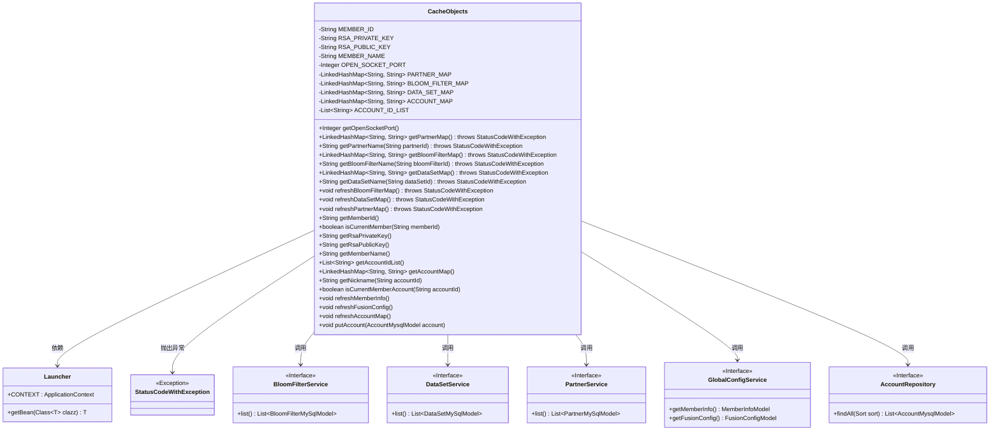
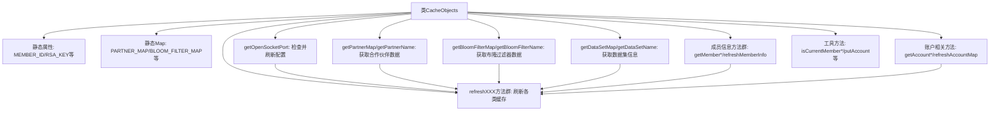

# 基础信息

|      |      |
|------|------|
| 名称 | CacheObjects |
| 编码语言 | .java |
| 代码路径 | WeFe/fusion/fusion-service/src/main/java/com/welab/wefe/data/fusion/service/service/CacheObjects.java |
| 包名 | com.welab.wefe.data.fusion.service.service |
| 依赖项 | ['com.welab.wefe.common.exception.StatusCodeWithException', 'com.welab.wefe.common.web.Launcher', 'com.welab.wefe.data.fusion.service.database.entity.AccountMysqlModel', 'com.welab.wefe.data.fusion.service.database.entity.BloomFilterMySqlModel', 'com.welab.wefe.data.fusion.service.database.entity.DataSetMySqlModel', 'com.welab.wefe.data.fusion.service.database.entity.PartnerMySqlModel', 'com.welab.wefe.data.fusion.service.database.repository.AccountRepository', 'com.welab.wefe.data.fusion.service.dto.entity.globalconfig.FusionConfigModel', 'com.welab.wefe.data.fusion.service.dto.entity.globalconfig.MemberInfoModel', 'com.welab.wefe.data.fusion.service.service.bloomfilter.BloomFilterService', 'com.welab.wefe.data.fusion.service.service.dataset.DataSetService', 'com.welab.wefe.data.fusion.service.service.globalconfig.GlobalConfigService', 'org.springframework.data.domain.Sort', 'java.util.ArrayList', 'java.util.LinkedHashMap', 'java.util.List'] |
| 概述说明 | CacheObjects类管理静态缓存数据，包括成员信息、密钥、端口及多个映射表（合作伙伴、布隆过滤器、数据集、账户）。提供获取和刷新这些数据的方法，确保数据最新。支持判断成员和账户归属。 |

# 说明

CacheObjects类是一个用于缓存各类静态数据的工具类，包含成员信息、RSA密钥、端口号以及多个映射表（合作伙伴、布隆过滤器、数据集、账户）。该类通过懒加载机制在首次访问时初始化数据，并提供刷新方法从数据库重新加载。主要功能包括获取成员ID、密钥、端口号，查询映射表中的名称，判断账户归属，以及同步更新缓存数据。所有静态数据都通过对应的Service或Repository从数据库获取，并采用同步方法保证线程安全。

# 类列表 Class Summary

| 名称   | 类型  | 说明 |
|-------|------|-------------|
| CacheObjects | class | CacheObjects类管理静态缓存数据，包括成员信息、RSA密钥、端口号及多个映射表（合作伙伴、布隆过滤器、数据集、账户）。提供获取和刷新缓存的方法，确保数据一致性。 |

## 类 CacheObjects

|      |      |
|------|------|
| 访问范围 | public |
| 类型 | class |
| 名称 | CacheObjects |
| 说明 | CacheObjects类管理静态缓存数据，包括成员信息、RSA密钥、端口号及多个映射表（合作伙伴、布隆过滤器、数据集、账户）。提供获取和刷新缓存的方法，确保数据一致性。 |

### UML类图

该图展示了CacheObjects类作为核心缓存管理器，通过静态变量存储各类配置和映射数据，并提供线程安全的访问和刷新方法。它依赖Launcher获取Spring上下文，并调用多个服务接口（如BloomFilterService、DataSetService等）来更新缓存数据，同时可能抛出StatusCodeWithException异常。类图中清晰体现了缓存数据的懒加载模式和刷新机制。

### 内部方法调用关系图

该流程图展示了CacheObjects类的完整结构，核心是静态缓存属性和两类关键操作：1) 各种getter方法在数据为空时会触发对应的refresh刷新操作；2) 所有refresh方法都通过Launcher获取服务Bean并更新缓存。类采用懒加载模式管理多种缓存数据（成员信息、合作伙伴、布隆过滤器等），通过同步方法保证线程安全，并提供账户管理、成员校验等实用功能。

### 字段列表 Field List

| 名称  | 类型  | 说明 |
|-------|-------|------|
| PARTNER_MAP = new LinkedHashMap<>() | LinkedHashMap<String, String> | 定义静态私有LinkedHashMap变量PARTNER_MAP，键值对类型均为String。 |
| BLOOM_FILTER_MAP = new LinkedHashMap<>() | LinkedHashMap<String, String> | 定义私有静态LinkedHashMap变量BLOOM_FILTER_MAP，键值均为字符串类型。 |
| ACCOUNT_MAP = new LinkedHashMap<>() | LinkedHashMap<String, String> | 私有静态常量ACCOUNT_MAP，类型为有序哈希映射，键值均为字符串。 |
| OPEN_SOCKET_PORT | Integer | 私有静态整型变量，用于存储开放套接字端口号。 |
| MEMBER_ID | String | 私有静态字符串变量MEMBER_ID |
| RSA_PRIVATE_KEY | String | 私有静态字符串变量RSA_PRIVATE_KEY。 |
| ACCOUNT_ID_LIST = new ArrayList<>() | List<String> | 声明一个私有静态不可变的字符串列表变量ACCOUNT_ID_LIST，初始化为空ArrayList。 |
| RSA_PUBLIC_KEY | String | 私有静态字符串变量RSA公钥 |
| DATA_SET_MAP = new LinkedHashMap<>() | LinkedHashMap<String, String> | 静态LinkedHashMap变量DATA_SET_MAP，键值对为String类型。 |
| MEMBER_NAME | String | 声明一个私有静态字符串变量MEMBER_NAME。 |

### 方法列表

| 名称  | 类型  | 说明 |
|-------|-------|------|
| getMemberId | String | 静态方法getMemberId返回MEMBER_ID，若为空则调用refreshMemberInfo刷新后返回。 |
| getOpenSocketPort | Integer | 获取开放Socket端口号。若未初始化则刷新配置后返回。 |
| getAccountMap | LinkedHashMap<String, String> | 静态方法getAccountMap返回LinkedHashMap，若ACCOUNT_MAP为空则调用refreshAccountMap刷新后返回。 |
| getRsaPublicKey | String | 静态方法获取RSA公钥，若为空则刷新成员信息后返回。 |
| getMemberName | String | 静态方法getMemberName返回成员名MEMBER_NAME，若为空则调用refreshMemberInfo刷新后返回。 |
| getPartnerName | String | 静态方法getPartnerName通过partnerId获取合作方名称，若未找到则刷新缓存后再次尝试，最终返回名称或抛出异常。 |
| refreshBloomFilterMap | void | 刷新布隆过滤器映射表：清空现有数据，从数据库加载所有布隆过滤器ID和名称到内存映射中。 |
| getBloomFilterName | String | 静态方法通过ID获取布隆过滤器名称，若不存在则刷新缓存后再次尝试获取。 |
| getAccountIdList | List<String> | 静态方法getAccountIdList返回账户ID列表，若列表为空则调用refreshAccountMap刷新，最终返回列表。 |
| getDataSetMap | LinkedHashMap<String, String> | 这是一个Java方法，返回一个LinkedHashMap类型的DATA_SET_MAP。如果DATA_SET_MAP为空，会先调用refreshBloomFilterMap方法更新数据。方法可能抛出StatusCodeWithException异常。 |
| getDataSetName | String | 静态方法通过ID获取数据集名称，若不存在则刷新缓存后再次尝试，仍无则抛出异常。 |
| refreshPartnerMap | void | 该方法刷新合作伙伴映射表，清空现有数据后从数据库加载所有合作伙伴信息，并将成员ID和名称存入映射表。 |
| refreshDataSetMap | void | 该方法刷新数据集映射表，清空现有数据后从数据库加载所有数据集，并将其ID和名称存入映射表。 |
| getPartnerMap | LinkedHashMap<String, String> | 静态方法getPartnerMap返回LinkedHashMap，若为空则调用refreshPartnerMap刷新，可能抛出StatusCodeWithException异常。 |
| getNickname | String | 静态同步方法getNickname根据accountId获取昵称：若accountId为空返回null，否则从AccountMap查找，未找到则返回默认成员名。 |
| isCurrentMemberAccount | boolean | 静态同步方法检查当前账户ID是否在账户列表中。 |
| refreshMemberInfo | void | 静态同步方法refreshMemberInfo从GlobalConfigService获取会员信息，若存在则更新会员ID、RSA公私钥和会员名称等全局变量。 |
| refreshFusionConfig | void | 静态同步方法`refreshFusionConfig`从`GlobalConfigService`获取配置，若存在则更新`OPEN_SOCKET_PORT`。 |
| refreshAccountMap | void | 静态同步方法refreshAccountMap清空并重新加载账户数据到ACCOUNT_MAP和ACCOUNT_ID_LIST，按昵称排序。 |
| putAccount | void | 这是一个Java同步方法，用于将账户信息存入全局映射和列表。方法检查账户非空后，将账户ID和昵称存入ACCOUNT_MAP，并将ID加入ACCOUNT_ID_LIST。 |
| getRsaPrivateKey | String | 获取RSA私钥的方法，若私钥为空则刷新成员信息后返回。 |
| getBloomFilterMap | LinkedHashMap<String, String> | 获取布隆过滤器映射表，若为空则刷新后返回。 |
| isCurrentMember | boolean | 检查当前成员ID是否与输入ID匹配，返回布尔值。 |

