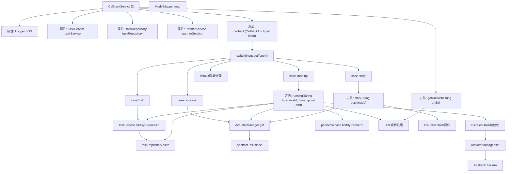

# 基础信息

|      |      |
|------|------|
| 名称 | CallbackService |
| 编码语言 | .java |
| 代码路径 | WeFe/fusion/fusion-service/src/main/java/com/welab/wefe/data/fusion/service/service/CallbackService.java |
| 包名 | com.welab.wefe.data.fusion.service.service |
| 依赖项 | ['com.welab.wefe.common.StatusCode', 'com.welab.wefe.common.exception.StatusCodeWithException', 'com.welab.wefe.common.util.StringUtil', 'com.welab.wefe.common.web.util.ModelMapper', 'com.welab.wefe.data.fusion.service.actuator.rsapsi.PsiClientActuator', 'com.welab.wefe.data.fusion.service.api.thirdparty.CallbackApi', 'com.welab.wefe.data.fusion.service.database.entity.PartnerMySqlModel', 'com.welab.wefe.data.fusion.service.database.entity.TaskMySqlModel', 'com.welab.wefe.data.fusion.service.database.repository.TaskRepository', 'com.welab.wefe.data.fusion.service.dto.entity.PartnerOutputModel', 'com.welab.wefe.data.fusion.service.enums.PSIActuatorStatus', 'com.welab.wefe.data.fusion.service.enums.TaskStatus', 'com.welab.wefe.data.fusion.service.manager.ActuatorManager', 'com.welab.wefe.data.fusion.service.task.AbstractTask', 'com.welab.wefe.data.fusion.service.task.PsiClientTask', 'org.slf4j.Logger', 'org.slf4j.LoggerFactory', 'com.welab.wefe.data.fusion.service.task.PsiServerTask', 'org.springframework.beans.factory.annotation.Autowired', 'org.springframework.stereotype.Service', 'java.net.URL', 'com.welab.wefe.common.StatusCode.DATA_NOT_FOUND'] |
| 概述说明 | CallbackService处理回调请求，根据类型执行不同操作：running启动客户端任务，init更新任务状态，success结束任务，stop停止任务。涉及TaskService、TaskRepository和PartnerService协作。 |

# 说明

CallbackService是一个处理回调请求的服务类，主要功能包括根据不同类型的回调输入执行相应操作。它依赖TaskService、TaskRepository和PartnerService进行任务和合作伙伴数据的管理。回调类型包括running、init、success和stop，分别对应任务运行、初始化、成功和停止的不同处理逻辑。running方法会在对方服务器准备就绪时启动客户端任务，init方法会更新任务状态为待处理，success方法会完成任务并销毁任务实例，stop方法会停止服务器任务并设置状态为异常。服务还包含提取URL域名的辅助方法。

# 类列表 Class Summary

| 名称   | 类型  | 说明 |
|-------|------|-------------|
| CallbackService | class | CallbackService处理回调请求，根据类型执行不同操作：running启动客户端任务，init更新任务状态，success结束任务，stop停止任务。包含任务状态管理和合作伙伴信息处理。 |


## 类 CallbackService

|      |      |
|------|------|
| 访问范围 | @Service;public |
| 类型 | class |
| 名称 | CallbackService |
| 说明 | CallbackService处理回调请求，根据类型执行不同操作：running启动客户端任务，init更新任务状态，success结束任务，stop停止任务。包含任务状态管理和合作伙伴信息处理。 |


### UML类图

```mermaid
classDiagram
    class CallbackService {
        -TaskService taskService
        -TaskRepository taskRepository
        -PartnerService partnerService
        +callback(CallbackApi.Input input) void
        -running(String businessId, String ip, int port) void
        -stop(String businessId) void
        -getUrlHost(String urlStr) String
    }

    class TaskService {
        <<Interface>>
        +findByBusinessId(String businessId) TaskMySqlModel
    }

    class TaskRepository {
        <<Interface>>
        +save(TaskMySqlModel task) void
    }

    class PartnerService {
        <<Interface>>
        +findByPartnerId(String partnerId) PartnerMySqlModel
    }

    class ActuatorManager {
        <<Singleton>>
        +get(String businessId) AbstractTask
        +set(AbstractTask task) void
    }

    class AbstractTask {
        <<Abstract>>
        +finish() void
        +run() void
        +close() void
    }

    class PsiClientTask {
        +PsiClientTask(String businessId, PsiClientActuator actuator)
    }

    class PsiServerTask {
        +close() void
    }

    class CallbackApi$Input {
        +getType() Enum
        +getBusinessId() String
        +getSocketIp() String
        +getSocketPort() int
        +getDataCount() int
    }

    class TaskMySqlModel {
        +setDataCount(int count) void
        +setStatus(TaskStatus status) void
        +getPartnerMemberId() String
        +getDataResourceId() String
        +isTrace() boolean
        +getTraceColumn() String
    }

    class PartnerMySqlModel {
        +getBaseUrl() String
    }

    class PartnerOutputModel {
        // Data transfer object
    }

    CallbackService --> TaskService : 依赖
    CallbackService --> TaskRepository : 依赖
    CallbackService --> PartnerService : 依赖
    CallbackService --> ActuatorManager : 依赖
    CallbackService --> CallbackApi$Input : 处理输入
    AbstractTask <|-- PsiClientTask
    AbstractTask <|-- PsiServerTask
    PartnerService ..> PartnerMySqlModel : 返回
    TaskService ..> TaskMySqlModel : 返回
```

类图描述：该图展示了回调服务CallbackService的核心结构，它通过依赖TaskService、TaskRepository和PartnerService来处理不同类型的回调请求。主要功能包括处理任务初始化(running)、成功(success)、停止(stop)等状态变更，并通过ActuatorManager管理任务执行器。系统采用抽象工厂模式，AbstractTask作为基类派生出PsiClientTask和PsiServerTask实现具体逻辑。各组件间通过清晰的接口定义进行协作，体现了良好的分层设计。


### 内部方法调用关系图



该流程图展示了CallbackService类的完整处理逻辑，主要包含callback方法根据不同类型(running/init/success/stop)的分支处理流程。running分支会启动客户端任务，init分支更新任务状态，success分支结束任务，stop分支关闭服务端任务。核心流程涉及任务查询、状态更新、执行器管理、合作伙伴信息处理等组件交互，通过清晰的箭头连接展示了完整的业务处理链条和异常处理路径。

### 字段列表 Field List

| 名称  | 类型  | 说明 |
|-------|-------|------|
| partnerService | PartnerService | 使用@Autowired自动注入PartnerService实例。 |
| taskRepository | TaskRepository | 使用@Autowired自动注入TaskRepository实例。 |
| taskService | TaskService | 自动注入TaskService实例。 |
| LOG = LoggerFactory.getLogger(CallbackService.class) | Logger | CallbackService类中定义了一个受保护的静态日志记录器实例。 |

### 方法列表

| 名称  | 类型  | 说明 |
|-------|-------|------|
| running | void | 方法running检查任务状态，更新为Running后创建并启动PsiClientTask。若任务或合作方不存在则报错或记录日志。 |
| stop | void | 该方法通过businessId获取PSI服务任务，将执行器状态设为异常并关闭任务，出错时抛出系统错误异常。 |
| getUrlHost | String | 该方法通过URL类解析输入字符串获取主机名，异常时记录日志并返回null。 |
| callback | void | 方法根据输入类型处理不同任务：运行中调用running，初始化更新任务状态为待处理，成功时结束任务，停止时调用stop，其他情况抛出异常。 |


