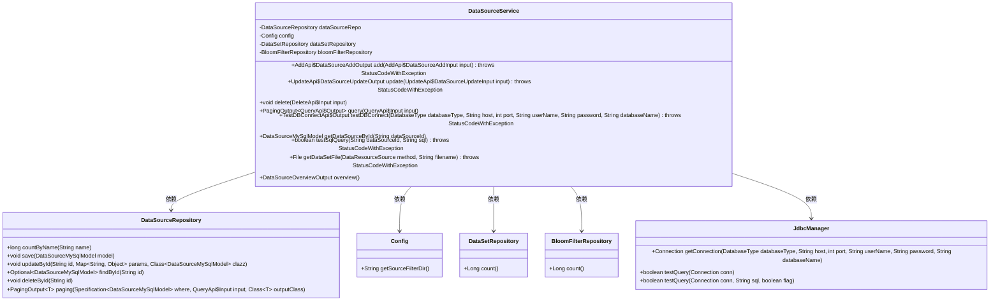

# 基础信息

|      |      |
|------|------|
| 名称 | DataSourceService |
| 编码语言 | .java |
| 代码路径 | WeFe/fusion/fusion-service/src/main/java/com/welab/wefe/data/fusion/service/service/DataSourceService.java |
| 包名 | com.welab.wefe.data.fusion.service.service |
| 依赖项 | ['com.welab.wefe.common.StatusCode', 'com.welab.wefe.common.data.mysql.Where', 'com.welab.wefe.common.exception.StatusCodeWithException', 'com.welab.wefe.common.jdbc.base.DatabaseType', 'com.welab.wefe.common.web.util.CurrentAccountUtil', 'com.welab.wefe.common.web.util.ModelMapper', 'com.welab.wefe.data.fusion.service.api.datasource', 'com.welab.wefe.data.fusion.service.config.Config', 'com.welab.wefe.data.fusion.service.database.entity.DataSourceMySqlModel', 'com.welab.wefe.data.fusion.service.database.repository.BloomFilterRepository', 'com.welab.wefe.data.fusion.service.database.repository.DataSetRepository', 'com.welab.wefe.data.fusion.service.database.repository.DataSourceRepository', 'com.welab.wefe.data.fusion.service.dto.base.PagingOutput', 'com.welab.wefe.data.fusion.service.dto.entity.DataSourceOverviewOutput', 'com.welab.wefe.data.fusion.service.enums.DataResourceSource', 'com.welab.wefe.data.fusion.service.manager.JdbcManager', 'org.springframework.beans.factory.annotation.Autowired', 'org.springframework.data.jpa.domain.Specification', 'org.springframework.stereotype.Service', 'java.io.File', 'java.sql.Connection', 'java.util.Date', 'java.util.HashMap', 'java.util.Map'] |
| 概述说明 | DataSourceService提供数据源管理功能，包括增删改查、测试连接、SQL查询验证及文件获取。支持数据库连接测试，确保数据源有效性，并统计数据集和布隆过滤器数量。 |

# 说明

DataSourceService是一个Spring服务类，提供数据源管理功能。主要功能包括：添加数据源时验证名称唯一性和数据库连接，保存数据源信息；更新数据源时测试连接并更新信息；删除数据源；分页查询数据源；测试数据库连接和SQL查询；获取上传的文件；统计数据集和布隆过滤器数量。通过JdbcManager处理数据库连接，使用Repository进行数据持久化操作。

# 类列表 Class Summary

| 名称   | 类型  | 说明 |
|-------|------|-------------|
| DataSourceService | class | DataSourceService提供数据源管理功能，包括添加、更新、删除、查询数据源，测试数据库连接，验证SQL查询，获取数据集文件及统计概览。 |

## 类 DataSourceService

|      |      |
|------|------|
| 访问范围 | @Service;public |
| 类型 | class |
| 名称 | DataSourceService |
| 说明 | DataSourceService提供数据源管理功能，包括添加、更新、删除、查询数据源，测试数据库连接，验证SQL查询，获取数据集文件及统计概览。 |

### UML类图

类图描述：DataSourceService是一个服务类，负责数据源的增删改查、数据库连接测试、SQL查询测试等操作。它依赖于DataSourceRepository进行数据源持久化操作，Config获取配置信息，DataSetRepository和BloomFilterRepository统计数据，以及JdbcManager管理数据库连接。类图展示了这些类之间的关系和主要方法。

### 内部方法调用关系图

```mermaid
graph TD
    A["类DataSourceService"]
    B["属性: DataSourceRepository dataSourceRepo"]
    C["属性: Config config"]
    D["属性: DataSetRepository dataSetRepository"]
    E["属性: BloomFilterRepository bloomFilterRepository"]
    F["方法: add(DataSourceAddInput) → DataSourceAddOutput"]
    G["方法: update(DataSourceUpdateInput) → DataSourceUpdateOutput"]
    H["方法: delete(DeleteApi.Input)"]
    I["方法: query(QueryApi.Input) → PagingOutput"]
    J["方法: testDBConnect() → TestDBConnectApi.Output"]
    K["方法: getDataSourceById(String) → DataSourceMySqlModel"]
    L["方法: testSqlQuery(String, String) → boolean"]
    M["方法: getDataSetFile(DataResourceSource, String) → File"]
    N["方法: overview() → DataSourceOverviewOutput"]

    A --> B
    A --> C
    A --> D
    A --> E
    A --> F
    A --> G
    A --> H
    A --> I
    A --> J
    A --> K
    A --> L
    A --> M
    A --> N

    F -->|"1. 检查名称唯一性"| F1["dataSourceRepo.countByName()"]
    F -->|"2. 测试连接"| J
    F -->|"3. 映射模型"| F2["ModelMapper.map()"]
    F -->|"4. 设置审计字段"| F3["CurrentAccountUtil.get().getId()"]
    F -->|"5. 保存数据"| F4["dataSourceRepo.save()"]

    G -->|"1. 测试连接"| J
    G -->|"2. 构建参数"| G1["new HashMap()"]
    G -->|"3. 更新数据"| G2["dataSourceRepo.updateById()"]
    G -->|"4. 映射输出"| G3["ModelMapper.map()"]

    H -->|"1. 查询数据"| H1["dataSourceRepo.findById()"]
    H -->|"2. 删除数据"| H2["dataSourceRepo.deleteById()"]

    I -->|"1. 构建查询条件"| I1["Where.create().equal().build()"]
    I -->|"2. 分页查询"| I2["dataSourceRepo.paging()"]

    J -->|"1. 获取连接"| J1["JdbcManager.getConnection()"]
    J -->|"2. 测试查询"| J2["JdbcManager.testQuery()"]

    L -->|"1. 获取数据源"| K
    L -->|"2. 获取连接"| J1
    L -->|"3. 测试SQL"| L1["JdbcManager.testQuery(sql)"]

    M -->|"1. 处理不同来源"| M1["switch(method)"]
    M -->|"2. 验证文件"| M2["file.exists()"]

    N -->|"1. 统计数据集"| N1["dataSetRepository.count()"]
    N -->|"2. 统计布隆过滤器"| N2["bloomFilterRepository.count()"]
```

流程图描述：该流程图展示了DataSourceService类的完整结构，包含4个依赖注入属性和8个核心方法。关键流程包括数据源的新增(add)和更新(update)时的连接测试与持久化操作，删除(delete)前的存在性检查，分页查询(query)的条件构建，以及数据库连接测试(testDBConnect)的详细步骤。所有方法均通过箭头清晰标注了内部调用关系和执行顺序，体现了数据验证、业务处理和持久化操作的完整链路。

### 字段列表 Field List

| 名称  | 类型  | 说明 |
|-------|-------|------|
| dataSetRepository | DataSetRepository | 使用@Autowired自动注入DataSetRepository实例。 |
| config | Config | 使用@Autowired自动注入Config配置对象。 |
| dataSourceRepo | DataSourceRepository | 自动注入数据源仓库实例。 |
| bloomFilterRepository | BloomFilterRepository | 自动注入布隆过滤器仓库实例。 |

### 方法列表

| 名称  | 类型  | 说明 |
|-------|-------|------|
| query | PagingOutput<QueryApi.Output> | Java方法query根据输入参数name和id查询数据，返回分页结果。使用Specification构建查询条件，调用dataSourceRepo分页方法。 |
| testDBConnect | TestDBConnectApi.Output | 测试数据库连接的方法，通过JDBC管理器建立连接并执行查询验证，成功返回结果，失败抛出异常。 |
| delete | void | 该方法根据输入ID从数据源仓库查找并删除对应记录，若记录不存在则直接返回。 |
| update | UpdateApi.DataSourceUpdateOutput | 更新数据源方法：测试连接后，将输入参数映射到模型并更新数据库，返回更新后的ID。 |
| add | AddApi.DataSourceAddOutput | 方法`add`用于添加数据源：检查名称唯一性，测试数据库连接，设置创建信息并保存，返回新数据源ID。若名称重复抛出异常。 |
| getDataSourceById | DataSourceMySqlModel | 根据ID从MySQL数据源仓库获取数据源对象，若不存在则返回null。 |
| testSqlQuery | boolean | 检查数据源并测试SQL查询，返回结果。若数据源不存在则抛出异常。 |
| getDataSetFile | File | 方法根据数据源类型获取文件：上传文件从配置目录查找，本地文件直接使用路径。若文件不存在则抛出异常。 |
| overview | DataSourceOverviewOutput | 方法overview统计数据集和布隆过滤器数量，返回包含两者的DataSourceOverviewOutput对象。 |

