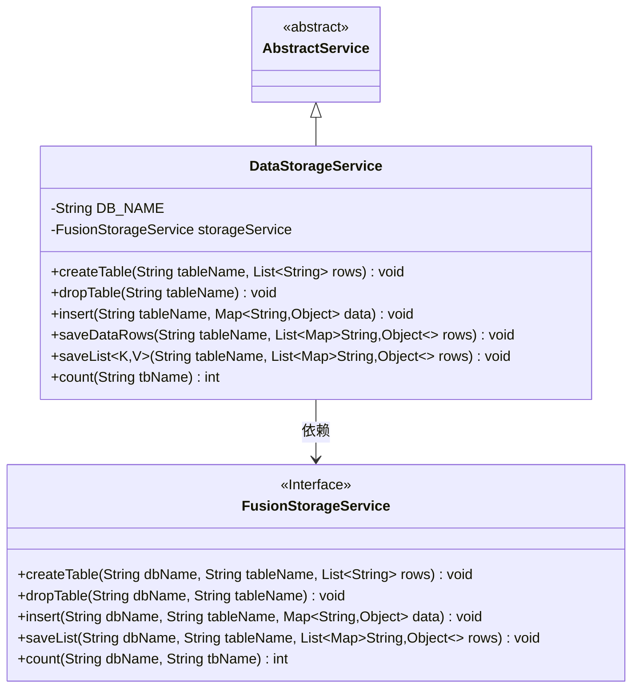
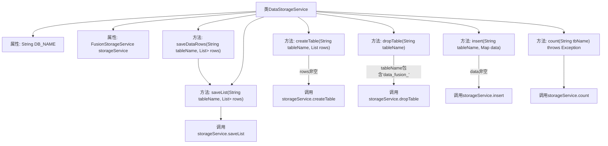

# 基础信息

|      |      |
|------|------|
| 名称 | DataStorageService |
| 编码语言 | .java |
| 代码路径 | WeFe/fusion/fusion-service/src/main/java/com/welab/wefe/data/fusion/service/service/DataStorageService.java |
| 包名 | com.welab.wefe.data.fusion.service.service |
| 依赖项 | ['org.springframework.beans.factory.annotation.Autowired', 'org.springframework.beans.factory.annotation.Value', 'org.springframework.stereotype.Service', 'java.util.List', 'java.util.Map'] |
| 概述说明 | DataStorageService类提供数据库表操作功能，包括创建表、删除表、插入数据、批量保存及数据计数，依赖FusionStorageService实现具体操作。 |

# 说明

DataStorageService是一个继承自AbstractService的服务类，用于数据库表操作。它通过@Value注入MySQL数据库名，并自动装配FusionStorageService。主要功能包括：创建表（需非空行列表）、删除表（仅限包含"data_fusion_"前缀的表）、插入单条数据（非空检查）、批量保存数据行（调用内部saveList方法）以及获取表记录数。所有操作均委托给storageService执行，并统一传递数据库名和表名参数。

# 类列表 Class Summary

| 名称   | 类型  | 说明 |
|-------|------|-------------|
| DataStorageService | class | DataStorageService提供数据库表操作功能，包括创建表、删除表、插入数据、批量保存及计数，依赖FusionStorageService实现具体逻辑。 |

## 类 DataStorageService

|      |      |
|------|------|
| 访问范围 | @Service;public |
| 类型 | class |
| 名称 | DataStorageService |
| 说明 | DataStorageService提供数据库表操作功能，包括创建表、删除表、插入数据、批量保存及计数，依赖FusionStorageService实现具体逻辑。 |

### UML类图

该类图展示了DataStorageService继承自AbstractService，并依赖FusionStorageService接口来实现数据库操作功能。DataStorageService包含创建表、删除表、插入数据、批量保存数据等核心方法，通过注入的FusionStorageService实例来执行具体操作。FusionStorageService作为接口定义了数据库操作的标准方法，实现了存储服务的抽象。

### 内部方法调用关系图

这段代码是DataStorageService类的实现，主要用于数据库表操作。它继承AbstractService，通过FusionStorageService完成实际存储操作。包含创建表、删除表、插入数据、批量保存和计数等功能。每个方法都包含前置条件检查，如参数非空检查或表名格式验证，验证通过后调用底层storageService的对应方法。类通过@Value注入数据库名，通过@Autowired注入存储服务，体现了Spring的依赖注入特性。

### 字段列表 Field List

| 名称  | 类型  | 说明 |
|-------|-------|------|
| DB_NAME | String | 代码片段通过@Value注解注入配置属性db.mysql.database的值到私有变量DB_NAME中。 |
| storageService | FusionStorageService | 自动注入FusionStorageService实例。 |

### 方法列表

| 名称  | 类型  | 说明 |
|-------|-------|------|
| dropTable | void | 该方法检查表名是否包含"data_fusion_"，若不含则直接返回；否则调用存储服务删除指定数据库中的表。 |
| createTable | void | 方法createTable接收表名和行数据列表，若列表为空则直接返回，否则调用storageService创建表。 |
| insert | void | Java方法：向指定表插入数据，参数为表名和数据Map，空数据直接返回，调用存储服务插入操作。 |
| saveDataRows | void | 该方法用于保存数据行，接收表名和数据行列表，调用saveList方法进行存储。 |
| saveList | void | Java方法saveList将Map列表存入指定数据库表，调用storageService的saveList实现。 |
| count | int | 方法count统计指定表记录数，调用storageService的count方法，需传入数据库名和表名，可能抛出异常。 |

