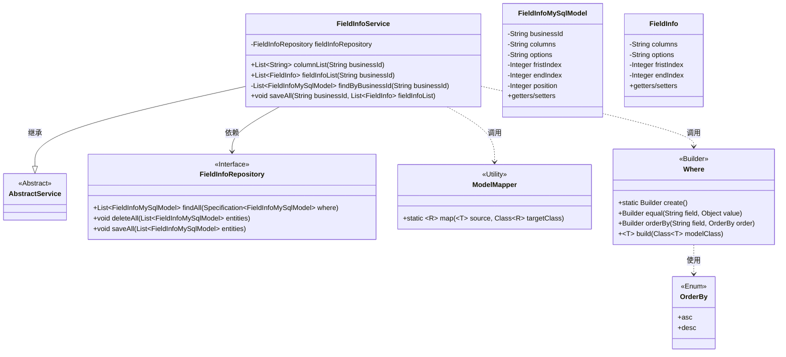
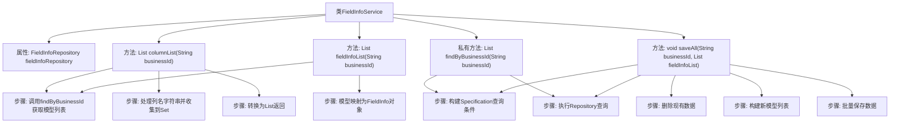

# 基础信息

|      |      |
|------|------|
| 名称 | FieldInfoService |
| 编码语言 | .java |
| 代码路径 | WeFe/fusion/fusion-service/src/main/java/com/welab/wefe/data/fusion/service/service/FieldInfoService.java |
| 包名 | com.welab.wefe.data.fusion.service.service |
| 依赖项 | ['com.welab.wefe.common.data.mysql.Where', 'com.welab.wefe.common.data.mysql.enums.OrderBy', 'com.welab.wefe.common.web.util.ModelMapper', 'com.welab.wefe.data.fusion.service.database.entity.FieldInfoMySqlModel', 'com.welab.wefe.data.fusion.service.database.repository.FieldInfoRepository', 'com.welab.wefe.data.fusion.service.utils.primarykey.FieldInfo', 'org.springframework.beans.factory.annotation.Autowired', 'org.springframework.data.jpa.domain.Specification', 'org.springframework.stereotype.Service', 'java.util', 'java.util.stream.Collectors'] |
| 概述说明 | FieldInfoService类提供字段信息管理功能，包括按businessId查询字段列表、字段信息列表，以及批量保存字段信息。通过FieldInfoRepository操作数据库，支持条件查询和排序。 |

# 说明

FieldInfoService是一个服务类，继承自AbstractService，包含字段信息相关操作。它通过FieldInfoRepository与数据库交互。主要功能包括：columnList方法根据businessId获取字段列名列表；fieldInfoList方法获取字段信息列表并进行模型转换；findByBusinessId私有方法按businessId查询并按position排序；saveAll方法先删除现有数据，再保存新的字段信息列表，包含businessId、columns、options、索引位置等属性。

# 类列表 Class Summary

| 名称   | 类型  | 说明 |
|-------|------|-------------|
| FieldInfoService | class | FieldInfoService类提供字段信息管理功能，包括查询字段列表、字段信息列表及批量保存字段信息。通过FieldInfoRepository操作数据库，支持按businessId查询和排序。 |

## 类 FieldInfoService

|      |      |
|------|------|
| 访问范围 | @Service;public |
| 类型 | class |
| 名称 | FieldInfoService |
| 说明 | FieldInfoService类提供字段信息管理功能，包括查询字段列表、字段信息列表及批量保存字段信息。通过FieldInfoRepository操作数据库，支持按businessId查询和排序。 |

### UML类图

该类图展示了FieldInfoService的核心结构及其关联关系。作为继承AbstractService的业务服务类，它通过FieldInfoRepository操作FieldInfoMySqlModel数据，并借助ModelMapper实现模型转换。Where构建器类用于创建动态查询条件，OrderBy枚举定义排序方式。主要功能包括：获取字段列名列表(columnList)、获取字段信息列表(fieldInfoList)以及批量保存字段数据(saveAll)。类间通过依赖、继承和调用关系协作，形成完整的业务处理流程。

### 内部方法调用关系图

该流程图展示了FieldInfoService类的核心结构和主要方法调用关系。类通过FieldInfoRepository与数据库交互，提供三种核心功能：获取字段列名列表(columnList)、获取字段信息列表(fieldInfoList)和批量保存数据(saveAll)。私有方法findByBusinessId被前两个公共方法复用，用于按业务ID查询数据。saveAll方法实现了先删除后保存的更新逻辑，包含完整的模型转换和批量操作流程。所有数据库操作都通过构建Specification条件来执行。

### 字段列表 Field List

| 名称  | 类型  | 说明 |
|-------|-------|------|
| fieldInfoRepository | FieldInfoRepository | 自动注入FieldInfoRepository实例。 |

### 方法列表

| 名称  | 类型  | 说明 |
|-------|-------|------|
| saveAll | void | 方法saveAll根据businessId删除旧数据，并将fieldInfoList转换为FieldInfoMySqlModel列表后保存。处理包括设置字段值如columns、options、索引和位置。 |
| findByBusinessId | List<FieldInfoMySqlModel> | 该方法根据businessId查询FieldInfoMySqlModel列表，按position升序排序，返回查询结果。 |
| fieldInfoList | List<FieldInfo> | 该方法根据businessId查询数据库，将结果转换为FieldInfo列表并返回。 |
| columnList | List<String> | 该方法根据businessId查询字段信息，提取所有列名并去重后返回列表。 |

