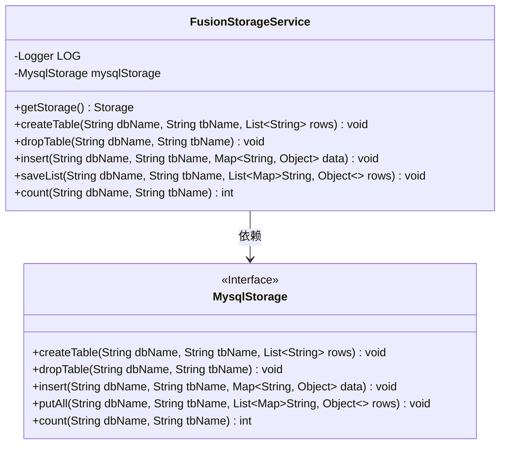
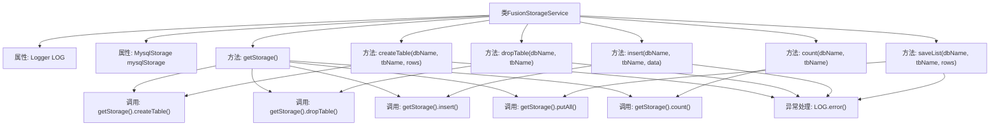

# 基础信息

|      |      |
|------|------|
| 名称 | FusionStorageService |
| 编码语言 | .java |
| 代码路径 | WeFe/fusion/fusion-service/src/main/java/com/welab/wefe/data/fusion/service/service/FusionStorageService.java |
| 包名 | com.welab.wefe.data.fusion.service.service |
| 依赖项 | ['com.welab.wefe.data.fusion.service.repo.Storage', 'com.welab.wefe.data.fusion.service.repo.impl.MysqlStorage', 'org.slf4j.Logger', 'org.slf4j.LoggerFactory', 'org.springframework.beans.factory.annotation.Autowired', 'org.springframework.stereotype.Service', 'java.util.List', 'java.util.Map'] |
| 概述说明 | FusionStorageService是一个Spring服务类，通过MysqlStorage实现数据库表的创建、删除、数据插入、批量保存和计数功能，并捕获异常记录日志。 |

# 说明

FusionStorageService是一个Spring服务类，通过自动注入的MysqlStorage实例提供数据库操作功能。主要方法包括获取存储实例、创建表、删除表、插入单条数据、批量保存数据以及统计记录数。所有操作均通过getStorage()代理到MysqlStorage实现，并捕获异常记录日志。类中包含完整的异常处理机制，通过LOG对象记录错误信息。

# 类列表 Class Summary

| 名称   | 类型  | 说明 |
|-------|------|-------------|
| FusionStorageService | class | FusionStorageService是一个Spring服务类，通过MysqlStorage操作数据库，提供创建表、删除表、插入数据、批量保存和计数功能，异常时记录日志。 |

## 类 FusionStorageService

|      |      |
|------|------|
| 访问范围 | @Service;public |
| 类型 | class |
| 名称 | FusionStorageService |
| 说明 | FusionStorageService是一个Spring服务类，通过MysqlStorage操作数据库，提供创建表、删除表、插入数据、批量保存和计数功能，异常时记录日志。 |

### UML类图

这段代码展示了一个Spring服务类`FusionStorageService`，它通过依赖注入的`MysqlStorage`接口实现数据库操作。类图清晰地显示了服务类与存储接口的关系，以及各自的方法签名。服务类封装了表创建、删除、数据插入和计数等数据库操作，所有方法都通过统一的`getStorage()`获取存储实例并委托调用，同时捕获异常记录日志。接口定义了标准的数据库操作方法，体现了依赖倒置原则。

### 内部方法调用关系图

这段代码展示了一个Spring服务类FusionStorageService，它封装了对MysqlStorage的各种数据库操作。流程图清晰地呈现了类结构、方法调用关系和异常处理流程，所有数据库操作都通过getStorage()方法代理到mysqlStorage实例，并统一进行异常日志记录。核心功能包括表管理(创建/删除)、数据操作(插入/批量插入)和计数查询，每个操作都遵循"调用存储层→捕获异常"的标准流程。

### 字段列表 Field List

| 名称  | 类型  | 说明 |
|-------|-------|------|
| mysqlStorage | MysqlStorage | 代码中通过@Autowired自动注入MysqlStorage实例。 |
| LOG = LoggerFactory.getLogger(FusionStorageService.class) | Logger | 类FusionStorageService中定义了一个静态不可变的日志记录器实例LOG。 |

### 方法列表

| 名称  | 类型  | 说明 |
|-------|-------|------|
| createTable | void | 方法createTable用于创建表，接收数据库名、表名和行数据列表参数，调用存储接口执行创建操作，捕获异常并记录错误日志。 |
| getStorage | Storage | 获取存储对象，返回mysqlStorage实例。 |
| dropTable | void | 该方法用于删除指定数据库中的表，捕获异常并记录错误日志。 |
| insert | void | 方法insert接收数据库名、表名和数据映射，调用存储接口插入数据，异常时记录错误日志。 |
| saveList | void | 方法saveList将数据行存入指定数据库表，捕获异常并记录日志。 |
| count | int | 该方法统计指定数据库和表的记录数，调用存储接口实现，可能抛出异常。 |

