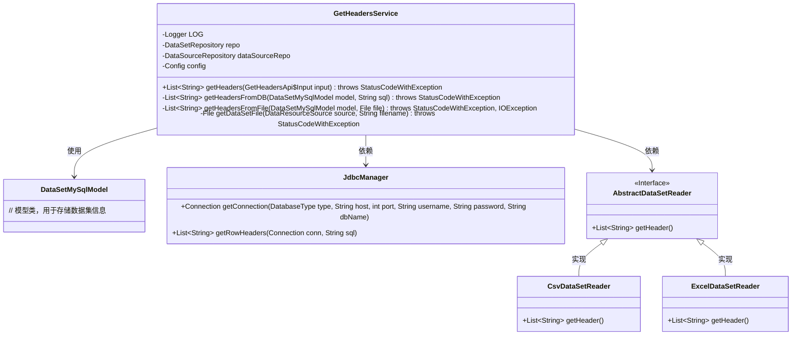
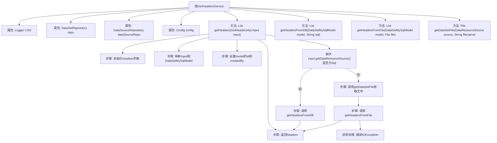
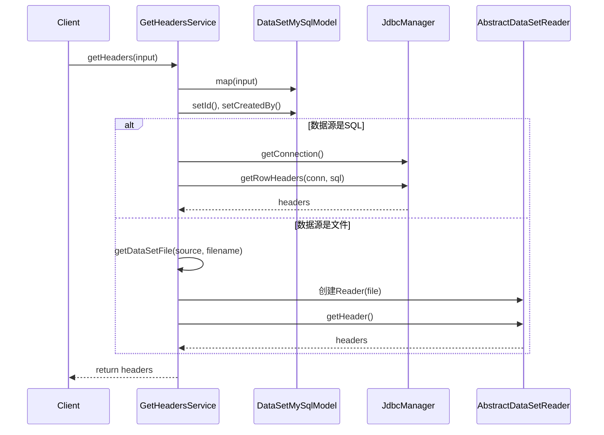

# 基础信息

|      |      |
|------|------|
| 名称 | GetHeadersService |
| 编码语言 | .java |
| 代码路径 | WeFe/fusion/fusion-service/src/main/java/com/welab/wefe/data/fusion/service/service/GetHeadersService.java |
| 包名 | com.welab.wefe.data.fusion.service.service |
| 依赖项 | ['com.welab.wefe.common.StatusCode', 'com.welab.wefe.common.exception.StatusCodeWithException', 'com.welab.wefe.common.jdbc.base.DatabaseType', 'com.welab.wefe.common.web.util.CurrentAccountUtil', 'com.welab.wefe.common.web.util.ModelMapper', 'com.welab.wefe.data.fusion.service.api.dataset.GetHeadersApi', 'com.welab.wefe.data.fusion.service.config.Config', 'com.welab.wefe.data.fusion.service.database.entity.DataSetMySqlModel', 'com.welab.wefe.data.fusion.service.database.repository.DataSetRepository', 'com.welab.wefe.data.fusion.service.database.repository.DataSourceRepository', 'com.welab.wefe.data.fusion.service.enums.DataResourceSource', 'com.welab.wefe.data.fusion.service.manager.JdbcManager', 'com.welab.wefe.data.fusion.service.utils.AbstractDataSetReader', 'com.welab.wefe.data.fusion.service.utils.CsvDataSetReader', 'com.welab.wefe.data.fusion.service.utils.ExcelDataSetReader', 'org.slf4j.Logger', 'org.slf4j.LoggerFactory', 'org.springframework.beans.factory.annotation.Autowired', 'org.springframework.stereotype.Service', 'java.io.File', 'java.io.IOException', 'java.sql.Connection', 'java.util.ArrayList', 'java.util.List'] |
| 概述说明 | GetHeadersService类根据输入源（数据库或文件）获取数据表头。若为数据库，通过SQL查询获取；若为文件，根据文件类型（CSV或Excel）读取表头。处理异常并记录日志。 |

# 说明

GetHeadersService是一个Spring服务类，用于从数据库或文件中获取数据集表头。它通过Autowired注入DataSetRepository、DataSourceRepository和Config依赖。getHeaders方法根据输入参数的数据源类型（SQL或文件）调用不同方法获取表头。若数据源为SQL，则通过JdbcManager连接数据库并执行SQL获取表头；若为文件，则根据文件类型（CSV或Excel）使用相应读取器获取表头。文件路径处理支持上传文件或本地文件，若文件不存在则抛出异常。过程中会记录日志并处理可能的IO异常。

# 类列表 Class Summary

| 名称   | 类型  | 说明 |
|-------|------|-------------|
| GetHeadersService | class | GetHeadersService类提供获取数据集表头功能，支持从数据库SQL或文件（CSV/Excel）读取。包含数据库连接、文件处理和异常处理逻辑。 |

## 类 GetHeadersService

|      |      |
|------|------|
| 访问范围 | @Service;public |
| 类型 | class |
| 名称 | GetHeadersService |
| 说明 | GetHeadersService类提供获取数据集表头功能，支持从数据库SQL或文件（CSV/Excel）读取。包含数据库连接、文件处理和异常处理逻辑。 |

### UML类图

这段代码描述了一个服务类`GetHeadersService`，用于从数据库或文件中获取数据集的列头信息。核心功能包括：通过SQL查询数据库获取表头，或通过解析CSV/Excel文件获取表头。类图中展示了主要组件及其关系：服务类依赖`JdbcManager`处理数据库连接，通过抽象工厂模式选择不同的文件读取器（CSV或Excel），并统一使用`DataSetMySqlModel`作为数据载体。异常处理贯穿整个流程，包括文件IO错误和参数校验异常。

### 内部方法调用关系图

这段代码是一个Spring服务类，主要功能是根据输入参数获取数据集的列头信息。流程图展示了类结构和主要方法调用关系，时序图详细描述了获取列头的两种路径：从数据库SQL查询或从文件读取。核心逻辑通过判断数据源类型(DataResourceSource)进行分支处理，分别调用getHeadersFromDB或getHeadersFromFile方法，最终返回headers列表。异常处理机制确保在文件读取错误时抛出特定状态码异常。

### 字段列表 Field List

| 名称  | 类型  | 说明 |
|-------|-------|------|
| dataSourceRepo | DataSourceRepository | 使用@Autowired自动注入DataSourceRepository实例dataSourceRepo。 |
| config | Config | 自动注入Config配置实例。 |
| LOG = LoggerFactory.getLogger(this.getClass()) | Logger | 类中定义的私有静态日志对象，用于记录当前类的日志信息。 |
| repo | DataSetRepository | 自动注入DataSetRepository实例到repo变量。 |

### 方法列表

| 名称  | 类型  | 说明 |
|-------|-------|------|
| getHeaders | List<String> | 方法根据输入获取表头列表。若数据源为SQL，从数据库查询；否则从文件读取。处理异常并返回结果。 |
| getHeadersFromDB | List<String> | 从数据库获取数据集表头：连接Hive数据库，执行SQL查询并返回列头信息。 |
| getHeadersFromFile | List<String> | 该方法从文件读取数据集表头。根据文件类型（CSV或Excel）选择对应的读取器，返回表头列表。处理过程记录日志，可能抛出异常。 |
| getDataSetFile | File | 该方法根据数据源类型获取文件对象，若文件不存在则抛出异常。支持上传文件、本地文件和SQL三种来源。 |

