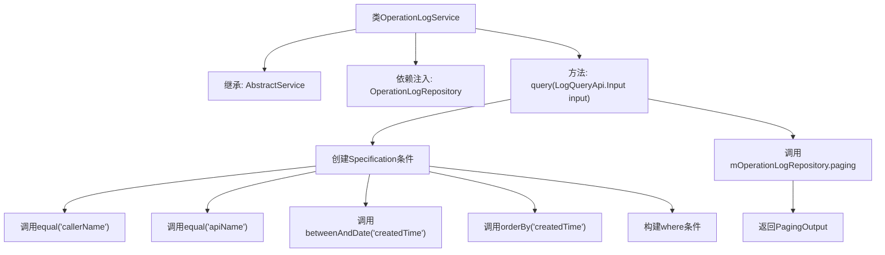

# 基础信息

|      |      |
|------|------|
| 名称 | OperationLogService |
| 编码语言 | .java |
| 代码路径 | WeFe/fusion/fusion-service/src/main/java/com/welab/wefe/data/fusion/service/service/OperationLogService.java |
| 包名 | com.welab.wefe.data.fusion.service.service |
| 依赖项 | ['com.welab.wefe.common.data.mysql.Where', 'com.welab.wefe.common.data.mysql.enums.OrderBy', 'com.welab.wefe.common.exception.StatusCodeWithException', 'com.welab.wefe.data.fusion.service.api.operation.LogQueryApi', 'com.welab.wefe.data.fusion.service.database.entity.OperationLogMysqlModel', 'com.welab.wefe.data.fusion.service.database.repository.OperationLogRepository', 'com.welab.wefe.data.fusion.service.dto.base.PagingOutput', 'com.welab.wefe.data.fusion.service.dto.entity.OperationLogOutputModel', 'org.springframework.beans.factory.annotation.Autowired', 'org.springframework.data.jpa.domain.Specification', 'org.springframework.stereotype.Service'] |
| 概述说明 | OperationLogService提供分页查询操作日志功能，支持按调用者、API名称和时间范围筛选，结果按创建时间降序排列。 |

# 说明

OperationLogService是一个继承自AbstractService的服务类，用于操作日志查询。它通过Autowired注入OperationLogRepository来访问数据库。提供的query方法接收LogQueryApi.Input参数，构建包含callerName、apiName和createdTime范围条件的查询规范，并按createdTime降序排序。最终返回分页的OperationLogOutputModel结果。方法可能抛出StatusCodeWithException异常。

# 类列表 Class Summary

| 名称   | 类型  | 说明 |
|-------|------|-------------|
| OperationLogService | class | 操作日志服务类，通过条件查询日志记录并分页返回结果。使用仓库接口实现数据访问，支持按调用者、API名和时间范围筛选，按创建时间降序排序。 |


## 类 OperationLogService

|      |      |
|------|------|
| 访问范围 | @Service;public |
| 类型 | class |
| 名称 | OperationLogService |
| 说明 | 操作日志服务类，通过条件查询日志记录并分页返回结果。使用仓库接口实现数据访问，支持按调用者、API名和时间范围筛选，按创建时间降序排序。 |


### UML类图

```mermaid
classDiagram
    class OperationLogService {
        -OperationLogRepository mOperationLogRepository
        +PagingOutput~OperationLogOutputModel~ query(LogQueryApi$Input input) StatusCodeWithException
    }
    
    class AbstractService {
        <<abstract>>
    }
    
    class OperationLogRepository {
        +PagingOutput~T~ paging(Specification~OperationLogMysqlModel~ where, LogQueryApi$Input input, Class~T~ clazz)
    }
    
    class LogQueryApi {
        class Input {
            +String callerName
            +String apiName
            +Date startTime
            +Date endTime
        }
    }
    
    class OperationLogMysqlModel {
    }
    
    class OperationLogOutputModel {
    }
    
    class Where {
        +create() WhereBuilder
    }
    
    class WhereBuilder {
        +equal(String field, Object value) WhereBuilder
        +betweenAndDate(String field, Date start, Date end) WhereBuilder
        +orderBy(String field, OrderBy order) WhereBuilder
        +build(Class~T~ clazz) Specification~T~
    }
    
    class OrderBy {
        <<enumeration>>
        asc
        desc
    }
    
    OperationLogService --|> AbstractService : 继承
    OperationLogService --> OperationLogRepository : 依赖
    OperationLogService --> LogQueryApi$Input : 依赖
    OperationLogRepository --> OperationLogMysqlModel : 操作
    OperationLogRepository --> OperationLogOutputModel : 返回
    WhereBuilder --> OrderBy : 使用
    WhereBuilder --> Specification : 生成
    Where --> WhereBuilder : 创建
```

这段代码展示了一个操作日志服务类OperationLogService，它继承自AbstractService，通过OperationLogRepository进行数据库操作。核心功能是query方法，接收LogQueryApi.Input参数，使用Where构建器创建查询条件，最终返回分页的操作日志数据。类图清晰地展示了各组件间的依赖关系，包括输入参数处理、查询条件构建、数据库操作和结果输出等关键环节。


### 内部方法调用关系图



该流程图展示了OperationLogService类的结构和query方法的执行流程。该类继承自AbstractService，通过依赖注入使用OperationLogRepository。query方法首先构建包含多个条件的Specification对象（包括相等比较、时间范围查询和排序），然后调用Repository的分页查询方法，最终返回分页结果。整个过程体现了从条件构建到数据库查询的完整数据访问流程，符合典型的Spring Data JPA查询模式。

### 字段列表 Field List

| 名称  | 类型  | 说明 |
|-------|-------|------|
| mOperationLogRepository | OperationLogRepository | 自动注入操作日志仓库实例。 |

### 方法列表

| 名称  | 类型  | 说明 |
|-------|-------|------|
| query | PagingOutput<OperationLogOutputModel> | 该方法根据输入条件查询操作日志，支持按调用者、接口名和时间范围筛选，并按创建时间降序分页返回结果。 |


