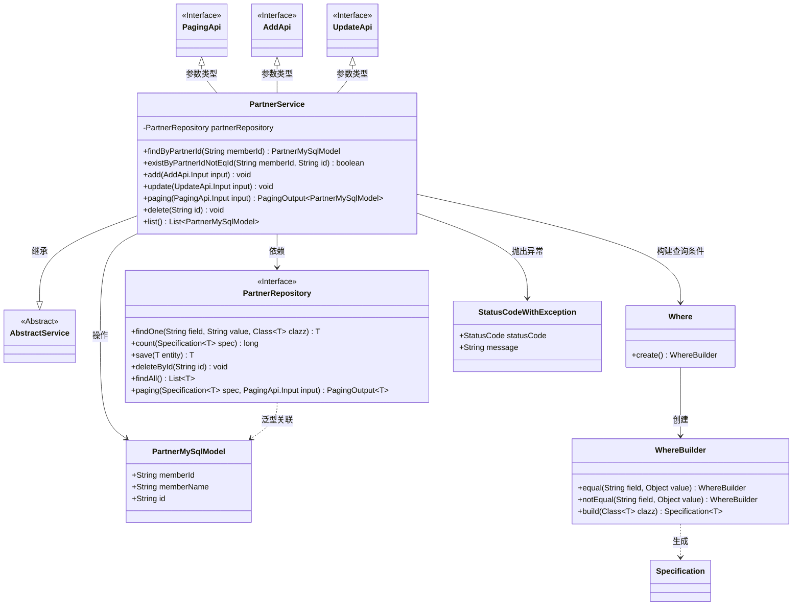

# 基础信息

|      |      |
|------|------|
| 名称 | PartnerService |
| 编码语言 | .java |
| 代码路径 | WeFe/fusion/fusion-service/src/main/java/com/welab/wefe/data/fusion/service/service/PartnerService.java |
| 包名 | com.welab.wefe.data.fusion.service.service |
| 依赖项 | ['com.welab.wefe.common.StatusCode', 'com.welab.wefe.common.data.mysql.Where', 'com.welab.wefe.common.exception.StatusCodeWithException', 'com.welab.wefe.data.fusion.service.api.partner.AddApi', 'com.welab.wefe.data.fusion.service.api.partner.PagingApi', 'com.welab.wefe.data.fusion.service.api.partner.UpdateApi', 'com.welab.wefe.data.fusion.service.database.entity.PartnerMySqlModel', 'com.welab.wefe.data.fusion.service.database.repository.PartnerRepository', 'com.welab.wefe.data.fusion.service.dto.base.PagingOutput', 'org.springframework.beans.BeanUtils', 'org.springframework.beans.factory.annotation.Autowired', 'org.springframework.data.jpa.domain.Specification', 'org.springframework.stereotype.Service', 'java.util.List'] |
| 概述说明 | PartnerService类提供合作伙伴管理功能，包括查询、添加、更新、删除和分页查询。通过memberId检查合作伙伴是否存在，确保数据唯一性。使用Repository进行数据库操作，支持条件查询和分页。 |

# 说明

PartnerService是一个服务类，继承自AbstractService，提供合作伙伴数据管理功能。主要方法包括：通过memberId查询合作伙伴、检查memberId是否存在（排除指定ID）、新增合作伙伴（校验重复）、更新合作伙伴（校验存在性和重复）、分页查询、删除合作伙伴及获取所有合作伙伴列表。使用PartnerRepository进行数据库操作，并在操作中进行数据校验和异常处理。

# 类列表 Class Summary

| 名称   | 类型  | 说明 |
|-------|------|-------------|
| PartnerService | class | PartnerService类提供合作伙伴管理功能，包括查询、添加、更新、删除和分页查询。通过memberId检查合作伙伴是否存在，确保数据唯一性。使用Repository进行数据库操作，支持条件查询和分页。 |

## 类 PartnerService

|      |      |
|------|------|
| 访问范围 | @Service;public |
| 类型 | class |
| 名称 | PartnerService |
| 说明 | PartnerService类提供合作伙伴管理功能，包括查询、添加、更新、删除和分页查询。通过memberId检查合作伙伴是否存在，确保数据唯一性。使用Repository进行数据库操作，支持条件查询和分页。 |

### UML类图

这段类图展示了PartnerService的核心结构和关联关系。PartnerService继承自AbstractService，通过PartnerRepository进行数据持久化操作，主要处理PartnerMySqlModel实体的CRUD操作。服务类使用Where构建器创建动态查询条件，并通过StatusCodeWithException处理业务异常。图中清晰地呈现了服务层与持久层、实体类以及工具类之间的协作关系，体现了Spring框架中典型的服务层实现模式。

### 内部方法调用关系图

```mermaid
graph TD
    A["PartnerService"]
    B["属性: PartnerRepository partnerRepository"]
    C["方法: findByPartnerId(String memberId)"]
    D["方法: existByPartnerIdNotEqId(String memberId, String id)"]
    E["方法: add(AddApi.Input input)"]
    F["方法: update(UpdateApi.Input input)"]
    G["方法: paging(PagingApi.Input input)"]
    H["方法: delete(String id)"]
    I["方法: list()"]

    A --> B
    A --> C
    A --> D
    A --> E
    A --> F
    A --> G
    A --> H
    A --> I

    C --> C1["partnerRepository.findOne"]
    D --> D1["Where.create.equal.notEqual.build"]
    D --> D2["partnerRepository.count"]
    E --> E1["findByPartnerId检查存在性"]
    E --> E2["BeanUtils.copyProperties"]
    E --> E3["partnerRepository.save"]
    F --> F1["partnerRepository.findOne检查存在性"]
    F --> F2["existByPartnerIdNotEqId验证冲突"]
    F --> F3["BeanUtils.copyProperties"]
    F --> F4["partnerRepository.save"]
    G --> G1["Where.create.equal.build"]
    G --> G2["partnerRepository.paging"]
    H --> H1["partnerRepository.deleteById"]
    I --> I1["partnerRepository.findAll"]
```

该流程图展示了PartnerService类的完整结构，包含7个核心方法和1个自动注入的Repository属性。主要业务逻辑围绕合作伙伴数据的CRUD操作展开，其中add和update方法包含完整的业务验证流程（存在性检查、属性拷贝、持久化操作），paging方法实现多条件分页查询，delete和list提供基础数据操作。所有数据库交互均通过partnerRepository实现，关键操作如save/findOne/count等清晰标注。异常处理流程体现在add和update方法中，通过状态码抛出业务异常。

### 字段列表 Field List

| 名称  | 类型  | 说明 |
|-------|-------|------|
| partnerRepository | PartnerRepository | 自动注入PartnerRepository实例。 |

### 方法列表

| 名称  | 类型  | 说明 |
|-------|-------|------|
| update | void | 更新合作伙伴信息方法：检查ID有效性，验证成员ID唯一性，复制属性并保存。若无效或重复则抛出异常。 |
| existByPartnerIdNotEqId | boolean | 检查指定memberId下是否存在id不等于给定值的Partner记录。 |
| add | void | 该方法检查合作伙伴是否存在，若存在则抛出异常；不存在则保存新合作伙伴数据。 |
| findByPartnerId | PartnerMySqlModel | 根据成员ID查询合作伙伴MySQL模型，返回匹配结果。 |
| paging | PagingOutput<PartnerMySqlModel> | 分页查询方法，根据成员ID和名称筛选合作伙伴数据，返回分页结果。 |
| delete | void | 删除指定ID的合作伙伴记录。 |
| list | List<PartnerMySqlModel> | 该方法返回所有合作伙伴的MySQL模型列表，通过调用partnerRepository的findAll方法实现。 |

