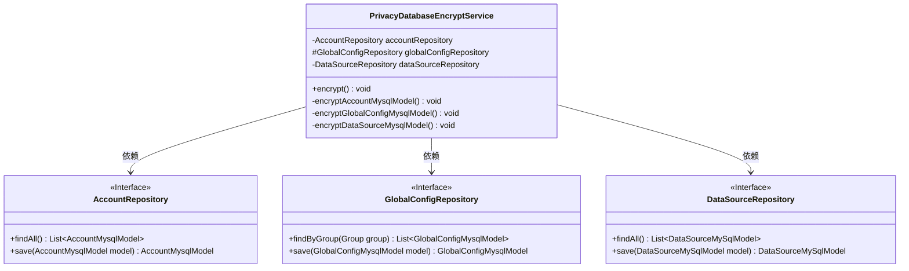
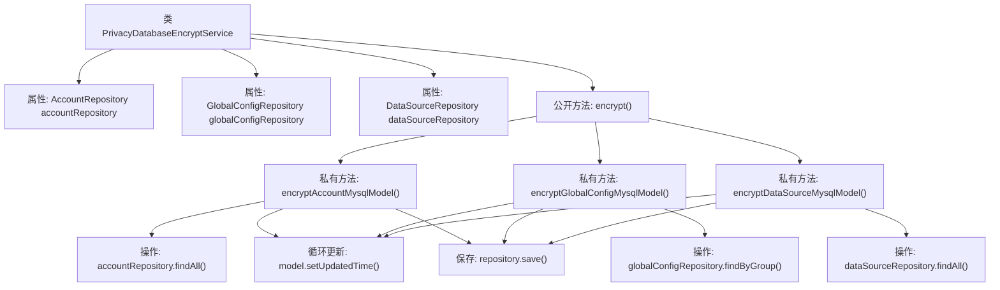

# 基础信息

|      |      |
|------|------|
| 名称 | PrivacyDatabaseEncryptService |
| 编码语言 | .java |
| 代码路径 | WeFe/fusion/fusion-service/src/main/java/com/welab/wefe/data/fusion/service/service/PrivacyDatabaseEncryptService.java |
| 包名 | com.welab.wefe.data.fusion.service.service |
| 依赖项 | ['com.welab.wefe.data.fusion.service.database.entity.AccountMysqlModel', 'com.welab.wefe.data.fusion.service.database.entity.DataSourceMySqlModel', 'com.welab.wefe.data.fusion.service.database.entity.GlobalConfigMysqlModel', 'com.welab.wefe.data.fusion.service.database.repository.AccountRepository', 'com.welab.wefe.data.fusion.service.database.repository.DataSourceRepository', 'com.welab.wefe.data.fusion.service.database.repository.GlobalConfigRepository', 'com.welab.wefe.data.fusion.service.service.globalconfig.BaseGlobalConfigService', 'org.springframework.beans.factory.annotation.Autowired', 'org.springframework.stereotype.Service', 'org.springframework.transaction.annotation.Transactional', 'org.springframework.util.CollectionUtils', 'java.util.Date', 'java.util.List'] |
| 概述说明 | PrivacyDatabaseEncryptService类用于加密数据库隐私数据，包含三个加密方法：账户、全局配置和数据源，均更新修改时间并保存。 |

# 说明

PrivacyDatabaseEncryptService是一个Spring服务类，负责对数据库中的隐私数据进行加密处理。该类通过自动注入AccountRepository、GlobalConfigRepository和DataSourceRepository三个仓库接口来操作数据。主方法encrypt()使用事务注解确保操作原子性，依次调用三个私有方法分别处理账户、全局配置和数据源模型。每个方法都先查询对应模型列表，若非空则遍历列表更新每个模型的updatedTime字段并保存回数据库。其中全局配置方法额外筛选了GROUP为MEMBER_INFO的记录。

# 类列表 Class Summary

| 名称   | 类型  | 说明 |
|-------|------|-------------|
| PrivacyDatabaseEncryptService | class | PrivacyDatabaseEncryptService是一个服务类，用于加密数据库中的隐私数据。它通过三个私有方法分别加密账户、全局配置和数据源模型，更新它们的更新时间并保存到对应仓库。所有操作在一个事务中执行，出错时回滚。 |

## 类 PrivacyDatabaseEncryptService

|      |      |
|------|------|
| 访问范围 | @Service;public |
| 类型 | class |
| 名称 | PrivacyDatabaseEncryptService |
| 说明 | PrivacyDatabaseEncryptService是一个服务类，用于加密数据库中的隐私数据。它通过三个私有方法分别加密账户、全局配置和数据源模型，更新它们的更新时间并保存到对应仓库。所有操作在一个事务中执行，出错时回滚。 |

### UML类图

这段代码展示了一个Spring服务类`PrivacyDatabaseEncryptService`，它通过三个私有方法分别处理不同类型的数据加密任务。该类依赖三个JPA仓库接口（`AccountRepository`、`GlobalConfigRepository`和`DataSourceRepository`）来获取和保存数据。每个加密方法都会遍历对应的模型列表，更新其时间戳并保存。类图中清晰地展示了服务类与仓库接口之间的依赖关系，以及各个接口的方法签名。

### 内部方法调用关系图

这段代码流程图展示了PrivacyDatabaseEncryptService类的核心结构和执行流程。该类通过三个私有方法分别处理不同数据模型的加密操作：账户、全局配置和数据源。每个方法首先从对应仓库获取数据列表，然后遍历列表更新每个模型的更新时间字段并保存。公开方法encrypt()作为入口统一调用这三个私有方法，整个过程在事务管理下执行，任何异常都会触发回滚。流程图清晰地呈现了从属性注入到方法调用，再到具体数据库操作的分层逻辑关系。

### 字段列表 Field List

| 名称  | 类型  | 说明 |
|-------|-------|------|
| accountRepository | AccountRepository | 使用@Autowired自动注入AccountRepository实例。 |
| dataSourceRepository | DataSourceRepository | 使用@Autowired自动注入DataSourceRepository实例。 |
| globalConfigRepository | GlobalConfigRepository | 自动注入全局配置仓库实例。 |

### 方法列表

| 名称  | 类型  | 说明 |
|-------|-------|------|
| encryptAccountMysqlModel | void | 加密账户MySQL模型数据：遍历所有账户记录，更新时间为当前日期并保存。 |
| encrypt | void | 使用@Transactional注解的方法encrypt，包含三个加密操作，遇到异常时回滚。 |
| encryptGlobalConfigMysqlModel | void | 加密MEMBER_INFO组的全局配置数据，更新时间为当前时间并保存。 |
| encryptDataSourceMysqlModel | void | 该方法用于加密MySQL数据源模型，遍历所有模型并更新时间为当前日期，然后保存到数据库。 |

