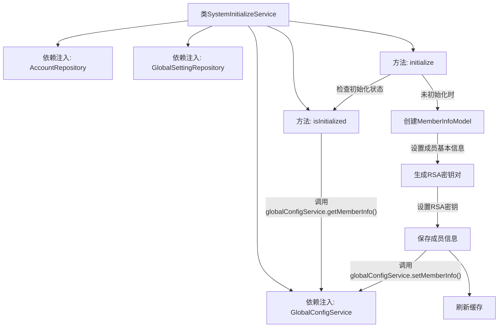
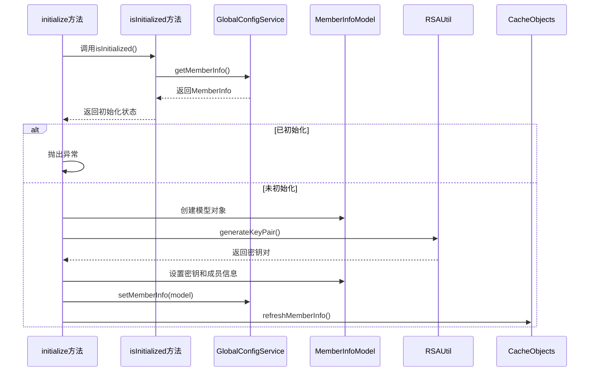

# 基础信息

|      |      |
|------|------|
| 名称 | SystemInitializeService |
| 编码语言 | .java |
| 代码路径 | WeFe/fusion/fusion-service/src/main/java/com/welab/wefe/data/fusion/service/service/SystemInitializeService.java |
| 包名 | com.welab.wefe.data.fusion.service.service |
| 依赖项 | ['com.welab.wefe.common.StatusCode', 'com.welab.wefe.common.exception.StatusCodeWithException', 'com.welab.wefe.common.util.RSAUtil', 'com.welab.wefe.data.fusion.service.api.system.InitializeApi', 'com.welab.wefe.data.fusion.service.database.repository.AccountRepository', 'com.welab.wefe.data.fusion.service.database.repository.GlobalSettingRepository', 'com.welab.wefe.data.fusion.service.dto.entity.globalconfig.MemberInfoModel', 'com.welab.wefe.data.fusion.service.service.globalconfig.GlobalConfigService', 'org.springframework.beans.factory.annotation.Autowired', 'org.springframework.stereotype.Service', 'org.springframework.transaction.annotation.Transactional', 'java.util.UUID'] |
| 概述说明 | SystemInitializeService用于系统初始化，检查是否已初始化并通过initialize方法设置成员信息，包括生成RSA密钥对。若重复初始化会抛出异常。 |

# 说明

SystemInitializeService是一个系统初始化服务类，包含三个依赖注入组件：AccountRepository、GlobalSettingRepository和GlobalConfigService。提供isInitialized方法检查系统是否已初始化，通过globalConfigService获取成员信息判断。initialize方法用于初始化系统，采用事务管理确保操作原子性。首先检查系统是否已初始化，若已初始化则抛出异常。创建MemberInfoModel对象，设置成员ID、名称、邮箱、手机号等信息，并生成RSA密钥对存储。最后通过globalConfigService保存成员信息并刷新缓存。注释显示原使用globalSettingRepository的方案已被注释掉。

# 类列表 Class Summary

| 名称   | 类型  | 说明 |
|-------|------|-------------|
| SystemInitializeService | class | SystemInitializeService类用于系统初始化，包含检查是否已初始化的isInitialized方法和执行初始化的initialize方法。初始化时生成RSA密钥对并保存成员信息，防止重复操作。 |


## 类 SystemInitializeService

|      |      |
|------|------|
| 访问范围 | @Service;public |
| 类型 | class |
| 名称 | SystemInitializeService |
| 说明 | SystemInitializeService类用于系统初始化，包含检查是否已初始化的isInitialized方法和执行初始化的initialize方法。初始化时生成RSA密钥对并保存成员信息，防止重复操作。 |


### UML类图

```mermaid
classDiagram
    class SystemInitializeService {
        -AccountRepository accountRepository
        -GlobalSettingRepository globalSettingRepository
        -GlobalConfigService globalConfigService
        +isInitialized() boolean
        +initialize(InitializeApi$Input input) void
    }

    class AccountRepository {
        <<Interface>>
    }

    class GlobalSettingRepository {
        <<Interface>>
    }

    class GlobalConfigService {
        <<Interface>>
        +getMemberInfo() MemberInfoModel
        +setMemberInfo(MemberInfoModel model) void
    }

    class InitializeApi$Input {
        +String memberName
        +String memberEmail
        +String memberMobile
    }

    class MemberInfoModel {
        +String memberId
        +String memberName
        +String memberEmail
        +String memberMobile
        +String rsaPrivateKey
        +String rsaPublicKey
    }

    class RSAUtil {
        <<Utility>>
        +generateKeyPair() RsaKeyPair
    }

    class RsaKeyPair {
        +String privateKey
        +String publicKey
    }

    class StatusCodeWithException {
        +StatusCode statusCode
        +String message
    }

    class CacheObjects {
        <<Utility>>
        +refreshMemberInfo() void
    }

    SystemInitializeService --> AccountRepository : 依赖
    SystemInitializeService --> GlobalSettingRepository : 依赖
    SystemInitializeService --> GlobalConfigService : 依赖
    SystemInitializeService --> InitializeApi$Input : 使用
    SystemInitializeService --> MemberInfoModel : 创建
    SystemInitializeService --> RSAUtil : 调用
    SystemInitializeService --> StatusCodeWithException : 抛出
    GlobalConfigService --> MemberInfoModel : 操作
    RSAUtil --> RsaKeyPair : 生成
    SystemInitializeService --> CacheObjects : 调用
```

该代码展示了一个系统初始化服务，主要功能包括检查系统是否已初始化（通过查询全局配置）和执行初始化操作（创建成员信息并生成RSA密钥对）。类图清晰地呈现了服务与多个Repository、Service和工具类的依赖关系，以及数据传输对象的结构。初始化过程涉及密钥生成、数据存储和缓存刷新等关键操作，并通过事务管理确保原子性。


### 内部方法调用关系图





该流程图描述了SystemInitializeService类的初始化流程，主要包含两个核心方法：isInitialized()用于检查系统是否已完成初始化，initialize()负责执行实际的系统初始化操作。初始化过程包括创建成员信息模型、生成RSA密钥对、保存配置信息到GlobalConfigService以及刷新缓存等步骤。时序图则详细展示了方法间的调用顺序和交互逻辑，特别是初始化前的状态检查和异常处理流程。整个设计采用事务性操作确保数据一致性，并通过依赖注入管理各组件间的协作关系。

### 字段列表 Field List

| 名称  | 类型  | 说明 |
|-------|-------|------|
| accountRepository | AccountRepository | 自动注入AccountRepository实例。 |
| globalSettingRepository | GlobalSettingRepository | 使用@Autowired自动注入GlobalSettingRepository实例。 |
| globalConfigService | GlobalConfigService | 使用@Autowired自动注入GlobalConfigService实例。 |

### 方法列表

| 名称  | 类型  | 说明 |
|-------|-------|------|
| isInitialized | boolean | 检查全局配置服务中的成员信息是否已初始化，返回布尔值。 |
| initialize | void | 方法initialize使用事务处理，检查系统是否已初始化，未初始化则创建成员信息并生成RSA密钥对，最后更新全局配置和缓存。若已初始化则抛出异常。 |


