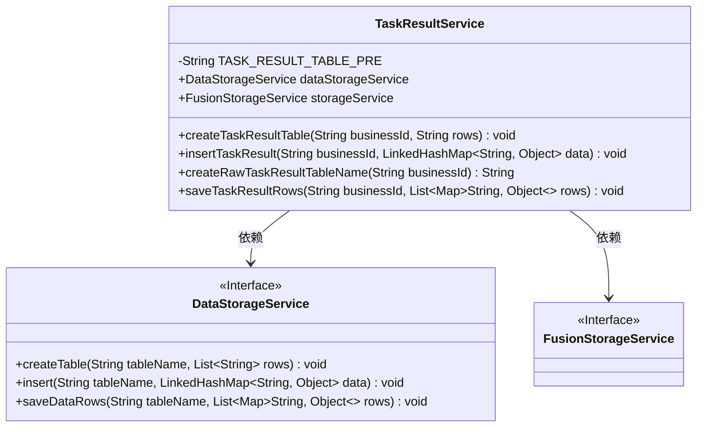
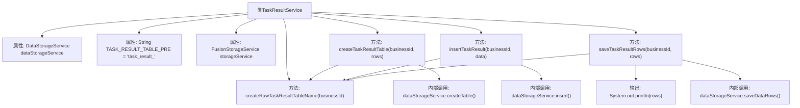

# 基础信息

|      |      |
|------|------|
| 名称 | TaskResultService |
| 编码语言 | .java |
| 代码路径 | WeFe/fusion/fusion-service/src/main/java/com/welab/wefe/data/fusion/service/service/TaskResultService.java |
| 包名 | com.welab.wefe.data.fusion.service.service |
| 依赖项 | ['org.springframework.beans.factory.annotation.Autowired', 'org.springframework.stereotype.Service', 'java.util.Arrays', 'java.util.LinkedHashMap', 'java.util.List', 'java.util.Map'] |
| 概述说明 | TaskResultService类提供任务结果表操作，包括创建表、插入数据、批量保存及生成表名功能，依赖DataStorageService实现存储逻辑。 |

# 说明

TaskResultService是一个Spring服务类，用于管理任务结果表的相关操作。它依赖DataStorageService和FusionStorageService进行数据存储。主要功能包括：通过createTaskResultTable方法创建以"task_result_"为前缀的业务ID相关表；insertTaskResult方法插入单条数据；saveTaskResultRows方法批量保存多行数据。表名生成逻辑封装在createRawTaskResultTableName方法中，统一采用前缀加业务ID的命名规则。

# 类列表 Class Summary

| 名称   | 类型  | 说明 |
|-------|------|-------------|
| TaskResultService | class | TaskResultService类提供任务结果表操作，包括创建表、插入数据、批量保存及生成表名功能，依赖DataStorageService进行存储操作。 |

## 类 TaskResultService

|      |      |
|------|------|
| 访问范围 | @Service;public |
| 类型 | class |
| 名称 | TaskResultService |
| 说明 | TaskResultService类提供任务结果表操作，包括创建表、插入数据、批量保存及生成表名功能，依赖DataStorageService进行存储操作。 |

### UML类图

这段代码展示了一个任务结果服务类(TaskResultService)，它通过依赖注入的方式使用数据存储服务(DataStorageService)和融合存储服务(FusionStorageService)。主要功能包括创建任务结果表、插入单条数据、批量保存数据行以及生成原始表名。类图中清晰地展示了这三个类之间的关系，其中TaskResultService作为核心业务类，依赖于两个接口服务来完成数据存储操作。所有方法都围绕业务ID(businessId)展开操作，通过添加固定前缀(TASK_RESULT_TABLE_PRE)来构造表名，实现了任务结果数据的结构化存储功能。

### 内部方法调用关系图

这段代码是TaskResultService类，主要用于管理任务结果表的创建、数据插入和批量保存操作。通过DataStorageService进行底层表操作，包含生成表名、创建表、插入单条数据和批量保存数据等功能。核心逻辑围绕businessId动态生成表名，并委托给dataStorageService执行具体存储操作，其中表名格式为"task_result_"+businessId。代码结构清晰，职责单一，符合服务层的设计原则。

### 字段列表 Field List

| 名称  | 类型  | 说明 |
|-------|-------|------|
| storageService | FusionStorageService | 自动注入FusionStorageService实例。 |
| dataStorageService | DataStorageService | 使用@Autowired自动注入DataStorageService实例。 |
| TASK_RESULT_TABLE_PRE = "task_result_" | String | 定义字符串常量TASK_RESULT_TABLE_PRE，值为"task_result_"，用作表名前缀。 |

### 方法列表

| 名称  | 类型  | 说明 |
|-------|-------|------|
| createTaskResultTable | void | 方法创建任务结果表，根据业务ID生成表名，并使用数据存储服务创建包含指定行的表。 |
| insertTaskResult | void | 方法insertTaskResult接收业务ID和数据，生成表名后存储数据。 |
| createRawTaskResultTableName | String | 方法生成任务结果表名，前缀加业务ID。 |
| saveTaskResultRows | void | 该方法保存任务结果数据，打印数据行并调用存储服务将数据存入指定业务ID对应的表中。 |

