# 基础信息

|      |      |
|------|------|
| 名称 | TaskService |
| 编码语言 | .java |
| 代码路径 | WeFe/fusion/fusion-service/src/main/java/com/welab/wefe/data/fusion/service/service/TaskService.java |
| 包名 | com.welab.wefe.data.fusion.service.service |
| 依赖项 | ['com.alibaba.fastjson.JSONObject', 'com.welab.wefe.common.StatusCode', 'com.welab.wefe.common.data.mysql.Where', 'com.welab.wefe.common.exception.StatusCodeWithException', 'com.welab.wefe.common.util.StringUtil', 'com.welab.wefe.common.web.util.ModelMapper', 'com.welab.wefe.data.fusion.service.actuator.rsapsi.PsiServerActuator', 'com.welab.wefe.data.fusion.service.api.task', 'com.welab.wefe.data.fusion.service.database.entity.BloomFilterMySqlModel', 'com.welab.wefe.data.fusion.service.database.entity.DataSetMySqlModel', 'com.welab.wefe.data.fusion.service.database.entity.PartnerMySqlModel', 'com.welab.wefe.data.fusion.service.database.entity.TaskMySqlModel', 'com.welab.wefe.data.fusion.service.database.repository.DataSetRepository', 'com.welab.wefe.data.fusion.service.database.repository.PartnerRepository', 'com.welab.wefe.data.fusion.service.database.repository.TaskRepository', 'com.welab.wefe.data.fusion.service.dto.base.PagingOutput', 'com.welab.wefe.data.fusion.service.dto.entity.PartnerOutputModel', 'com.welab.wefe.data.fusion.service.dto.entity.TaskOutput', 'com.welab.wefe.data.fusion.service.dto.entity.TaskOverviewOutput', 'com.welab.wefe.data.fusion.service.dto.entity.bloomfilter.BloomfilterOutputModel', 'com.welab.wefe.data.fusion.service.dto.entity.dataset.DataSetOutputModel', 'com.welab.wefe.data.fusion.service.enums', 'com.welab.wefe.data.fusion.service.manager.ActuatorManager', 'com.welab.wefe.data.fusion.service.service.bloomfilter.BloomFilterService', 'com.welab.wefe.data.fusion.service.task.AbstractTask', 'com.welab.wefe.data.fusion.service.task.PsiServerTask', 'com.welab.wefe.data.fusion.service.utils.primarykey.FieldInfo', 'com.welab.wefe.data.fusion.service.utils.primarykey.PrimaryKeyUtils', 'org.apache.commons.collections4.CollectionUtils', 'org.apache.commons.lang3.StringUtils', 'org.springframework.beans.factory.annotation.Autowired', 'org.springframework.data.jpa.domain.Specification', 'org.springframework.stereotype.Service', 'org.springframework.transaction.annotation.Transactional', 'java.math.BigInteger', 'java.util.Arrays', 'java.util.Date', 'java.util.List', 'java.util.UUID', 'java.util.concurrent', 'java.util.stream.Collectors', 'com.welab.wefe.common.StatusCode.DATA_NOT_FOUND', 'com.welab.wefe.common.StatusCode.PARAMETER_VALUE_INVALID'] |
| 概述说明 | TaskService类提供任务管理功能，包括查找、更新、添加、处理任务，支持RSA-PSI算法和布隆过滤器操作，涉及任务状态管理、数据资源处理和第三方服务交互。 |

# 说明

TaskService是一个服务类，继承自AbstractService，主要负责任务管理功能。它通过多个Repository（如TaskRepository、DataSetRepository等）和Service（如PartnerService、ThirdPartyService等）进行数据操作和业务处理。主要功能包括：通过ID或业务ID查询任务、更新任务状态和统计信息、添加和更新任务、处理任务请求（如RSA-PSI算法处理）、接收合作伙伴的对齐请求、分页查询任务列表、获取任务详情、删除任务以及获取任务概览统计信息。该类还涉及事务管理（@Transactional）和异常处理（StatusCodeWithException）。

# 类列表 Class Summary

| 名称   | 类型  | 说明 |
|-------|------|-------------|
| TaskService | class | TaskService类提供任务管理功能，包括任务增删改查、状态更新、PSI算法处理及数据对齐操作，支持RSA_PSI算法和布隆过滤器。 |

## 类 TaskService

|      |      |
|------|------|
| 访问范围 | @Service;public |
| 类型 | class |
| 名称 | TaskService |
| 说明 | TaskService类提供任务管理功能，包括任务增删改查、状态更新、PSI算法处理及数据对齐操作，支持RSA_PSI算法和布隆过滤器。 |

### UML类图

```mermaid
classDiagram
    class AbstractService {
        <<Abstract>>
    }

    class TaskService {
        -TaskRepository taskRepository
        -DataSetRepository dataSetRepository
        -PartnerRepository partnerRepository
        -PartnerService partnerService
        -ThirdPartyService thirdPartyService
        -BloomFilterService bloomFilterService
        -TaskResultService taskResultService
        -FieldInfoService fieldInfoService
        +find(String taskId) TaskMySqlModel
        +findByBusinessId(String businessId) TaskMySqlModel
        +updateByBusinessId(String businessId, TaskStatus status, Integer fusionCount, Integer processedCount, long spend) void
        +add(AddApi.Input input) void
        +update(UpdateApi.Input input) void
        +handle(HandleApi.Input input) void
        +psi(HandleApi.Input input, TaskMySqlModel task, PartnerMySqlModel partner) void
        +psiClient(HandleApi.Input input, TaskMySqlModel task, PartnerMySqlModel partner) void
        +psiServer(HandleApi.Input input, TaskMySqlModel task, PartnerMySqlModel partner) void
        +alignByPartner(ReceiveApi.Input input) void
        +paging(PagingApi.Input input) PagingOutput~TaskOutput~
        +detail(String taskId) TaskOutput
        +setName(TaskOutput model) void
        +setDataResouceList(TaskOutput model) void
        +setPartnerList(TaskOutput model) void
        +delete(String id) void
        +overview() TaskOverviewOutput
    }

    class TaskRepository {
        <<Interface>>
        +findOne(String field, String value, Class~T~ clazz) T
        +save(TaskMySqlModel model) void
        +paging(Specification~TaskMySqlModel~ where, PagingApi.Input input) PagingOutput~TaskMySqlModel~
        +deleteById(String id) void
        +count() Long
        +count(String field, Object value, Class~T~ clazz) Long
    }

    class DataSetRepository {
        <<Interface>>
        +findOne(String field, String value, Class~T~ clazz) T
    }

    class PartnerRepository {
        <<Interface>>
    }

    class PartnerService {
        <<Interface>>
        +findByPartnerId(String partnerId) PartnerMySqlModel
    }

    class ThirdPartyService {
        <<Interface>>
        +alignApply(TaskMySqlModel task) void
        +callback(String baseUrl, String businessId, CallbackType type, Object... args) JSONObject
    }

    class BloomFilterService {
        <<Interface>>
        +findById(String id) BloomFilterMySqlModel
    }

    class TaskResultService {
        <<Interface>>
    }

    class FieldInfoService {
        <<Interface>>
        +saveAll(String businessId, List~FieldInfo~ fieldInfoList) void
        +fieldInfoList(String businessId) List~FieldInfo~
    }

    AbstractService <|-- TaskService
    TaskService --> TaskRepository : 依赖
    TaskService --> DataSetRepository : 依赖
    TaskService --> PartnerRepository : 依赖
    TaskService --> PartnerService : 依赖
    TaskService --> ThirdPartyService : 依赖
    TaskService --> BloomFilterService : 依赖
    TaskService --> TaskResultService : 依赖
    TaskService --> FieldInfoService : 依赖
```

该图展示了TaskService作为核心服务类，继承自AbstractService，并通过依赖注入与多个Repository和Service交互。主要功能包括任务CRUD操作、PSI算法处理、分页查询和状态管理。类图清晰地反映了Spring服务层的典型结构，其中TaskService作为协调者，通过8个依赖组件完成分布式任务处理流程，特别是PSI（Private Set Intersection）算法的服务端/客户端实现。

### 内部方法调用关系图

```mermaid
graph TD
    A["类TaskService"]
    B["属性: TaskRepository taskRepository"]
    C["属性: DataSetRepository dataSetRepository"]
    D["属性: PartnerRepository partnerRepository"]
    E["属性: PartnerService partnerService"]
    F["属性: ThirdPartyService thirdPartyService"]
    G["属性: BloomFilterService bloomFilterService"]
    H["属性: TaskResultService taskResultService"]
    I["属性: FieldInfoService fieldInfoService"]
    J["方法: find(String taskId)"]
    K["方法: findByBusinessId(String businessId)"]
    L["方法: updateByBusinessId(...)"]
    M["方法: add(AddApi.Input input)"]
    N["方法: update(UpdateApi.Input input)"]
    O["方法: handle(HandleApi.Input input)"]
    P["方法: psi(HandleApi.Input...)"]
    Q["方法: psiClient(...)"]
    R["方法: psiServer(...)"]
    S["方法: alignByPartner(...)"]
    T["方法: paging(...)"]
    U["方法: detail(String taskId)"]
    V["方法: setName(TaskOutput model)"]
    W["方法: setDataResouceList(...)"]
    X["方法: setPartnerList(...)"]
    Y["方法: delete(String id)"]
    Z["方法: overview()"]

    A --> B
    A --> C
    A --> D
    A --> E
    A --> F
    A --> G
    A --> H
    A --> I
    A --> J
    A --> K
    A --> L
    A --> M
    A --> N
    A --> O
    O --> P
    P --> Q
    P --> R
    A --> S
    A --> T
    A --> U
    U --> V
    U --> W
    U --> X
    A --> Y
    A --> Z
```

该流程图展示了TaskService类的完整结构，包含9个依赖注入属性和15个核心方法。关键业务流程如任务处理(handle)会通过psi方法分派到psiClient或psiServer实现，更新操作(updateByBusinessId)包含状态校验和数据持久化，新增任务(add)涉及多表操作和第三方服务调用。类中方法呈现清晰的层级关系，主要分为CRUD操作、业务处理流程和辅助方法三大类，体现了任务管理系统的核心逻辑。

### 字段列表 Field List

| 名称  | 类型  | 说明 |
|-------|-------|------|
| partnerRepository | PartnerRepository | 使用@Autowired自动注入PartnerRepository实例。 |
| dataSetRepository | DataSetRepository | 使用@Autowired自动注入DataSetRepository实例。 |
| bloomFilterService | BloomFilterService | 自动注入布隆过滤器服务实例。 |
| taskResultService | TaskResultService | 使用@Autowired自动注入TaskResultService实例。 |
| partnerService | PartnerService | 使用@Autowired自动注入PartnerService实例。 |
| taskRepository | TaskRepository | 使用@Autowired自动注入TaskRepository实例。 |
| thirdPartyService | ThirdPartyService | 自动注入第三方服务实例。 |
| fieldInfoService | FieldInfoService | 自动注入FieldInfoService服务实例。 |

### 方法列表

| 名称  | 类型  | 说明 |
|-------|-------|------|
| detail | TaskOutput | 该方法通过任务ID查询数据库，映射结果到TaskOutput对象。若数据不存在则抛出异常，否则设置名称、数据资源和合作伙伴列表后返回结果。 |
| alignByPartner | void | 事务方法alignByPartner处理输入参数，校验PSI执行角色和数据量后创建任务模型并存储。异常时回滚，参数错误抛出状态码异常。 |
| psiServer | void | 方法psiServer处理PSI任务：检查业务ID是否存在，验证布隆过滤器数据，配置任务参数后启动新线程执行任务，更新状态并通知客户端。异常时抛出状态码错误。 |
| psiClient | void | 方法psiClient处理PSI任务：校验数据资源ID，查找数据集，保存字段信息，更新任务状态和属性，最后回调第三方服务。 |
| add | void | 事务性方法add处理任务创建：生成业务ID，保存字段信息，设置任务属性。根据算法和资源类型设置PSI执行角色，验证数据集存在后保存任务并触发第三方对齐申请。 |
| update | void | 事务方法更新任务数据，检查任务存在性后更新名称、资源ID等字段。若算法为RSA_PSI且资源类型为布隆过滤器，设角色为server并保存。否则检查数据集存在性，若算法为RSA_PSI设角色为client，更新行数后保存。异常时回滚。 |
| paging | PagingOutput<TaskOutput> | 分页查询任务数据，根据业务ID、状态和角色筛选，映射结果并设置名称后返回分页输出。 |
| updateByBusinessId | void | 根据业务ID更新任务状态、融合数、处理数和耗时，若任务不存在则抛出异常。 |
| findByBusinessId | TaskMySqlModel | 根据业务ID查询任务，返回TaskMySqlModel对象，若失败抛出StatusCodeWithException异常。 |
| psi | void | 方法psi根据task角色调用不同PSI处理逻辑：server角色调用psiServer，client角色调用psiClient，其他情况不处理。 |
| handle | void | 方法handle处理输入，检查任务状态和存在性，验证合作方信息，根据算法类型执行相应操作（如RSA_PSI），异常时回滚。 |
| setName | void | 方法`setName`为`TaskOutput`模型设置名称：使用`partnerMemberId`获取合作方名称，根据`dataResourceType`类型（BloomFilter或其他）设置对应的数据资源名称。 |
| setPartnerList | void | 方法setPartnerList根据任务模型中的合作方ID查询合作方信息，映射为输出模型并设置到任务模型的合作方列表中。 |
| delete | void | 事务方法删除任务，异常时回滚，需判断任务状态。 |
| overview | TaskOverviewOutput | 方法统计任务总数、发起者数、提供者数、待处理数和运行中数，并返回汇总结果。 |
| find | TaskMySqlModel | 查找指定ID的MySQL任务模型，若失败则抛出异常。 |
| setDataResouceList | void | 该方法根据任务输出的数据类型设置对应的资源列表。若为布隆过滤器类型，则查询并映射为布隆过滤器输出模型；若为数据集类型，则查询数据集并设置哈希函数。最终将结果存入模型的相应列表。 |

