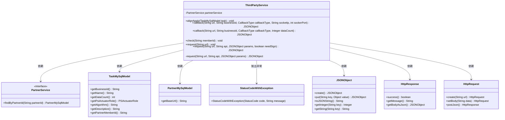
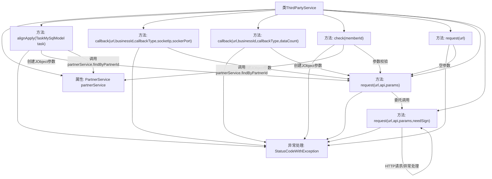

# 基础信息

|      |      |
|------|------|
| 名称 | ThirdPartyService |
| 编码语言 | .java |
| 代码路径 | WeFe/fusion/fusion-service/src/main/java/com/welab/wefe/data/fusion/service/service/ThirdPartyService.java |
| 包名 | com.welab.wefe.data.fusion.service.service |
| 依赖项 | ['com.alibaba.fastjson.JSONObject', 'com.welab.wefe.common.StatusCode', 'com.welab.wefe.common.exception.StatusCodeWithException', 'com.welab.wefe.common.http.HttpRequest', 'com.welab.wefe.common.http.HttpResponse', 'com.welab.wefe.common.util.JObject', 'com.welab.wefe.common.util.RSAUtil', 'com.welab.wefe.data.fusion.service.database.entity.PartnerMySqlModel', 'com.welab.wefe.data.fusion.service.database.entity.TaskMySqlModel', 'com.welab.wefe.data.fusion.service.enums.CallbackType', 'com.welab.wefe.data.fusion.service.enums.PSIActuatorRole', 'org.springframework.beans.factory.annotation.Autowired', 'org.springframework.stereotype.Service', 'java.util.TreeMap'] |
| 概述说明 | ThirdPartyService提供第三方服务交互功能，包括任务对齐请求、回调处理和远程检查。通过RSA签名确保请求安全，处理异常状态码。 |

# 说明

ThirdPartyService是一个处理第三方服务交互的类，主要功能包括任务对齐申请、回调处理和远程检查。alignApply方法根据任务参数构建请求并发送至合作方，若合作方信息不存在则抛出异常。提供两种callback方法，分别处理带socket信息或数据量的回调请求。check方法验证合作方成员是否存在。核心request方法处理HTTP请求，支持RSA签名验证，确保数据有序性，并处理响应状态码和错误信息。所有方法均可能抛出StatusCodeWithException异常以反馈错误状态。

# 类列表 Class Summary

| 名称   | 类型  | 说明 |
|-------|------|-------------|
| ThirdPartyService | class | ThirdPartyService提供与第三方交互的功能，包括任务对齐请求、回调处理和远程检查，支持参数签名和错误处理。 |

## 类 ThirdPartyService

|      |      |
|------|------|
| 访问范围 | @Service;public |
| 类型 | class |
| 名称 | ThirdPartyService |
| 说明 | ThirdPartyService提供与第三方交互的功能，包括任务对齐请求、回调处理和远程检查，支持参数签名和错误处理。 |

### UML类图

这段代码展示了一个第三方服务类`ThirdPartyService`，它通过`PartnerService`接口与合作伙伴系统交互，主要功能包括任务对齐申请、回调通知和远程检查。类图清晰地呈现了核心类及其关系：`ThirdPartyService`依赖多个模型类和服务接口，使用`HttpRequest`发起网络请求，处理`JSONObject`数据格式，并通过`StatusCodeWithException`处理异常情况。流程中涉及签名验证、参数组装和响应处理等关键步骤，体现了完整的外部系统交互逻辑。

### 内部方法调用关系图

该流程图展示了ThirdPartyService类的核心结构和调用关系。该类主要处理与第三方服务的交互，包含请求对齐(alignApply)、回调处理(callback)、远程检查(check)等核心方法，最终都通过request方法实现HTTP请求。流程特别强调了异常处理机制(StatusCodeWithException)和关键业务逻辑，如参数构建、RSA签名验证和HTTP通信。所有公共方法最终都会调用私有request方法完成实际请求，该方法实现了参数处理、签名验证和响应解析等核心功能。

### 字段列表 Field List

| 名称  | 类型  | 说明 |
|-------|-------|------|
| partnerService | PartnerService | 自动注入PartnerService实例。 |

### 方法列表

| 名称  | 类型  | 说明 |
|-------|-------|------|
| check | void | 检查成员ID有效性，若不存在则抛出异常；存在则请求其基础URL。 |
| callback | JSONObject | Java方法：通过URL回调第三方服务，传递业务ID、回调类型和数据量参数，返回JSON响应。 |
| alignApply | void | 方法alignApply接收TaskMySqlModel参数，构建包含业务ID、名称等字段的JSON对象，校验合作方信息后向合作方URL发送任务请求。若合作方不存在则抛出异常。 |
| callback | JSONObject | 方法`callback`通过URL调用第三方接口，传递业务ID、回调类型、IP和端口参数，返回JSON结果。可能抛出异常。 |
| request | void | 该方法通过给定URL发起请求，调用第三方远程检查接口，无参数传递，可能抛出状态码异常。 |
| request | JSONObject | 私有方法：通过URL和API发送JSON请求，参数为params，默认处理异常，返回JSONObject。 |
| request | JSONObject | 该方法通过URL和API发送JSON请求，支持RSA签名。参数排序防篡改，签名失败或响应错误时抛出异常，成功返回JSON结果。 |

