# 基础信息

|      |      |
|------|------|
| 名称 | service |
| 编码语言 | .java |
| 代码路径 | WeFe/fusion/fusion-service/src/main/java/com/welab/wefe/data/fusion/service/service |
| 包名 | docs.fusion.fusion-service.src.main.java.com.welab.wefe.data.fusion.service.service |
| 概述说明 | 布隆过滤器管理模块负责创建、更新、查询及监控，支持多线程和加密校验。全局配置模块管理成员信息和邮件设置，支持分组操作。数据集模块处理创建、状态跟踪和批量处理。任务服务管理任务状态、统计和请求处理。系统初始化服务检查并初始化系统配置。合作伙伴服务管理合作伙伴数据。存储服务提供数据库操作功能。单点登录服务处理账户初始化和更新。抽象服务提供日志功能。数据存储服务管理表操作。字段信息服务处理字段列名和属性。任务结果服务管理结果表。回调服务处理任务回调。缓存工具类管理静态数据。隐私数据加密服务处理数据库加密。数据源服务管理数据源连接和验证。表头服务获取数据集表头。第三方服务处理合作方交互。操作日志服务查询日志记录。 |

# 说明

## 概述  
该模块核心职责是构建数据融合平台的核心服务层，提供布隆过滤器管理、全局配置管理、数据集生命周期管理和任务调度四大核心能力。接口规范遵循分层设计，包含CRUD操作（如`increment`计数更新）、状态监控（如`GetBloomFilterStateService`）和批量处理（类似事件总线模式）。关键数据结构包括布隆过滤器实例、MailServerModel（SMTP参数）、数据集动态表名（DATA_SET_TABLE_PRE+ID）和任务模型。外部依赖涉及MySQL（通过JPA/Hibernate）、RSA加密、Spring框架和文件系统IO，例如通过JdbcManager处理SQL数据源连接。

## 主要业务场景  
典型应用模式为隐私计算工作流：1) 系统初始化（SystemInitializeService生成RSA密钥）→2) 数据准备（DataSetAddService加载CSV/SQL数据）→3) 安全计算（TaskService处理RSA-PSI算法）→4) 结果回调（CallbackService状态同步）。交互模式融合生产者-消费者模型（如10,000行批次处理）和配置中心模式（GlobalConfigService管理多租户参数）。功能完整性体现在加密校验（不超过5字段组合）、线程安全操作（如CacheObjects缓存同步）和异常处理（如StatusCodeWithException）。API类型覆盖管理类（PartnerService增删改查）、监控类（OperationLogService日志查询）和集成类（ThirdPartyService跨节点通信）。

### 包内部结构视图

```mermaid
graph TD
    service --> bloomfilter
    service --> globalconfig
    service --> dataset
    service --> TaskService.java
    service --> SystemInitializeService.java
    service --> PartnerService.java
    service --> FusionStorageService.java
    service --> AccountService.java
    service --> AbstractService.java
    service --> DataStorageService.java
    service --> FieldInfoService.java
    service --> TaskResultService.java
    service --> CallbackService.java
    service --> CacheObjects.java
    service --> PrivacyDatabaseEncryptService.java
    service --> DataSourceService.java
    service --> GetHeadersService.java
    service --> ThirdPartyService.java
    service --> OperationLogService.java
    bloomfilter --> BloomFilterAddServiceDataRowConsumer.java
    bloomfilter --> BloomFilterService.java
    bloomfilter --> BloomFilterAddService.java
    bloomfilter --> GetBloomFilterStateService.java
    globalconfig --> GlobalConfigService.java
    globalconfig --> MailServerModel.java
    globalconfig --> BaseGlobalConfigService.java
    dataset --> DataSetAddService.java
    dataset --> GetDataSetStateService.java
    dataset --> DataSetAddServiceDataRowConsumer.java
    dataset --> DataSetService.java
    dataset --> DataSetStorageHelper.java
```

该流程图展示了WeFe项目中fusion-service模块的Java服务类层级结构。根节点"service"下包含三个子目录（bloomfilter、globalconfig、dataset）和多个直接服务类文件。每个子目录又包含各自的服务实现类，如bloomfilter目录下包含布隆过滤器相关服务，globalconfig目录包含全局配置服务，dataset目录包含数据集服务。整体结构清晰地反映了服务类的组织方式。

# 文件列表

| 名称   | 类型  | 说明 |
|-------|------|-------------|
| [TaskService.java](TaskService.md) | file | TaskService类提供任务管理功能，包括查找、更新、添加、处理任务，支持RSA-PSI算法和布隆过滤器操作，涉及任务状态管理、数据资源处理和第三方服务交互。 |
| [SystemInitializeService.java](SystemInitializeService.md) | file | SystemInitializeService用于系统初始化，检查是否已初始化并通过initialize方法设置成员信息，包括生成RSA密钥对。若重复初始化会抛出异常。 |
| [PartnerService.java](PartnerService.md) | file | PartnerService类提供合作伙伴管理功能，包括查询、添加、更新、删除和分页查询。通过memberId检查合作伙伴是否存在，确保数据唯一性。使用Repository进行数据库操作，支持条件查询和分页。 |
| [FusionStorageService.java](FusionStorageService.md) | file | FusionStorageService是一个Spring服务类，通过MysqlStorage实现数据库表的创建、删除、数据插入、批量保存和计数功能，并捕获异常记录日志。 |
| [AccountService.java](AccountService.md) | file | AccountService处理SSO登录，检查系统初始化，查询或创建账户，更新信息并返回登录结果。 |
| [AbstractService.java](AbstractService.md) | file | 抽象服务类提供日志记录功能，包含日志对象和异常日志方法。 |
| [DataStorageService.java](DataStorageService.md) | file | DataStorageService类提供数据库表操作功能，包括创建表、删除表、插入数据、批量保存及数据计数，依赖FusionStorageService实现具体操作。 |
| [FieldInfoService.java](FieldInfoService.md) | file | FieldInfoService类提供字段信息管理功能，包括按businessId查询字段列表、字段信息列表，以及批量保存字段信息。通过FieldInfoRepository操作数据库，支持条件查询和排序。 |
| [TaskResultService.java](TaskResultService.md) | file | TaskResultService类提供任务结果表操作，包括创建表、插入数据、批量保存及生成表名功能，依赖DataStorageService实现存储逻辑。 |
| [CallbackService.java](CallbackService.md) | file | CallbackService处理回调请求，根据类型执行不同操作：running启动客户端任务，init更新任务状态，success结束任务，stop停止任务。涉及TaskService、TaskRepository和PartnerService协作。 |
| [CacheObjects.java](CacheObjects.md) | file | CacheObjects类管理静态缓存数据，包括成员信息、密钥、端口及多个映射表（合作伙伴、布隆过滤器、数据集、账户）。提供获取和刷新这些数据的方法，确保数据最新。支持判断成员和账户归属。 |
| [PrivacyDatabaseEncryptService.java](PrivacyDatabaseEncryptService.md) | file | PrivacyDatabaseEncryptService类用于加密数据库隐私数据，包含三个加密方法：账户、全局配置和数据源，均更新修改时间并保存。 |
| [DataSourceService.java](DataSourceService.md) | file | DataSourceService提供数据源管理功能，包括增删改查、测试连接、SQL查询验证及文件获取。支持数据库连接测试，确保数据源有效性，并统计数据集和布隆过滤器数量。 |
| [GetHeadersService.java](GetHeadersService.md) | file | GetHeadersService类根据输入源（数据库或文件）获取数据表头。若为数据库，通过SQL查询获取；若为文件，根据文件类型（CSV或Excel）读取表头。处理异常并记录日志。 |
| [ThirdPartyService.java](ThirdPartyService.md) | file | ThirdPartyService提供第三方服务交互功能，包括任务对齐请求、回调处理和远程检查。通过RSA签名确保请求安全，处理异常状态码。 |
| [OperationLogService.java](OperationLogService.md) | file | OperationLogService提供分页查询操作日志功能，支持按调用者、API名称和时间范围筛选，结果按创建时间降序排列。 |
| [dataset](dataset/_module.md) | package | DataSetAddService处理数据集添加，验证参数并存储数据。GetDataSetStateService更新数据集状态和进度。DataSetAddServiceDataRowConsumer批量处理数据行。DataSetService管理数据集操作。DataSetStorageHelper处理数据集存储和统计。 |
| [globalconfig](globalconfig/_module.md) | package | GlobalConfigService继承BaseGlobalConfigService，提供配置管理功能，包括更新配置、RSA密钥、成员信息等。MailServerModel封装邮件服务器配置信息。BaseGlobalConfigService管理分组配置，支持增删改查及序列化操作。 |
| [bloomfilter](bloomfilter/_module.md) | package | BloomFilterAddServiceDataRowConsumer处理数据生成布隆过滤器，支持多线程和批量操作。BloomFilterService提供增删改查及数据预览功能，操作MySQL数据库。BloomFilterAddService实现过滤器添加、数据读取和检查功能。GetBloomFilterStateService管理过滤器状态更新和查询。 |

