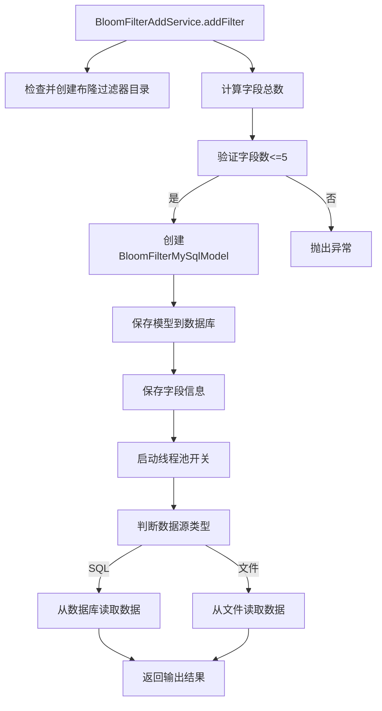
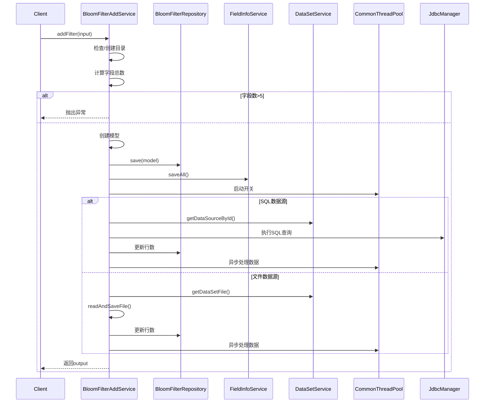

# 基础信息

|      |      |
|------|------|
| 名称 | BloomFilterAddService |
| 编码语言 | .java |
| 代码路径 | WeFe/fusion/fusion-service/src/main/java/com/welab/wefe/data/fusion/service/service/bloomfilter/BloomFilterAddService.java |
| 包名 | com.welab.wefe.data.fusion.service.service.bloomfilter |
| 依赖项 | ['com.welab.wefe.common.CommonThreadPool', 'com.welab.wefe.common.StatusCode', 'com.welab.wefe.common.exception.StatusCodeWithException', 'com.welab.wefe.common.util.JObject', 'com.welab.wefe.common.util.StringUtil', 'com.welab.wefe.common.web.Launcher', 'com.welab.wefe.common.web.util.CurrentAccountUtil', 'com.welab.wefe.data.fusion.service.api.bloomfilter.AddApi', 'com.welab.wefe.data.fusion.service.config.Config', 'com.welab.wefe.data.fusion.service.database.entity.BloomFilterMySqlModel', 'com.welab.wefe.data.fusion.service.database.entity.DataSourceMySqlModel', 'com.welab.wefe.data.fusion.service.database.repository.BloomFilterRepository', 'com.welab.wefe.data.fusion.service.enums.DataResourceSource', 'com.welab.wefe.data.fusion.service.enums.Progress', 'com.welab.wefe.data.fusion.service.manager.JdbcManager', 'com.welab.wefe.data.fusion.service.service.AbstractService', 'com.welab.wefe.data.fusion.service.service.FieldInfoService', 'com.welab.wefe.data.fusion.service.service.dataset.DataSetService', 'com.welab.wefe.data.fusion.service.utils.AbstractDataSetReader', 'com.welab.wefe.data.fusion.service.utils.CsvDataSetReader', 'com.welab.wefe.data.fusion.service.utils.ExcelDataSetReader', 'com.welab.wefe.data.fusion.service.utils.bf.BloomFilters', 'com.welab.wefe.data.fusion.service.utils.primarykey.FieldInfo', 'com.welab.wefe.data.fusion.service.utils.primarykey.PrimaryKeyUtils', 'com.welab.wefe.fusion.core.utils.CryptoUtils', 'com.welab.wefe.fusion.core.utils.PSIUtils', 'org.apache.commons.lang3.StringUtils', 'org.springframework.beans.factory.annotation.Autowired', 'org.springframework.stereotype.Service', 'org.springframework.transaction.annotation.Transactional', 'java.io.File', 'java.io.FileReader', 'java.io.IOException', 'java.io.LineNumberReader', 'java.math.BigInteger', 'java.nio.file.Paths', 'java.security.SecureRandom', 'java.sql.Connection', 'java.util.ArrayList', 'java.util.Date', 'java.util.List'] |
| 概述说明 | BloomFilterAddService类提供布隆过滤器添加功能，支持从数据库或文件读取数据，校验加密组合复杂度，保存模型信息，并处理数据源。包含数据解析、线程池操作及加密校验逻辑。 |

# 说明

该代码实现了一个布隆过滤器服务，主要功能包括添加过滤器、从文件或数据库读取数据并保存到MySQL、以及检查数据是否存在于过滤器中。服务首先验证输入参数，确保加密组合不超过5个字段。然后根据数据来源（SQL或文件）分别处理，读取数据并生成布隆过滤器。检查功能通过盲因子和加密技术验证数据是否匹配。整个过程涉及目录创建、数据解析、多线程处理和异常捕获。

# 类列表 Class Summary

| 名称   | 类型  | 说明 |
|-------|------|-------------|
| BloomFilterAddService | class | BloomFilterAddService类提供布隆过滤器添加功能，支持从数据库或文件读取数据，处理字段组合限制，保存模型信息，并包含数据校验逻辑。 |


## 类 BloomFilterAddService

|      |      |
|------|------|
| 访问范围 | @Service;public |
| 类型 | class |
| 名称 | BloomFilterAddService |
| 说明 | BloomFilterAddService类提供布隆过滤器添加功能，支持从数据库或文件读取数据，处理字段组合限制，保存模型信息，并包含数据校验逻辑。 |


### UML类图

```mermaid
classDiagram
    class BloomFilterAddService {
        -BloomFilterRepository bloomFilterRepository
        -DataSetService dataSetService
        -Config config
        -FieldInfoService fieldInfoService
        +addFilter(AddApi~Input~ input) AddApi~BloomfilterAddOutput~
        -readAndSaveFile(BloomFilterMySqlModel model, File file, List~String~ idFeatureFields) int
        +readAndSaveFromDB(BloomFilterMySqlModel model, List~String~ headers) int
        +CheckFilter(String id, BigInteger N, BigInteger e, BigInteger d, List~Object~ CheckData, BloomFilters~BigInteger~ bf) boolean
    }

    class AbstractService {
        <<Abstract>>
    }

    class BloomFilterRepository {
        <<Interface>>
        +save(BloomFilterMySqlModel model)
        +updateById(String id, String field, Object value, Class~T~ clazz)
    }

    class DataSetService {
        <<Interface>>
        +getDataSetFile(DataResourceSource source, String filename) File
        +getDataSourceById(String id) DataSourceMySqlModel
    }

    class FieldInfoService {
        <<Interface>>
        +saveAll(String modelId, List~FieldInfo~ fieldInfos)
        +fieldInfoList(String id) List~FieldInfo~
    }

    class Config {
        -String bloomFilterDir
        +String getBloomFilterDir()
    }

    class BloomFilterMySqlModel {
        -String id
        -String description
        -DataResourceSource dataResourceSource
        -String name
        -String rows
        -int usedCount
        -int rowCount
        -Date updatedTime
        -String statement
        -String sourcePath
        -String dataSourceId
        -String hashFunction
        -String src
        -int processCount
        // getters/setters
    }

    class AddApi {
        class Input {
            -List~FieldInfo~ fieldInfoList
            -String description
            -DataResourceSource dataResourceSource
            -String name
            -List~String~ rows
            -String sql
            -String filename
            -String dataSourceId
            // getters/setters
        }
        class BloomfilterAddOutput {
            -String dataSourceId
            +setDataSourceId(String id)
        }
    }

    class FieldInfo {
        -List~String~ columnList
        // getters/setters
    }

    class DataResourceSource {
        <<Enumeration>>
        Sql
        File
    }

    class BloomFilterAddServiceDataRowConsumer {
        -BloomFilterMySqlModel model
        -File file
        // 消费逻辑实现
    }

    AbstractService <|-- BloomFilterAddService
    BloomFilterAddService --> BloomFilterRepository : 依赖
    BloomFilterAddService --> DataSetService : 依赖
    BloomFilterAddService --> FieldInfoService : 依赖
    BloomFilterAddService --> Config : 依赖
    BloomFilterAddService --> AddApi : 使用输入输出
    BloomFilterAddService --> BloomFilterMySqlModel : 操作
    BloomFilterAddService --> FieldInfo : 处理字段信息
    BloomFilterAddService --> BloomFilterAddServiceDataRowConsumer : 创建使用
    DataSetService --> DataSourceMySqlModel : 查询
    AddApi .. Input
    AddApi .. BloomfilterAddOutput
```

类图描述：该图展示了BloomFilterAddService的核心结构，它继承自AbstractService并依赖多个服务接口（BloomFilterRepository、DataSetService、FieldInfoService）和配置类（Config）。主要功能包括通过addFilter方法处理布隆过滤器添加请求，根据数据来源（SQL或文件）调用readAndSaveFromDB或readAndSaveFile方法，并使用BloomFilterAddServiceDataRowConsumer进行数据消费。同时包含CheckFilter方法用于校验数据匹配情况，涉及加密运算和布隆过滤器查询。


### 内部方法调用关系图





该流程图展示了BloomFilterAddService的核心方法addFilter的处理流程，主要包含目录检查、参数验证、模型创建、数据源判断和异步处理等关键步骤。时序图详细描述了客户端调用到服务内部各组件交互的过程，包括异常处理、数据库操作和线程池调度等关键交互节点。整个过程严格遵循事务性操作，确保数据一致性，同时支持SQL和文件两种数据源的处理方式。

### 字段列表 Field List

| 名称  | 类型  | 说明 |
|-------|-------|------|
| bloomFilterRepository | BloomFilterRepository | 使用@Autowired自动注入BloomFilterRepository实例。 |
| fieldInfoService | FieldInfoService | 自动注入FieldInfoService服务实例。 |
| config | Config | 自动注入Config配置实例。 |
| dataSetService | DataSetService | 自动注入DataSetService实例。 |

### 方法列表

| 名称  | 类型  | 说明 |
|-------|-------|------|
| addFilter | AddApi.BloomfilterAddOutput | 该方法用于添加布隆过滤器，检查参数合法性后创建并保存模型，根据数据源类型从数据库或文件读取数据生成过滤器，最后返回数据源ID。异常时回滚事务。 |
| readAndSaveFile | int | 方法读取文件数据并保存，支持CSV和Excel格式，计算行数后更新数据库，创建目录并处理数据行，最后返回总行数。 |
| readAndSaveFromDB | int | 方法从数据库读取数据并保存，检查数据源有效性，统计行数，更新处理状态，创建目录，异步处理数据后返回行数。 |
| CheckFilter | boolean | 该方法检查数据是否存在于布隆过滤器中。步骤如下：1.获取字段信息；2.生成盲因子；3.处理主键并加密；4.签名查询数据；5.验证匹配结果。匹配成功返回true，否则false。 |


