# 基础信息

|      |      |
|------|------|
| 名称 | BloomFilterAddServiceDataRowConsumer |
| 编码语言 | .java |
| 代码路径 | WeFe/fusion/fusion-service/src/main/java/com/welab/wefe/data/fusion/service/service/bloomfilter/BloomFilterAddServiceDataRowConsumer.java |
| 包名 | com.welab.wefe.data.fusion.service.service.bloomfilter |
| 依赖项 | ['java.io.File', 'java.io.FileOutputStream', 'java.io.IOException', 'java.math.BigInteger', 'java.util.List', 'java.util.Map', 'java.util.concurrent.CopyOnWriteArrayList', 'java.util.concurrent.ExecutorService', 'java.util.concurrent.Executors', 'java.util.concurrent.TimeUnit', 'java.util.concurrent.atomic.AtomicInteger', 'java.util.function.Consumer', 'org.bouncycastle.crypto.AsymmetricCipherKeyPair', 'org.bouncycastle.crypto.params.RSAKeyParameters', 'org.bouncycastle.crypto.params.RSAPrivateCrtKeyParameters', 'org.slf4j.Logger', 'org.slf4j.LoggerFactory', 'org.springframework.beans.factory.annotation.Autowired', 'com.welab.wefe.common.BatchConsumer', 'com.welab.wefe.common.util.JObject', 'com.welab.wefe.common.web.Launcher', 'com.welab.wefe.data.fusion.service.database.entity.BloomFilterMySqlModel', 'com.welab.wefe.data.fusion.service.database.repository.BloomFilterRepository', 'com.welab.wefe.data.fusion.service.enums.Progress', 'com.welab.wefe.data.fusion.service.service.FieldInfoService', 'com.welab.wefe.data.fusion.service.utils.bf.BloomFilters', 'com.welab.wefe.data.fusion.service.utils.primarykey.FieldInfo', 'com.welab.wefe.data.fusion.service.utils.primarykey.PrimaryKeyUtils', 'com.welab.wefe.fusion.core.utils.CryptoUtils', 'com.welab.wefe.fusion.core.utils.PSIUtils'] |
| 概述说明 | BloomFilterAddServiceDataRowConsumer类实现Consumer接口，用于批量处理数据并生成布隆过滤器。包含RSA密钥对、布隆过滤器操作、多线程处理及进度跟踪功能。支持批量消费数据，通过线程池加速处理，最终将结果写入文件。 |

# 说明

BloomFilterAddServiceDataRowConsumer是一个实现Consumer接口的类，主要用于处理数据并生成布隆过滤器。它包含多个关键属性，如布隆过滤器实例、RSA密钥参数、进度跟踪和批量处理工具。类中提供了生成布隆过滤器的两种方法：多线程优化版本和单线程版本。通过批量消费数据，将处理后的数据添加到布隆过滤器中，并支持进度更新和结果保存。同时包含数据校验和线程安全操作的功能。

# 类列表 Class Summary

| 名称   | 类型  | 说明 |
|-------|------|-------------|
| BloomFilterAddServiceDataRowConsumer | class | BloomFilterAddServiceDataRowConsumer类实现Consumer接口，用于批量处理数据并生成布隆过滤器。包含RSA密钥对、布隆过滤器操作、多线程处理及进度跟踪功能。支持批量消费数据，通过线程池加速处理，最终将结果写入文件。 |


## 类 BloomFilterAddServiceDataRowConsumer

|      |      |
|------|------|
| 访问范围 | public |
| 类型 | class |
| 名称 | BloomFilterAddServiceDataRowConsumer |
| 说明 | BloomFilterAddServiceDataRowConsumer类实现Consumer接口，用于批量处理数据并生成布隆过滤器。包含RSA密钥对、布隆过滤器操作、多线程处理及进度跟踪功能。支持批量消费数据，通过线程池加速处理，最终将结果写入文件。 |


### UML类图

```mermaid
classDiagram
    class BloomFilterAddServiceDataRowConsumer {
        -Logger LOG
        -BloomFilterRepository bloomFilterRepository
        -String src
        -AsymmetricCipherKeyPair keyPair
        -BloomFilters~BigInteger~ bf
        -RSAKeyParameters pk
        -BigInteger e
        -BigInteger N
        -RSAPrivateCrtKeyParameters sk
        -BigInteger d
        -List~FieldInfo~ fieldInfoList
        -Integer processCount
        -AtomicInteger checkCount
        -Progress process
        -List~Object~ CheckData
        -BloomFilterMySqlModel model
        -BatchConsumer~Map~String,Object~~ batchConsumer
        +BloomFilters~BigInteger~ getBf()
        +void setBf(BloomFilters~BigInteger~ bf)
        +BigInteger getE()
        +void setE(BigInteger e)
        +BigInteger getN()
        +void setN(BigInteger n)
        +BigInteger getD()
        +void setD(BigInteger d)
        +Integer getProcessCount()
        +void setProcessCount(Integer processCount)
        +Progress getProcess()
        +void setProcess(Progress process)
        +List~Object~ getCheckData()
        +BloomFilterMySqlModel getModel()
        +BloomFilterAddServiceDataRowConsumer(BloomFilterMySqlModel model, File file)
        +void accept(Map~String,Object~ data)
        +void generateFilter(BloomFilterMySqlModel model, List~Map~String,Object~~ rows)
        +void generateFilterSlown(BloomFilterMySqlModel model, List~Map~String,Object~~ rows)
        +void waitForFinishAndClose()
        +AtomicInteger getCheckCount()
        +void setCheckCount(AtomicInteger checkCount)
        +void setCheckData(List~Object~ checkData)
        +synchronized void addToBf(BigInteger z)
    }

    class BloomFilterRepository {
        <<Interface>>
        +save(BloomFilterMySqlModel model)
        +updateById(String id, String field, Object value, Class~T~ clazz)
        +findOne(String field, Object value, Class~T~ clazz)
    }

    class BloomFilters~T~ {
        <<Interface>>
        +add(T element)
        +writeTo(OutputStream out)
        +size()
    }

    class BatchConsumer~T~ {
        +BatchConsumer(int batchSize, int maxWaitTime, Consumer~List~T~~ processor)
        +add(T item)
        +waitForFinishAndClose()
    }

    class BloomFilterMySqlModel {
        +String id
        +String src
        +Progress process
        +Integer processCount
        +Integer rowCount
        +String d
        +String n
        +String e
        +getProcessCount()
        +getRowCount()
        +getId()
        +getSrc()
        +setD(String d)
        +setN(String n)
        +setE(String e)
        +setSrc(String src)
        +setProcess(Progress process)
    }

    class FieldInfo {
        // 字段信息类
    }

    class Progress {
        <<Enumeration>>
        Ready
        Running
        Success
    }

    BloomFilterAddServiceDataRowConsumer --> BloomFilterRepository : 依赖
    BloomFilterAddServiceDataRowConsumer --> BloomFilters~BigInteger~ : 使用
    BloomFilterAddServiceDataRowConsumer --> BatchConsumer~Map~String,Object~~ : 组合
    BloomFilterAddServiceDataRowConsumer --> BloomFilterMySqlModel : 关联
    BloomFilterAddServiceDataRowConsumer --> FieldInfo : 关联
    BloomFilterAddServiceDataRowConsumer --> Progress : 使用
```

该类图展示了BloomFilterAddServiceDataRowConsumer的核心结构，它是一个实现Consumer接口的布隆过滤器数据处理服务。主要功能包括：通过线程池批量处理数据、使用RSA加密算法处理数据、维护处理状态(Progress枚举)，并通过BloomFilterRepository持久化数据。类中包含多个加密相关参数(BigInteger e/N/d)和并发控制组件(AtomicInteger checkCount)，通过BatchConsumer实现高效批量消费。与BloomFilterMySqlModel保持强关联，用于存储处理进度和参数配置。


### 内部方法调用关系图

```mermaid
graph TD
    A["类BloomFilterAddServiceDataRowConsumer"]
    B["属性: Logger LOG"]
    C["属性: BloomFilterRepository bloomFilterRepository"]
    D["属性: String src"]
    E["属性: AsymmetricCipherKeyPair keyPair"]
    F["属性: BloomFilters<BigInteger> bf"]
    G["属性: RSAKeyParameters pk"]
    H["属性: BigInteger e/N/d"]
    I["属性: RSAPrivateCrtKeyParameters sk"]
    J["属性: List<FieldInfo> fieldInfoList"]
    K["属性: Integer processCount"]
    L["属性: AtomicInteger checkCount"]
    M["属性: Progress process"]
    N["属性: List<Object> CheckData"]
    O["属性: BloomFilterMySqlModel model"]
    P["属性: BatchConsumer<Map> batchConsumer"]
    Q["构造方法: BloomFilterAddServiceDataRowConsumer"]
    R["方法: generateFilter"]
    S["方法: generateFilterSlown"]
    T["方法: waitForFinishAndClose"]
    U["方法: addToBf"]
    V["方法: 多组getter/setter"]

    A --> B
    A --> C
    A --> D
    A --> E
    A --> F
    A --> G
    A --> H
    A --> I
    A --> J
    A --> K
    A --> L
    A --> M
    A --> N
    A --> O
    A --> P
    A --> Q
    Q --> R
    Q --> S
    A --> T
    A --> U
    A --> V
    R -->|"线程池处理"| U
    S -->|"单线程处理"| F
```



该流程图展示了BloomFilterAddServiceDataRowConsumer类的完整结构，包含18个核心属性和5个关键方法。构造方法初始化布隆过滤器参数并启动批处理消费者，generateFilter方法通过线程池并行处理数据加密和过滤器添加操作，generateFilterSlown提供单线程处理路径，waitForFinishAndClose确保消费队列完成。类中使用了多种加密参数(RSA密钥对)和并发控制机制(AtomicInteger/CopyOnWriteArrayList)，通过BatchConsumer实现高效批量处理，最终将布隆过滤器数据持久化到文件系统。

### 字段列表 Field List

| 名称  | 类型  | 说明 |
|-------|-------|------|
| processCount = 0 | Integer | 定义一个私有整型变量processCount，初始值为0。 |
| N | BigInteger | 声明一个私有的大整数变量N。 |
| e | BigInteger | 私有的大整数变量e。 |
| bloomFilterRepository | BloomFilterRepository | 自动注入布隆过滤器存储库实例。 |
| d | BigInteger | 私有的大整数变量d。 |
| keyPair | AsymmetricCipherKeyPair | 非对称加密密钥对 |
| LOG = LoggerFactory.getLogger(this.getClass()) | Logger | 定义当前类的日志记录器实例LOG，用于输出日志信息。 |
| CheckData = new CopyOnWriteArrayList<>() | List<Object> | 定义一个线程安全的动态数组CheckData，使用CopyOnWriteArrayList实现。 |
| bf | BloomFilters<BigInteger> | 私有布隆过滤器，存储大整数类型。 |
| process | Progress | 私有进度对象process |
| src | String | 私有字符串变量src声明。 |
| checkCount = new AtomicInteger(0) | AtomicInteger | 定义一个线程安全的整型变量checkCount，初始值为0，用于多线程环境下的计数操作。 |
| sk | RSAPrivateCrtKeyParameters | 私钥参数：RSAPrivateCrtKeyParameters类型变量sk。 |
| pk | RSAKeyParameters | 私钥RSA参数 |
| fieldInfoList | List<FieldInfo> | 字段信息列表，存储FieldInfo对象集合。 |
| batchConsumer | BatchConsumer<Map<String, Object>> | 私有批量消费者，处理Map<String, Object>类型数据。 |
| model | BloomFilterMySqlModel | 私有成员变量model，类型为BloomFilterMySqlModel。 |

### 方法列表

| 名称  | 类型  | 说明 |
|-------|-------|------|
| generateFilterSlown | void | 方法生成布隆过滤器，处理数据行并计算哈希值存入过滤器。处理完成后更新数据库状态并保存过滤器到文件。记录耗时和日志。 |
| generateFilter | void | 方法生成布隆过滤器，使用120线程池处理数据，计算哈希并添加到过滤器，记录处理时间和数量，完成后更新状态并保存到文件。 |
| getD | BigInteger | Java方法：返回BigInteger类型私有变量d的值。 |
| setN | void | 设置N的值为输入的大整数n。 |
| getBf | BloomFilters<BigInteger> | 获取BigInteger类型的布隆过滤器对象bf。 |
| setProcess | void | 设置进度对象的方法，将传入的process赋值给当前对象的process属性。 |
| setProcessCount | void | 定义了一个公共方法，用于设置整数类型的processCount属性值。 |
| accept | void | 重写accept方法，将传入的Map数据添加到batchConsumer中。 |
| setE | void | 设置公钥指数e的方法，参数为BigInteger类型。 |
| getN | BigInteger | Java方法返回BigInteger类型的N值。 |
| getProcess | Progress | 获取进程对象的方法，返回process变量。 |
| getProcessCount | Integer | 获取进程数量的方法，返回整型值processCount。 |
| getModel | BloomFilterMySqlModel | 获取BloomFilterMySqlModel对象的方法。 |
| setBf | void | 方法setBf用于设置BloomFilters<BigInteger>类型的成员变量bf。 |
| getCheckData | List<Object> | 获取检查数据列表的方法，返回CheckData对象列表。 |
| setCheckData | void | 这是一个Java方法，用于设置CheckData属性，接收一个Object类型的List参数。 |
| waitForFinishAndClose | void | 方法waitForFinishAndClose调用batchConsumer的相同方法，等待完成并关闭。 |
| setD | void | 设置私有变量d的值，参数类型为BigInteger。 |
| getCheckCount | AtomicInteger | 获取检查次数的原子整数值。 |
| setCheckCount | void | 这是一个Java方法，用于设置类的checkCount属性，参数类型为AtomicInteger。 |
| getE | BigInteger | 方法返回BigInteger类型的变量e。 |
| addToBf | void | 同步方法addToBf，将BigInteger类型参数z添加到成员变量bf中。 |


