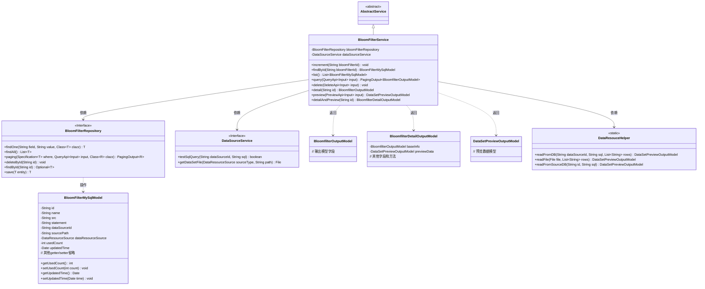

# 基础信息

|      |      |
|------|------|
| 名称 | BloomFilterService |
| 编码语言 | .java |
| 代码路径 | WeFe/fusion/fusion-service/src/main/java/com/welab/wefe/data/fusion/service/service/bloomfilter/BloomFilterService.java |
| 包名 | com.welab.wefe.data.fusion.service.service.bloomfilter |
| 依赖项 | ['com.welab.wefe.common.StatusCode', 'com.welab.wefe.common.data.mysql.Where', 'com.welab.wefe.common.exception.StatusCodeWithException', 'com.welab.wefe.common.util.StringUtil', 'com.welab.wefe.common.web.util.ModelMapper', 'com.welab.wefe.data.fusion.service.api.bloomfilter.DeleteApi', 'com.welab.wefe.data.fusion.service.api.bloomfilter.PreviewApi', 'com.welab.wefe.data.fusion.service.api.bloomfilter.QueryApi', 'com.welab.wefe.data.fusion.service.database.entity.BloomFilterMySqlModel', 'com.welab.wefe.data.fusion.service.database.repository.BloomFilterRepository', 'com.welab.wefe.data.fusion.service.dto.base.PagingOutput', 'com.welab.wefe.data.fusion.service.dto.entity.bloomfilter.BloomfilterDetailOutputModel', 'com.welab.wefe.data.fusion.service.dto.entity.bloomfilter.BloomfilterOutputModel', 'com.welab.wefe.data.fusion.service.dto.entity.dataset.DataSetPreviewOutputModel', 'com.welab.wefe.data.fusion.service.enums.DataResourceSource', 'com.welab.wefe.data.fusion.service.service.AbstractService', 'com.welab.wefe.data.fusion.service.service.DataSourceService', 'com.welab.wefe.data.fusion.service.utils.dataresouce.DataResouceHelper', 'org.springframework.beans.factory.annotation.Autowired', 'org.springframework.data.jpa.domain.Specification', 'org.springframework.stereotype.Service', 'java.io.File', 'java.io.FileNotFoundException', 'java.io.IOException', 'java.nio.file.Paths', 'java.util.Arrays', 'java.util.Date', 'java.util.List'] |
| 概述说明 | BloomFilterService提供布隆过滤器管理功能，包括增删查改、分页查询、详情预览及数据源处理。支持SQL和文件数据源，包含使用计数更新和异常处理。 |

# 说明

该BloomFilterService类是一个服务层组件，继承自AbstractService，主要提供布隆过滤器的增删改查及数据预览功能。它通过BloomFilterRepository操作MySQL数据库，并依赖DataSourceService处理数据源。核心功能包括：通过increment方法更新过滤器使用计数；通过findById和list方法查询数据；query方法支持分页条件查询；delete方法删除过滤器及关联文件；detail方法获取详情；preview方法预览数据源内容（支持SQL查询和文件读取）；detailAndPreview方法组合详情与预览功能。异常处理涵盖数据不存在、文件IO错误等场景，日志记录关键操作。

# 类列表 Class Summary

| 名称   | 类型  | 说明 |
|-------|------|-------------|
| BloomFilterService | class | BloomFilterService提供布隆过滤器管理功能，包括增删改查、预览和详情查询，支持数据库和文件数据源操作。 |

## 类 BloomFilterService

|      |      |
|------|------|
| 访问范围 | @Service;public |
| 类型 | class |
| 名称 | BloomFilterService |
| 说明 | BloomFilterService提供布隆过滤器管理功能，包括增删改查、预览和详情查询，支持数据库和文件数据源操作。 |

### UML类图

这段类图展示了布隆过滤器服务(BloomFilterService)的核心结构，它继承自抽象服务类(AbstractService)，并依赖数据源服务(DataSourceService)和布隆过滤器仓库(BloomFilterRepository)来完成数据操作。服务类通过操作BloomFilterMySqlModel实体类，并返回BloomfilterOutputModel、BloomfilterDetailOutputModel等输出模型，实现了布隆过滤器的增删改查、预览等业务功能。DataResouceHelper作为静态工具类，提供了从数据库和文件读取数据的辅助方法。整个设计体现了分层架构思想，各模块职责明确，通过接口和抽象类实现松耦合。

### 内部方法调用关系图

```mermaid
graph TD
    A["类BloomFilterService"]
    B["属性: BloomFilterRepository bloomFilterRepository"]
    C["属性: DataSourceService dataSourceService"]
    D["方法: increment(String bloomFilterId)"]
    E["方法: findById(String bloomFilterId)"]
    F["方法: list()"]
    G["方法: query(QueryApi.Input input)"]
    H["方法: delete(DeleteApi.Input input)"]
    I["方法: detail(String id)"]
    J["方法: preview(PreviewApi.Input input)"]
    K["方法: detailAndPreview(String id)"]

    A --> B
    A --> C
    A --> D
    A --> E
    A --> F
    A --> G
    A --> H
    A --> I
    A --> J
    A --> K

    D --> E1["bloomFilterRepository.findOne"]
    D --> E2["model.setUsedCount"]
    D --> E3["model.setUpdatedTime"]
    D --> E4["bloomFilterRepository.save"]

    E --> F1["bloomFilterRepository.findOne"]

    F --> G1["bloomFilterRepository.findAll"]

    G --> H1["Where.create"]
    G --> H2["bloomFilterRepository.paging"]

    H --> I1["bloomFilterRepository.findById"]
    H --> I2["bloomFilterRepository.deleteById"]
    H --> I3["file.delete"]

    I --> J1["bloomFilterRepository.findById"]
    I --> J2["ModelMapper.map"]

    J --> K1["findById"]
    J --> K2["dataSourceService.testSqlQuery"]
    J --> K3["DataResouceHelper.readFromDB"]
    J --> K4["dataSourceService.getDataSetFile"]
    J --> K5["DataResouceHelper.readFile"]

    K --> L1["detail"]
    K --> L2["ModelMapper.map"]
    K --> L3["preview"]
```

该流程图展示了BloomFilterService类的结构和主要方法调用关系。类包含两个自动注入的属性和8个核心方法，涉及布隆过滤器的增删改查及预览功能。关键操作包括通过bloomFilterRepository进行数据库交互，使用dataSourceService处理数据源，以及通过DataResouceHelper实现数据读取。方法间存在多层调用关系，如detailAndPreview会调用detail和preview方法，preview方法又可能调用findById和DataResouceHelper的读取方法。整体流程体现了从数据库操作到文件处理的完整数据处理链路。

### 字段列表 Field List

| 名称  | 类型  | 说明 |
|-------|-------|------|
| dataSourceService | DataSourceService | 使用@Autowired自动注入DataSourceService实例。 |
| bloomFilterRepository | BloomFilterRepository | 自动注入布隆过滤器存储库实例。 |

### 方法列表

| 名称  | 类型  | 说明 |
|-------|-------|------|
| increment | void | 该方法通过ID查询布隆过滤器模型，增加其使用计数并更新修改时间，最后保存更改。 |
| list | List<BloomFilterMySqlModel> | 该方法返回一个包含所有BloomFilterMySqlModel对象的列表，数据来源于bloomFilterRepository的findAll查询。 |
| findById | BloomFilterMySqlModel | 根据ID查询布隆过滤器模型，通过仓库方法按ID查找并返回对应模型。 |
| detailAndPreview | BloomfilterDetailOutputModel | 该方法通过ID获取布隆过滤器详情，映射为输出模型后，调用预览接口获取数据集预览，最终合并返回带预览数据的详情模型。 |
| preview | DataSetPreviewOutputModel | 预览数据方法：根据输入源（数据库或文件）读取数据并返回预览结果，处理异常情况如文件不存在或读取错误。 |
| query | PagingOutput<BloomfilterOutputModel> | 该方法通过输入参数构建查询条件，按ID精确匹配和名称模糊匹配筛选数据，返回分页查询结果。 |
| delete | void | 该方法根据输入ID删除数据库记录及关联文件。若记录不存在则直接返回；存在则删除记录，并检查关联文件路径，若文件存在则删除并打印成功信息。 |
| detail | BloomfilterOutputModel | 该方法通过ID查询布隆过滤器数据，若不存在则抛出异常，存在则映射为输出模型并返回。过程中记录日志。 |

