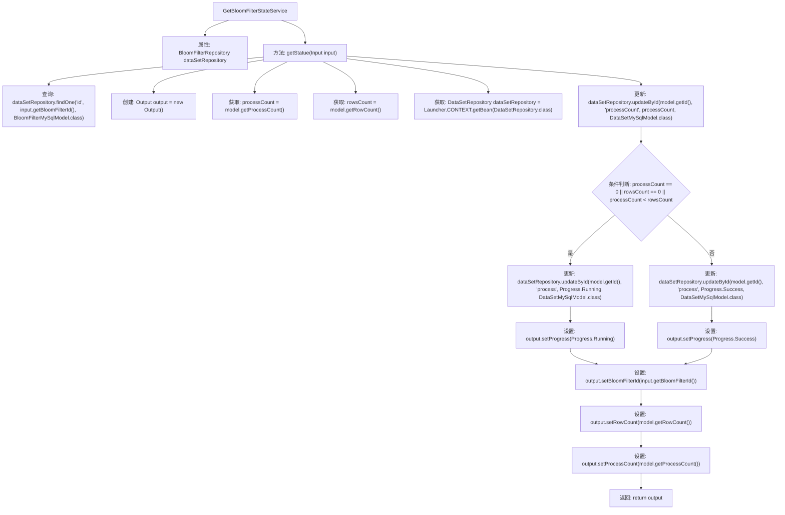

# 基础信息

|      |      |
|------|------|
| 名称 | GetBloomFilterStateService |
| 编码语言 | .java |
| 代码路径 | WeFe/fusion/fusion-service/src/main/java/com/welab/wefe/data/fusion/service/service/bloomfilter/GetBloomFilterStateService.java |
| 包名 | com.welab.wefe.data.fusion.service.service.bloomfilter |
| 依赖项 | ['com.welab.wefe.common.exception.StatusCodeWithException', 'com.welab.wefe.common.web.Launcher', 'com.welab.wefe.data.fusion.service.api.bloomfilter.GetBloomFilterStateApi', 'com.welab.wefe.data.fusion.service.api.bloomfilter.GetBloomFilterStateApi.Output', 'com.welab.wefe.data.fusion.service.database.entity.BloomFilterMySqlModel', 'com.welab.wefe.data.fusion.service.database.entity.DataSetMySqlModel', 'com.welab.wefe.data.fusion.service.database.repository.DataSetRepository', 'com.welab.wefe.data.fusion.service.database.repository.BloomFilterRepository', 'com.welab.wefe.data.fusion.service.enums.Progress', 'com.welab.wefe.data.fusion.service.service.AbstractService', 'org.springframework.beans.factory.annotation.Autowired', 'org.springframework.stereotype.Service', 'java.io.IOException'] |
| 概述说明 | 获取布隆过滤器状态的服务类，根据处理进度更新状态并返回输出结果。若处理完成则标记成功，否则标记为运行中。 |

# 说明

该服务类用于获取并更新布隆过滤器的状态。它通过注入的BloomFilterRepository查询指定ID的布隆过滤器模型，检查其处理计数和行数。若处理计数为零、行数为零或处理计数小于行数，则将状态设为运行中；若处理计数大于等于行数，则设为成功。最后返回包含布隆过滤器ID、行数、处理计数和当前状态的输出对象。过程中会实时更新数据库中的处理计数和状态字段。

# 类列表 Class Summary

| 名称   | 类型  | 说明 |
|-------|------|-------------|
| GetBloomFilterStateService | class | 获取布隆过滤器状态的服务类，通过ID查询数据库记录，比较处理数和行数更新进度状态，返回包含ID、行数和处理数的输出对象。 |


## 类 GetBloomFilterStateService

|      |      |
|------|------|
| 访问范围 | @Service;public |
| 类型 | class |
| 名称 | GetBloomFilterStateService |
| 说明 | 获取布隆过滤器状态的服务类，通过ID查询数据库记录，比较处理数和行数更新进度状态，返回包含ID、行数和处理数的输出对象。 |


### UML类图

```mermaid
classDiagram
    class AbstractService {
        <<abstract>>
    }

    class GetBloomFilterStateService {
        -BloomFilterRepository dataSetRepository
        +Output getStatue(GetBloomFilterStateApi$Input input) throws StatusCodeWithException, IOException
    }

    class BloomFilterRepository {
        <<Interface>>
        +findOne(String fieldName, Object value, Class~T~ clazz) BloomFilterMySqlModel
    }

    class DataSetRepository {
        <<Interface>>
        +updateById(String id, String fieldName, Object value, Class~T~ clazz) void
    }

    class GetBloomFilterStateApi$Input {
        +String getBloomFilterId() String
    }

    class Output {
        -String bloomFilterId
        -int rowCount
        -int processCount
        -Progress progress
        +setBloomFilterId(String bloomFilterId) void
        +setRowCount(int rowCount) void
        +setProcessCount(int processCount) void
        +setProgress(Progress progress) void
    }

    class BloomFilterMySqlModel {
        -String id
        -int processCount
        -int rowCount
        +getId() String
        +getProcessCount() int
        +getRowCount() int
    }

    class DataSetMySqlModel {
        <<Model>>
    }

    enum Progress {
        <<enum>>
        Running
        Success
    }

    AbstractService <|-- GetBloomFilterStateService
    GetBloomFilterStateService --> BloomFilterRepository : 依赖
    GetBloomFilterStateService --> DataSetRepository : 依赖
    GetBloomFilterStateService --> GetBloomFilterStateApi$Input : 使用
    GetBloomFilterStateService --> Output : 返回
    BloomFilterRepository --> BloomFilterMySqlModel : 查询
    DataSetRepository --> DataSetMySqlModel : 更新
```

这段代码展示了一个服务类`GetBloomFilterStateService`，它继承自`AbstractService`，通过`BloomFilterRepository`查询布隆过滤器状态，并使用`DataSetRepository`更新处理进度。根据处理计数和行数的比较结果，设置不同的进度状态（运行中或成功）到输出对象中。类图清晰地展示了各组件间的依赖关系和数据流动路径。


### 内部方法调用关系图



该流程图描述了GetBloomFilterStateService类的核心逻辑流程。服务首先通过BloomFilterId查询数据库获取模型数据，然后根据processCount和rowsCount的比较结果更新处理状态（Running或Success），最后组装输出结果。整个过程包含数据库查询、条件判断、状态更新和数据封装等关键步骤，展示了从输入参数到输出结果的完整处理链条，体现了对布隆过滤器状态管理的业务逻辑。

### 字段列表 Field List

| 名称  | 类型  | 说明 |
|-------|-------|------|
| dataSetRepository | BloomFilterRepository | 自动注入受保护的布隆过滤器数据仓库实例。 |

### 方法列表

| 名称  | 类型  | 说明 |
|-------|-------|------|
| getStatue | Output | 该方法根据输入ID查询布隆过滤器状态，比较处理数和行数更新进度状态为运行中或成功，并返回包含ID、行数和处理数的输出对象。 |


