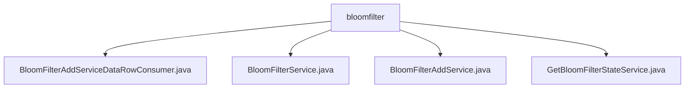

# 基础信息

|      |      |
|------|------|
| 名称 | bloomfilter |
| 编码语言 | .java |
| 代码路径 | WeFe/fusion/fusion-service/src/main/java/com/welab/wefe/data/fusion/service/service/bloomfilter |
| 包名 | docs.fusion.fusion-service.src.main.java.com.welab.wefe.data.fusion.service.service.bloomfilter |
| 概述说明 | BloomFilterAddServiceDataRowConsumer处理数据生成布隆过滤器，支持多线程和批量操作。BloomFilterService提供增删改查及数据预览功能，操作MySQL数据库。BloomFilterAddService实现过滤器添加、数据读取和检查功能。GetBloomFilterStateService管理过滤器状态更新和查询。 |

# 说明

## 概述  
该模块核心职责是实现布隆过滤器的全生命周期管理，包括创建、更新、查询及状态监控，支持多线程数据加载和加密校验。接口规范涵盖CRUD操作、数据预览和状态检查，例如通过`increment`更新使用计数、`preview`查看数据源内容。关键数据结构包含布隆过滤器实例、RSA密钥参数和进度跟踪对象。外部依赖包括MySQL数据库（通过BloomFilterRepository）、数据源服务（DataSourceService）和文件系统IO操作。例如批量消费数据时使用多线程优化版本提升性能。

## 主要业务场景  
典型应用模式为数据融合场景下的隐私保护查询：首先通过`BloomFilterAddService`从SQL或文件加载数据并生成过滤器；然后使用`BloomFilterService`进行分页查询或删除操作；最后通过`GetBloomFilterStateService`监控处理进度。交互模式类似事件总线，例如`BloomFilterAddServiceDataRowConsumer`批量消费数据时触发进度更新。功能完整性体现在支持加密字段校验（不超过5个组合）、异常处理（如文件IO错误）和线程安全操作。API类型包含状态检查API（返回ID/行数/状态）和数据预览API（支持SQL语法解析）。

### 包内部结构视图

该流程图展示了WeFe项目中bloomfilter目录下的文件结构关系。bloomfilter作为父节点，直接包含四个服务类文件：BloomFilterAddServiceDataRowConsumer、BloomFilterService、BloomFilterAddService和GetBloomFilterStateService。这些文件都属于布隆过滤器相关的服务实现类，位于fusion-service模块的特定包路径下，体现了该模块中布隆过滤器功能的实现结构。

# 文件列表

| 名称   | 类型  | 说明 |
|-------|------|-------------|
| [BloomFilterAddServiceDataRowConsumer.java](BloomFilterAddServiceDataRowConsumer.md) | file | BloomFilterAddServiceDataRowConsumer类实现Consumer接口，用于批量处理数据并生成布隆过滤器。包含RSA密钥对、布隆过滤器操作、多线程处理及进度跟踪功能。支持批量消费数据，通过线程池加速处理，最终将结果写入文件。 |
| [BloomFilterService.java](BloomFilterService.md) | file | BloomFilterService提供布隆过滤器管理功能，包括增删查改、分页查询、详情预览及数据源处理。支持SQL和文件数据源，包含使用计数更新和异常处理。 |
| [BloomFilterAddService.java](BloomFilterAddService.md) | file | BloomFilterAddService类提供布隆过滤器添加功能，支持从数据库或文件读取数据，校验加密组合复杂度，保存模型信息，并处理数据源。包含数据解析、线程池操作及加密校验逻辑。 |
| [GetBloomFilterStateService.java](GetBloomFilterStateService.md) | file | 获取布隆过滤器状态的服务类，根据处理进度更新状态并返回输出结果。若处理完成则标记成功，否则标记为运行中。 |

