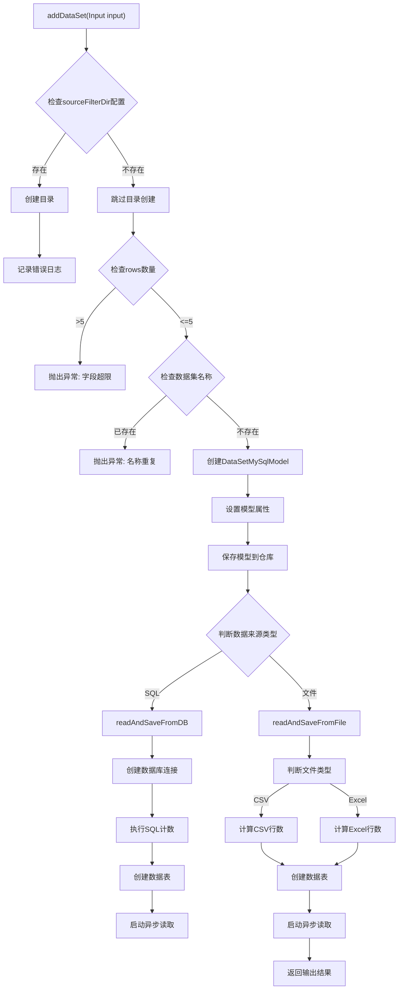
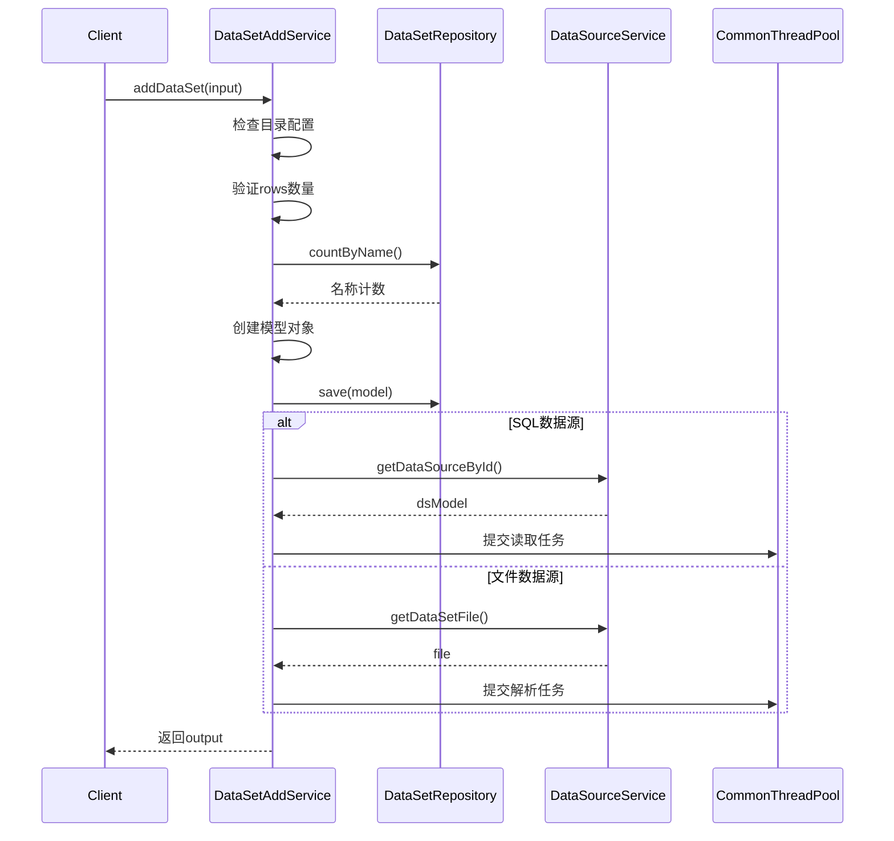

# 基础信息

|      |      |
|------|------|
| 名称 | DataSetAddService |
| 编码语言 | .java |
| 代码路径 | WeFe/fusion/fusion-service/src/main/java/com/welab/wefe/data/fusion/service/service/dataset/DataSetAddService.java |
| 包名 | com.welab.wefe.data.fusion.service.service.dataset |
| 依赖项 | ['java.io.File', 'java.io.FileReader', 'java.io.IOException', 'java.io.LineNumberReader', 'java.nio.file.Paths', 'java.sql.Connection', 'java.util.Date', 'java.util.List', 'org.apache.commons.lang3.StringUtils', 'org.springframework.beans.factory.annotation.Autowired', 'org.springframework.stereotype.Service', 'com.welab.wefe.common.CommonThreadPool', 'com.welab.wefe.common.StatusCode', 'com.welab.wefe.common.exception.StatusCodeWithException', 'com.welab.wefe.common.util.StringUtil', 'com.welab.wefe.common.web.Launcher', 'com.welab.wefe.common.web.util.CurrentAccountUtil', 'com.welab.wefe.data.fusion.service.api.dataset.AddApi', 'com.welab.wefe.data.fusion.service.config.Config', 'com.welab.wefe.data.fusion.service.database.entity.DataSetMySqlModel', 'com.welab.wefe.data.fusion.service.database.entity.DataSourceMySqlModel', 'com.welab.wefe.data.fusion.service.database.repository.DataSetRepository', 'com.welab.wefe.data.fusion.service.enums.DataResourceSource', 'com.welab.wefe.data.fusion.service.enums.Progress', 'com.welab.wefe.data.fusion.service.manager.JdbcManager', 'com.welab.wefe.data.fusion.service.service.AbstractService', 'com.welab.wefe.data.fusion.service.service.DataSourceService', 'com.welab.wefe.data.fusion.service.utils.AbstractDataSetReader', 'com.welab.wefe.data.fusion.service.utils.CsvDataSetReader', 'com.welab.wefe.data.fusion.service.utils.ExcelDataSetReader'] |
| 概述说明 | 数据集添加服务类，包含从文件或数据库读取数据并存储的功能，支持去重和字段数量校验。 |

# 说明

DataSetAddService是一个服务类，用于添加数据集。它首先检查配置目录是否存在并创建，然后验证输入参数，包括字段数量限制和数据集名称唯一性。接着创建并保存数据集模型到数据库，根据数据来源（SQL或文件）分别处理。对于文件来源，解析CSV或Excel文件并存储数据；对于SQL来源，执行查询并存储结果。处理过程中更新数据集状态和行数，最终返回数据集的ID和数据源ID。整个过程包含错误处理和日志记录。

# 类列表 Class Summary

| 名称   | 类型  | 说明 |
|-------|------|-------------|
| DataSetAddService | class | 数据集添加服务类，包含从文件或数据库读取数据并存储的功能，支持字段限制、名称查重及去重处理。 |

## 类 DataSetAddService

|      |      |
|------|------|
| 访问范围 | @Service;public |
| 类型 | class |
| 名称 | DataSetAddService |
| 说明 | 数据集添加服务类，包含从文件或数据库读取数据并存储的功能，支持字段限制、名称查重及去重处理。 |

### UML类图

```mermaid
classDiagram
    class DataSetAddService {
        -DataSetRepository dataSetRepository
        -DataSourceService dataSourceService
        -Config config
        +AddApi.DataSetAddOutput addDataSet(AddApi.Input input) throws Exception
        -int readAndSaveFromFile(DataSetMySqlModel model, File file, List~String~ rows, boolean deduplication) throws IOException, StatusCodeWithException
        -int readAndSaveFromDB(DataSetMySqlModel model, String dataSourceId, List~String~ headers, String sql, boolean deduplication) throws Exception
    }

    class DataSetRepository {
        +long countByName(String name)
        +save(DataSetMySqlModel model)
        +updateById(String id, String field, Object value, Class~T~ clazz)
    }

    class DataSourceService {
        +File getDataSetFile(DataResourceSource source, String filename) throws IOException
        +DataSourceMySqlModel getDataSourceById(String dataSourceId)
    }

    class Config {
        +String getSourceFilterDir()
    }

    class DataSetMySqlModel {
        +String id
        +String name
        +String description
        +String dataResourceSource
        +String rows
        +int usedCount
        +int rowCount
        +Date updatedTime
        +String statement
        +String sourcePath
        +String dataSourceId
        +boolean storaged
        // 其他setter/getter方法
    }

    class DataSourceMySqlModel {
        +String databaseType
        +String host
        +String port
        +String userName
        +String password
        +String databaseName
        // 其他字段和方法
    }

    class AbstractDataSetReader {
        <<Interface>>
        +List~String~ getHeader()
        +long getRowCount(int sheetIndex)
        +void readAllWithSelectRow(DataSetAddServiceDataRowConsumer consumer, List~String~ rows, int sheetIndex) throws StatusCodeWithException, IOException
    }

    class CsvDataSetReader {
        +CsvDataSetReader(File file)
    }

    class ExcelDataSetReader {
        +ExcelDataSetReader(File file)
    }

    class JdbcManager {
        +Connection getConnection(String dbType, String host, String port, String user, String pwd, String dbName)
        +long count(Connection conn, String sql)
        +void readWithSelectRow(Connection conn, String sql, DataSetAddServiceDataRowConsumer consumer, List~String~ headers)
    }

    class DataSetAddServiceDataRowConsumer {
        +DataSetAddServiceDataRowConsumer(DataSetMySqlModel model, boolean deduplication, File file, List~String~ rows)
        +DataSetAddServiceDataRowConsumer(DataSetMySqlModel model, boolean deduplication, int rowsCount, List~String~ headers)
    }

    class DataSetStorageHelper {
        +static void createDataSetTable(String id, List~String~ headers)
    }

    DataSetAddService --> DataSetRepository : 依赖
    DataSetAddService --> DataSourceService : 依赖
    DataSetAddService --> Config : 依赖
    DataSetAddService --> DataSetMySqlModel : 创建/使用
    DataSetAddService --> DataSourceMySqlModel : 使用
    DataSetAddService --> AbstractDataSetReader : 使用
    DataSetAddService --> JdbcManager : 使用
    DataSetAddService --> DataSetAddServiceDataRowConsumer : 创建/使用
    DataSetAddService --> DataSetStorageHelper : 使用
    CsvDataSetReader ..|> AbstractDataSetReader : 实现
    ExcelDataSetReader ..|> AbstractDataSetReader : 实现
```

这段代码描述了一个数据集添加服务(DataSetAddService)，它负责处理数据集的添加操作，包括从数据库或文件中读取数据并存储到MySQL中。服务依赖于数据集仓库(DataSetRepository)、数据源服务(DataSourceService)和配置(Config)等组件。核心方法addDataSet()根据输入参数决定数据来源(SQL或文件)，并调用相应的读取方法(readAndSaveFromDB或readAndSaveFromFile)。这些方法使用不同的读取器(AbstractDataSetReader的实现类)或JDBC管理器(JdbcManager)来获取数据，并通过消费者模式(DataSetAddServiceDataRowConsumer)处理数据行。整个过程涉及多个组件的协作，包括数据验证、目录创建、数据读取、存储和状态更新等。

### 内部方法调用关系图

该流程图展示了DataSetAddService的核心处理逻辑，主要包含数据验证、模型创建和异步数据处理三个关键阶段。首先进行输入参数校验（目录检查、字段数量限制和名称查重），然后创建并保存数据模型对象，最后根据数据来源类型（SQL或文件）分别启动不同的异步处理流程。时序图则详细描述了客户端调用与服务内部各组件间的交互过程，突出显示了数据验证、存储和异步处理的时序关系。整个流程体现了对数据完整性和处理效率的双重保障机制。

### 字段列表 Field List

| 名称  | 类型  | 说明 |
|-------|-------|------|
| dataSourceService | DataSourceService | 自动注入DataSourceService实例。 |
| config | Config | 自动注入Config配置实例。 |
| dataSetRepository | DataSetRepository | 自动注入DataSetRepository实例。 |

### 方法列表

| 名称  | 类型  | 说明 |
|-------|-------|------|
| readAndSaveFromFile | int | 方法从文件读取数据并保存到数据库，处理CSV或Excel格式，统计行数并更新模型状态，使用线程池异步读取数据。 |
| addDataSet | AddApi.DataSetAddOutput | 方法addDataSet用于添加数据集，检查目录存在性、字段数量限制和名称重复，保存模型并根据数据源类型从数据库或文件读取数据，最后返回输出结果。 |
| readAndSaveFromDB | int | 从数据库读取数据并保存，检查数据源有效性，统计行数，更新数据集状态，创建存储表，异步读取数据并处理，最后返回总行数。 |

