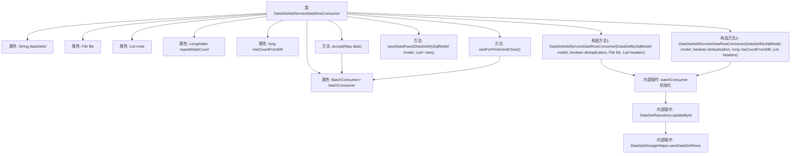

# 基础信息

|      |      |
|------|------|
| 名称 | DataSetAddServiceDataRowConsumer |
| 编码语言 | .java |
| 代码路径 | WeFe/fusion/fusion-service/src/main/java/com/welab/wefe/data/fusion/service/service/dataset/DataSetAddServiceDataRowConsumer.java |
| 包名 | com.welab.wefe.data.fusion.service.service.dataset |
| 依赖项 | ['com.welab.wefe.common.BatchConsumer', 'com.welab.wefe.common.web.Launcher', 'com.welab.wefe.data.fusion.service.database.entity.DataSetMySqlModel', 'com.welab.wefe.data.fusion.service.database.repository.DataSetRepository', 'com.welab.wefe.data.fusion.service.enums.Progress', 'java.io.File', 'java.util.List', 'java.util.Map', 'java.util.concurrent.atomic.LongAdder', 'java.util.function.Consumer'] |
| 概述说明 | 数据集行消费者类，支持批量处理和去重，可从文件或数据库读取数据，通过批处理加速写入，提供等待完成和关闭功能。 |

# 说明

这是一个用于批量处理数据集行的消费者类DataSetAddServiceDataRowConsumer。它实现了Consumer接口，主要功能是通过批处理方式高效地将数据行保存到数据集中。类中包含两个构造函数，分别支持从文件和数据库读取数据。核心成员包括数据集ID、文件对象、数据行列表、批处理消费者BatchConsumer、重复数据计数器repeatDataCount和数据库行数rowCountFromDB。类提供了保存数据行的saveDataRows方法，以及等待消费完成的waitForFinishAndClose方法。批处理机制通过设置最大批量大小(10000)来优化写入性能，并在处理过程中更新数据集状态为"运行中"。

# 类列表 Class Summary

| 名称   | 类型  | 说明 |
|-------|------|-------------|
| DataSetAddServiceDataRowConsumer | class | DataSetAddServiceDataRowConsumer类用于批量处理数据集行数据，支持文件或数据库来源，通过批处理加速写入，包含去重计数和进度更新功能。 |


## 类 DataSetAddServiceDataRowConsumer

|      |      |
|------|------|
| 访问范围 | public |
| 类型 | class |
| 名称 | DataSetAddServiceDataRowConsumer |
| 说明 | DataSetAddServiceDataRowConsumer类用于批量处理数据集行数据，支持文件或数据库来源，通过批处理加速写入，包含去重计数和进度更新功能。 |


### UML类图

```mermaid
classDiagram
    class DataSetAddServiceDataRowConsumer {
        -String dataSetId
        -File file
        -List~String~ rows
        -BatchConsumer~Map~String,Object~~ batchConsumer
        -LongAdder repeatDataCount
        -long rowCountFromDB
        +DataSetAddServiceDataRowConsumer(DataSetMySqlModel model, boolean deduplication, File file, List~String~ headers)
        +DataSetAddServiceDataRowConsumer(DataSetMySqlModel model, boolean deduplication, long rowCountFromDB, List~String~ headers)
        +saveDataRows(DataSetMySqlModel model, List~Map~String,Object~~ rows) void
        +accept(Map~String,Object~ data) void
        +waitForFinishAndClose() void
    }

    class BatchConsumer~T~ {
        <<Interface>>
        +setMaxBatchSize(int size) void
        +add(T item) void
        +waitForFinishAndClose() void
    }

    class DataSetMySqlModel {
        +String id
    }

    class DataSetRepository {
        +updateById(String id, String field, Progress progress, Class~T~ clazz) void
    }

    class DataSetStorageHelper {
        +saveDataSetRows(DataSetMySqlModel model, List~Map~String,Object~~ rows) void
    }

    DataSetAddServiceDataRowConsumer --> BatchConsumer~Map~String,Object~~ : 使用
    DataSetAddServiceDataRowConsumer --> DataSetMySqlModel : 依赖
    DataSetAddServiceDataRowConsumer --> DataSetRepository : 依赖
    DataSetAddServiceDataRowConsumer --> DataSetStorageHelper : 依赖
```

该类图展示了`DataSetAddServiceDataRowConsumer`的核心结构和关联关系。该类是一个数据行消费者，通过`BatchConsumer`实现批量处理，包含两个构造方法分别处理文件和数据库来源的数据。它依赖`DataSetRepository`更新状态，通过`DataSetStorageHelper`存储数据行，并维护重复数据计数和总行数等状态信息。整体设计采用批量处理模式以提高写入效率，支持异步数据消费流程。


### 内部方法调用关系图



流程图描述：该流程图展示了DataSetAddServiceDataRowConsumer类的完整结构，包含7个属性和5个主要方法。两个构造方法都会初始化batchConsumer并设置回调函数，回调函数中通过DataSetRepository更新状态并调用saveDataRows方法保存数据。accept方法将数据添加到batchConsumer，waitForFinishAndClose方法等待消费完成。核心数据处理流程通过BatchConsumer实现批量操作，最终数据通过DataSetStorageHelper持久化存储。

### 字段列表 Field List

| 名称  | 类型  | 说明 |
|-------|-------|------|
| repeatDataCount = new LongAdder() | LongAdder | 声明一个线程安全的LongAdder变量repeatDataCount，用于高效统计重复数据数量。 |
| rows | List<String> | 私有字符串列表rows |
| file | File | 私有文件对象file |
| rowCountFromDB | long | 数据库行数统计变量。 |
| dataSetId | String | 私有字符串类型变量dataSetId。 |
| batchConsumer | BatchConsumer<Map<String, Object>> | 私有批量消费者，处理Map<String, Object>类型数据。 |

### 方法列表

| 名称  | 类型  | 说明 |
|-------|-------|------|
| accept | void | 重写accept方法，设置批量处理最大尺寸为10000并添加数据。 |
| saveDataRows | void | 方法saveDataRows接收DataSetMySqlModel和行数据列表，调用DataSetStorageHelper保存数据行。 |
| waitForFinishAndClose | void | 方法waitForFinishAndClose调用batchConsumer的相同方法，等待完成并关闭。 |


