# 基础信息

|      |      |
|------|------|
| 名称 | DataSetService |
| 编码语言 | .java |
| 代码路径 | WeFe/fusion/fusion-service/src/main/java/com/welab/wefe/data/fusion/service/service/dataset/DataSetService.java |
| 包名 | com.welab.wefe.data.fusion.service.service.dataset |
| 依赖项 | ['com.welab.wefe.common.CommonThreadPool', 'com.welab.wefe.common.StatusCode', 'com.welab.wefe.common.data.mysql.Where', 'com.welab.wefe.common.exception.StatusCodeWithException', 'com.welab.wefe.common.jdbc.base.DatabaseType', 'com.welab.wefe.common.util.JObject', 'com.welab.wefe.common.web.util.ModelMapper', 'com.welab.wefe.data.fusion.service.api.dataset.DeleteApi', 'com.welab.wefe.data.fusion.service.api.dataset.PreviewApi', 'com.welab.wefe.data.fusion.service.api.dataset.QueryApi', 'com.welab.wefe.data.fusion.service.config.Config', 'com.welab.wefe.data.fusion.service.database.entity.DataSetMySqlModel', 'com.welab.wefe.data.fusion.service.database.entity.DataSourceMySqlModel', 'com.welab.wefe.data.fusion.service.database.repository.DataSetRepository', 'com.welab.wefe.data.fusion.service.database.repository.DataSourceRepository', 'com.welab.wefe.data.fusion.service.dto.base.PagingOutput', 'com.welab.wefe.data.fusion.service.dto.entity.dataset.DataSetDetailOutputModel', 'com.welab.wefe.data.fusion.service.dto.entity.dataset.DataSetOutputModel', 'com.welab.wefe.data.fusion.service.dto.entity.dataset.DataSetPreviewOutputModel', 'com.welab.wefe.data.fusion.service.enums.DataResourceSource', 'com.welab.wefe.data.fusion.service.manager.JdbcManager', 'com.welab.wefe.data.fusion.service.service.AbstractService', 'com.welab.wefe.data.fusion.service.service.DataStorageService', 'com.welab.wefe.data.fusion.service.utils.dataresouce.DataResouceHelper', 'org.springframework.beans.factory.annotation.Autowired', 'org.springframework.beans.factory.annotation.Value', 'org.springframework.data.jpa.domain.Specification', 'org.springframework.stereotype.Service', 'java.io.File', 'java.io.IOException', 'java.sql.Connection', 'java.sql.PreparedStatement', 'java.sql.ResultSet', 'java.sql.SQLException', 'java.util.ArrayList', 'java.util.Arrays', 'java.util.Date', 'java.util.List'] |
| 概述说明 | DataSetService提供数据集管理功能，包括增删改查、SQL测试、文件获取、分页查询和数据预览等操作。 |

# 说明

DataSetService是一个Spring服务类，继承自AbstractService，主要用于管理数据集相关操作。它通过注入多个依赖组件如DataSourceRepository、DataStorageService等实现功能。核心功能包括：数据集增删改查（如increment方法更新使用计数）、SQL查询测试、文件获取（支持上传和本地文件）、分页查询数据集列表、数据集预览（支持SQL和文件数据源）、数据集详情查看等。服务还处理数据库连接（通过JdbcManager）和异常状态码（StatusCodeWithException），并包含分页查询、数据统计和表操作等实用方法。配置信息如MySQL连接参数通过@Value注入。

# 类列表 Class Summary

| 名称   | 类型  | 说明 |
|-------|------|-------------|
| DataSetService | class | DataSetService类提供数据集管理功能，包括增删改查、SQL测试、文件获取及分页查询等操作。通过注入多个Repository和Service实现数据存储、查询及预览功能，支持MySQL和文件数据源处理。 |

## 类 DataSetService

|      |      |
|------|------|
| 访问范围 | @Service;public |
| 类型 | class |
| 名称 | DataSetService |
| 说明 | DataSetService类提供数据集管理功能，包括增删改查、SQL测试、文件获取及分页查询等操作。通过注入多个Repository和Service实现数据存储、查询及预览功能，支持MySQL和文件数据源处理。 |

### UML类图

```mermaid
classDiagram
    class AbstractService {
        <<Abstract>>
    }

    class DataSetService {
        -DataSourceRepository dataSourceRepo
        -DataStorageService dataStorageService
        -DataSetRepository dataSetRepository
        -Config config
        -String mySqlUrl
        -String mySqlUsername
        -String mySqlPassword
        -String TABLE_HEADER
        +increment(String id) void
        +findById(String id) DataSetMySqlModel
        +getDataSourceById(String dataSourceId) DataSourceMySqlModel
        +testSqlQuery(String dataSourceId, String sql) boolean
        +getDataSetFile(DataResourceSource method, String filename) File
        +list() List~DataSetMySqlModel~
        +query(QueryApi.Input input) PagingOutput~DataSetOutputModel~
        +paging(List~String~ columnList, String dataSetId, int pageIndex, int pageSize) List~JObject~
        +count(String dataSetId) int
        +delete(DeleteApi.Input input) void
        +detail(String id) DataSetOutputModel
        +preview(PreviewApi.Input input) DataSetPreviewOutputModel
        +detailAndPreview(String id) DataSetDetailOutputModel
    }

    class DataSourceRepository {
        <<Repository>>
        +findById(String id) Optional~DataSourceMySqlModel~
    }

    class DataStorageService {
        +dropTable(String tableName) void
    }

    class DataSetRepository {
        <<Repository>>
        +findOne(String field, String value, Class~T~ clazz) T
        +findAll() List~DataSetMySqlModel~
        +paging(Specification~T~ where, QueryApi.Input input, Class~T~ clazz) PagingOutput~T~
        +deleteById(String id) void
    }

    class Config {
        +getSourceFilterDir() String
    }

    class JdbcManager {
        +getConnection(DatabaseType type, String url, String user, String password) Connection
        +testQuery(Connection conn, String sql, boolean closeConn) boolean
        +close(Connection conn, Statement stmt, ResultSet rs) void
    }

    class DataSetMySqlModel {
        -String id
        -String name
        -int usedCount
        -Date updatedTime
        -DataResourceSource dataResourceSource
        -String dataSourceId
        -String statement
        -String sourcePath
        -String rows
        +getters/setters()
    }

    class DataSourceMySqlModel {
        -String id
        -DatabaseType databaseType
        -String host
        -int port
        -String userName
        -String password
        -String databaseName
        +getters/setters()
    }

    class DataSetOutputModel {
        -String id
        -String name
        +getters/setters()
    }

    class DataSetPreviewOutputModel {
        -List~JObject~ data
        +getters/setters()
    }

    class DataSetDetailOutputModel {
        -DataSetOutputModel baseInfo
        -DataSetPreviewOutputModel previewData
        +getters/setters()
    }

    class StatusCodeWithException {
        <<Exception>>
        -StatusCode statusCode
        -String message
        +getters/setters()
    }

    AbstractService <|-- DataSetService
    DataSetService --> DataSourceRepository : 依赖
    DataSetService --> DataStorageService : 依赖
    DataSetService --> DataSetRepository : 依赖
    DataSetService --> Config : 依赖
    DataSetService --> JdbcManager : 依赖
    DataSetService --> DataSetMySqlModel : 操作
    DataSetService --> DataSourceMySqlModel : 操作
    DataSetService --> DataSetOutputModel : 生成
    DataSetService --> DataSetPreviewOutputModel : 生成
    DataSetService --> DataSetDetailOutputModel : 生成
    DataSetService ..> StatusCodeWithException : 抛出
    DataSetRepository --> DataSetMySqlModel : 操作
    DataSourceRepository --> DataSourceMySqlModel : 操作
    JdbcManager --> Connection : 创建
    JdbcManager --> ResultSet : 操作
```

这段类图描述了DataSetService及其相关组件的结构关系。DataSetService继承自AbstractService，依赖多个Repository和Service组件（如DataSourceRepository、DataStorageService等），并操作多种Model类（如DataSetMySqlModel、DataSourceMySqlModel）。它提供了数据集管理功能，包括增删改查、分页查询、SQL测试、文件操作等，通过JdbcManager处理数据库连接，可能抛出StatusCodeWithException异常。各类模型用于数据传输和持久化，形成完整的数据集管理系统。

### 内部方法调用关系图

```mermaid
graph TD
    A["类DataSetService"]
    B["属性: DataSourceRepository dataSourceRepo"]
    C["属性: DataStorageService dataStorageService"]
    D["属性: DataSetRepository dataSetRepository"]
    E["属性: Config config"]
    F["属性: String mySqlUrl"]
    G["属性: String mySqlUsername"]
    H["属性: String mySqlPassword"]
    I["常量: String TABLE_HEADER"]
    J["方法: void increment(String id)"]
    K["方法: DataSetMySqlModel findById(String id)"]
    L["方法: DataSourceMySqlModel getDataSourceById(String dataSourceId)"]
    M["方法: boolean testSqlQuery(String dataSourceId, String sql)"]
    N["方法: File getDataSetFile(DataResourceSource method, String filename)"]
    O["方法: List<DataSetMySqlModel> list()"]
    P["方法: PagingOutput<DataSetOutputModel> query(QueryApi.Input input)"]
    Q["方法: List<JObject> paging(List<String> columnList, String dataSetId, int pageIndex, int pageSize)"]
    R["方法: int count(String dataSetId)"]
    S["方法: void delete(DeleteApi.Input input)"]
    T["方法: DataSetOutputModel detail(String id)"]
    U["方法: DataSetPreviewOutputModel preview(PreviewApi.Input input)"]
    V["方法: DataSetDetailOutputModel detailAndPreview(String id)"]

    A --> B
    A --> C
    A --> D
    A --> E
    A --> F
    A --> G
    A --> H
    A --> I
    A --> J
    A --> K
    A --> L
    A --> M
    A --> N
    A --> O
    A --> P
    A --> Q
    A --> R
    A --> S
    A --> T
    A --> U
    A --> V
```

这段代码定义了一个名为DataSetService的Spring服务类，主要用于处理数据集相关的各种操作。该类继承自AbstractService，包含多个自动注入的依赖项如数据源仓库、数据存储服务和配置对象。主要功能包括数据集增删改查、SQL测试、文件获取、分页查询和预览等。方法间存在多层调用关系，如detailAndPreview会调用preview方法，preview又会调用getDataSetFile等方法。整体设计采用分层架构，通过JdbcManager处理数据库连接，使用Repository进行数据访问，并包含完善的异常处理机制。

### 字段列表 Field List

| 名称  | 类型  | 说明 |
|-------|-------|------|
| config | Config | 使用@Autowired自动注入Config配置类的实例。 |
| dataSetRepository | DataSetRepository | 自动注入数据集仓库实例。 |
| dataSourceRepo | DataSourceRepository | 使用@Autowired自动注入DataSourceRepository实例dataSourceRepo。 |
| TABLE_HEADER = "data_fusion_" | String | 私有常量TABLE_HEADER定义为"data_fusion_"，用于表名前缀。 |
| mySqlPassword | String | 代码片段通过@Value注解从配置中注入MySQL密码到私有变量mySqlPassword。 |
| dataStorageService | DataStorageService | 自动注入DataStorageService实例。 |
| mySqlUsername | String | 代码片段通过@Value注解从配置中注入MySQL用户名到私有变量mySqlUsername。 |
| mySqlUrl | String | 代码片段通过Spring的@Value注解注入MySQL数据库URL配置到私有变量mySqlUrl中。 |

### 方法列表

| 名称  | 类型  | 说明 |
|-------|-------|------|
| query | PagingOutput<DataSetOutputModel> | 该方法根据输入条件查询数据集，返回分页结果。使用ID精确匹配和名称模糊匹配构建查询条件，调用分页接口返回输出模型列表。 |
| list | List<DataSetMySqlModel> | 该方法返回一个数据集列表，通过调用数据集的findAll方法从数据库中获取所有记录。 |
| findById | DataSetMySqlModel | 通过ID查询数据集，调用dataSetRepository的findOne方法，返回DataSetMySqlModel对象。 |
| testSqlQuery | boolean | 该方法测试SQL查询，先根据ID获取数据源模型，不存在则抛异常。然后建立数据库连接并执行查询测试，返回结果。 |
| increment | void | 该方法通过ID查询数据库记录，将使用次数加1并更新修改时间，最后保存变更。 |
| count | int | 该方法通过SQL查询统计指定数据集ID的记录数，使用JDBC连接MySQL数据库，处理异常并关闭资源，未查到结果返回0。 |
| paging | List<JObject> | 分页查询方法，根据列名、数据集ID、页码和页数构建SQL查询，返回JSON格式结果。处理异常并关闭数据库连接。 |
| delete | void | 该方法根据输入ID删除数据集：先查询数据是否存在，不存在则返回；存在则停止公共线程池，删除数据集记录及关联存储表。 |
| preview | DataSetPreviewOutputModel | 预览方法根据输入源类型处理数据：若为SQL则查询数据库，若为文件则读取文件内容，处理异常并返回结果集。 |
| getDataSourceById | DataSourceMySqlModel | 根据ID从数据源仓库获取MySQL数据模型，若无则返回null。 |
| detailAndPreview | DataSetDetailOutputModel | 该方法通过ID查询数据集，若不存在则抛出异常。存在则映射为输出模型，调用预览接口获取预览数据并设置到输出模型中返回。 |
| detail | DataSetOutputModel | 方法通过ID查询数据集，若不存在则抛出异常，存在则映射为输出模型返回。 |
| getDataSetFile | File | 方法根据数据源类型获取文件：UploadFile从配置目录查找，LocalFile直接使用路径。若文件不存在则抛出异常。 |

