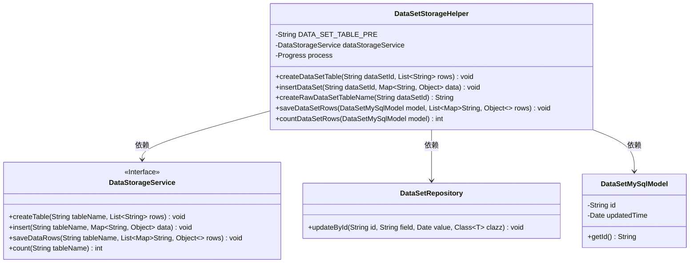
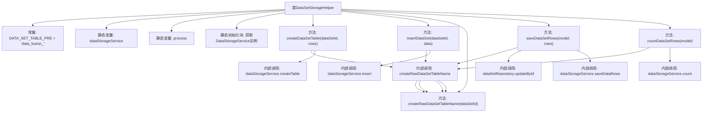

# 基础信息

|      |      |
|------|------|
| 名称 | DataSetStorageHelper |
| 编码语言 | .java |
| 代码路径 | WeFe/fusion/fusion-service/src/main/java/com/welab/wefe/data/fusion/service/service/dataset/DataSetStorageHelper.java |
| 包名 | com.welab.wefe.data.fusion.service.service.dataset |
| 依赖项 | ['com.welab.wefe.common.web.Launcher', 'com.welab.wefe.data.fusion.service.database.entity.DataSetMySqlModel', 'com.welab.wefe.data.fusion.service.database.repository.DataSetRepository', 'com.welab.wefe.data.fusion.service.enums.Progress', 'com.welab.wefe.data.fusion.service.service.DataStorageService', 'java.util.Date', 'java.util.List', 'java.util.Map'] |
| 概述说明 | DataSetStorageHelper类提供数据集表操作，包括创建表、插入数据、批量保存及统计行数，表名格式为data_fusion_加ID。依赖DataStorageService和DataSetRepository实现功能。 |

# 说明

DataSetStorageHelper是一个用于数据集存储管理的工具类，主要功能包括创建数据集表、插入数据、批量保存数据行以及统计行数。类中定义了表名前缀DATA_SET_TABLE_PRE，并通过静态初始化获取DataStorageService实例。核心方法包括createDataSetTable用于创建表，insertDataSet用于插入单条数据，saveDataSetRows用于批量保存数据并更新模型时间戳，countDataSetRows用于统计表行数。所有表名通过createRawDataSetTableName方法动态生成，格式为前缀加数据集ID。

# 类列表 Class Summary

| 名称   | 类型  | 说明 |
|-------|------|-------------|
| DataSetStorageHelper | class | DataSetStorageHelper类提供数据集表操作功能，包括创建表、插入数据、批量保存数据行及统计行数。通过DataStorageService实现具体存储逻辑，表名格式为data_fusion_加数据集ID。 |

## 类 DataSetStorageHelper

|      |      |
|------|------|
| 访问范围 | public |
| 类型 | class |
| 名称 | DataSetStorageHelper |
| 说明 | DataSetStorageHelper类提供数据集表操作功能，包括创建表、插入数据、批量保存数据行及统计行数。通过DataStorageService实现具体存储逻辑，表名格式为data_fusion_加数据集ID。 |

### UML类图

类图描述：DataSetStorageHelper是一个工具类，主要负责数据集表的创建、数据插入、批量保存和行数统计。它依赖于DataStorageService接口进行底层存储操作，使用DataSetRepository更新元数据，并操作DataSetMySqlModel模型对象。类中包含静态常量和静态方法，通过表名前缀拼接生成完整表名。

### 内部方法调用关系图

这段代码是DataSetStorageHelper类的流程图，主要功能是管理数据集表的创建、数据插入、批量保存和行数统计。通过静态初始化块获取DataStorageService实例，核心方法都依赖createRawDataSetTableName生成表名，并调用dataStorageService的不同方法完成数据库操作。流程展示了类成员、方法调用关系和内部依赖，其中saveDataSetRows还涉及DataSetRepository的更新操作。

### 字段列表 Field List

| 名称  | 类型  | 说明 |
|-------|-------|------|
| dataStorageService | DataStorageService | 声明一个私有的静态DataStorageService类实例变量dataStorageService。 |
| process | Progress | 定义了一个私有的静态Progress类型变量process。 |
| DATA_SET_TABLE_PRE = "data_fusion_" | String | 定义静态常量DATA_SET_TABLE_PRE，值为"data_fusion_"，用作表名前缀。 |

### 方法列表

| 名称  | 类型  | 说明 |
|-------|-------|------|
| createDataSetTable | void | 静态方法创建数据集表，参数为数据集ID和行列表，调用存储服务创建表。 |
| insertDataSet | void | 静态方法insertDataSet接收数据集ID和数据映射，生成表名后调用数据存储服务插入数据。 |
| saveDataSetRows | void | 该方法保存数据集行数据，更新数据集时间戳，并通过存储服务保存行数据到指定表。 |
| countDataSetRows | int | 静态方法countDataSetRows通过dataStorageService统计指定模型ID对应的数据表行数，可能抛出异常。 |
| createRawDataSetTableName | String | 该方法用于生成原始数据集表名，通过拼接前缀和数据集ID实现。 |

