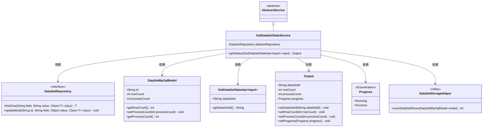
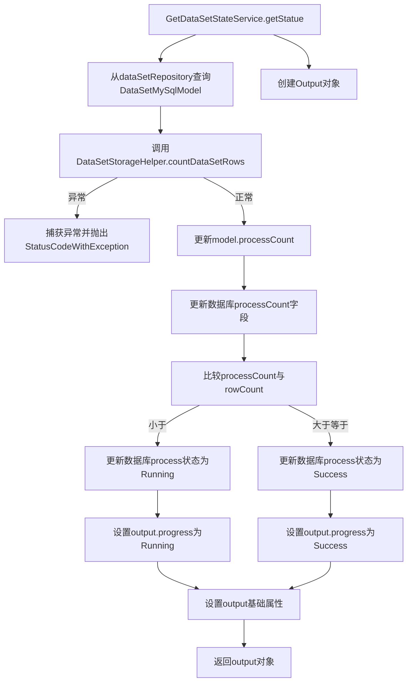

# 基础信息

|      |      |
|------|------|
| 名称 | GetDataSetStateService |
| 编码语言 | .java |
| 代码路径 | WeFe/fusion/fusion-service/src/main/java/com/welab/wefe/data/fusion/service/service/dataset/GetDataSetStateService.java |
| 包名 | com.welab.wefe.data.fusion.service.service.dataset |
| 依赖项 | ['com.welab.wefe.common.StatusCode', 'com.welab.wefe.common.exception.StatusCodeWithException', 'com.welab.wefe.common.web.Launcher', 'com.welab.wefe.data.fusion.service.api.dataset.GetDataSetStateApi', 'com.welab.wefe.data.fusion.service.api.dataset.GetDataSetStateApi.Output', 'com.welab.wefe.data.fusion.service.database.entity.DataSetMySqlModel', 'com.welab.wefe.data.fusion.service.database.repository.DataSetRepository', 'com.welab.wefe.data.fusion.service.enums.Progress', 'com.welab.wefe.data.fusion.service.service.AbstractService', 'org.springframework.beans.factory.annotation.Autowired', 'org.springframework.stereotype.Service', 'java.io.IOException'] |
| 概述说明 | 获取数据集状态服务：通过ID查询数据集，计算处理行数并更新进度状态，返回数据集ID、总行数及处理行数。处理完成时标记成功，否则标记为运行中。 |

# 说明

该服务类用于获取数据集状态并更新处理进度。通过数据集ID查询对应模型，计算已处理数据行数并更新数据库。若处理行数小于总行数，状态设为运行中；否则设为成功。返回结果包含数据集ID、总行数、已处理行数及当前进度状态。过程中可能抛出数据未找到异常。

# 类列表 Class Summary

| 名称   | 类型  | 说明 |
|-------|------|-------------|
| GetDataSetStateService | class | 获取数据集状态服务：根据输入ID查询数据集，统计处理行数并更新进度状态，返回数据集ID、总行数、处理行数及进度状态。 |

## 类 GetDataSetStateService

|      |      |
|------|------|
| 访问范围 | @Service;public |
| 类型 | class |
| 名称 | GetDataSetStateService |
| 说明 | 获取数据集状态服务：根据输入ID查询数据集，统计处理行数并更新进度状态，返回数据集ID、总行数、处理行数及进度状态。 |

### UML类图

这段代码描述了一个服务类`GetDataSetStateService`，它继承自`AbstractService`，用于获取数据集状态并更新处理进度。该服务通过`DataSetRepository`与数据库交互，使用`DataSetMySqlModel`存储数据集信息，并通过`DataSetStorageHelper`计算数据行数。根据处理进度与总行数的比较，更新数据集状态为`Running`或`Success`，并将结果封装在`Output`对象中返回。整个流程涉及多个组件的协作，包括数据访问、业务逻辑处理和状态管理。

### 内部方法调用关系图

这段代码流程图展示了GetDataSetStateService的核心业务逻辑流程。服务首先通过ID查询数据集模型，然后统计数据处理量并更新数据库状态。根据处理进度与总行数的比较结果，会分别设置不同的处理状态（Running/Success），最后组装包含数据集ID、总行数、已处理数等信息的输出对象。整个过程包含异常处理和数据一致性维护，体现了典型的状态跟踪服务设计模式。

### 字段列表 Field List

| 名称  | 类型  | 说明 |
|-------|-------|------|
| dataSetRepository | DataSetRepository | 自动注入数据集仓库实例。 |

### 方法列表

| 名称  | 类型  | 说明 |
|-------|-------|------|
| getStatue | Output | 方法根据输入ID查询数据集，统计处理行数并更新状态。若处理行数小于总行数，状态设为运行中；否则设为成功。返回数据集ID、总行数、处理行数和当前状态。 |

