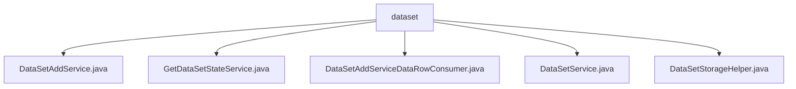

# 基础信息

|      |      |
|------|------|
| 名称 | dataset |
| 编码语言 | .java |
| 代码路径 | WeFe/fusion/fusion-service/src/main/java/com/welab/wefe/data/fusion/service/service/dataset |
| 包名 | docs.fusion.fusion-service.src.main.java.com.welab.wefe.data.fusion.service.service.dataset |
| 概述说明 | DataSetAddService处理数据集添加，验证参数并存储数据。GetDataSetStateService更新数据集状态和进度。DataSetAddServiceDataRowConsumer批量处理数据行。DataSetService管理数据集操作。DataSetStorageHelper处理数据集存储和统计。 |

# 说明

## 概述  
该模块核心职责是提供数据集全生命周期管理，包括创建、状态跟踪、批量处理和存储优化。接口规范涵盖CRUD操作、状态查询和批量消费，类似事件总线模式。关键数据结构包括数据集模型、批处理行列表和动态表名（如DATA_SET_TABLE_PRE+ID）。外部依赖涉及MySQL（通过JdbcManager）、DataStorageService和Spring框架。例如DataSetAddService支持SQL/文件双数据源，DataSetStorageHelper实现批量插入优化。  

## 主要业务场景  
典型流程为：创建数据集（验证→存储→状态初始化）→批量消费数据（文件解析或SQL执行）→状态同步更新。交互模式采用生产者-消费者模型，如DataSetAddServiceDataRowConsumer以10,000行为批次处理。完整功能覆盖数据集预览、分页查询和连接测试，例如DataSetService提供SQL语法校验。API类型包含管理类（增删改查）和监控类（状态/进度），集成案例包括CSV导入和数据库直连。

### 包内部结构视图

该流程图展示了数据集服务模块下的文件结构关系。根节点"dataset"包含5个Java服务类文件，分别处理数据集的不同功能：添加服务、状态获取服务、数据行消费服务、基础数据集服务和存储辅助工具。所有服务类都直接隶属于dataset目录下，没有更深层级的子目录结构。

# 文件列表

| 名称   | 类型  | 说明 |
|-------|------|-------------|
| [DataSetAddService.java](DataSetAddService.md) | file | 数据集添加服务类，包含从文件或数据库读取数据并存储的功能，支持去重和字段数量校验。 |
| [GetDataSetStateService.java](GetDataSetStateService.md) | file | 获取数据集状态服务：通过ID查询数据集，计算处理行数并更新进度状态，返回数据集ID、总行数及处理行数。处理完成时标记成功，否则标记为运行中。 |
| [DataSetAddServiceDataRowConsumer.java](DataSetAddServiceDataRowConsumer.md) | file | 数据集行消费者类，支持批量处理和去重，可从文件或数据库读取数据，通过批处理加速写入，提供等待完成和关闭功能。 |
| [DataSetService.java](DataSetService.md) | file | DataSetService提供数据集管理功能，包括增删改查、SQL测试、文件获取、分页查询和数据预览等操作。 |
| [DataSetStorageHelper.java](DataSetStorageHelper.md) | file | DataSetStorageHelper类提供数据集表操作，包括创建表、插入数据、批量保存及统计行数，表名格式为data_fusion_加ID。依赖DataStorageService和DataSetRepository实现功能。 |

