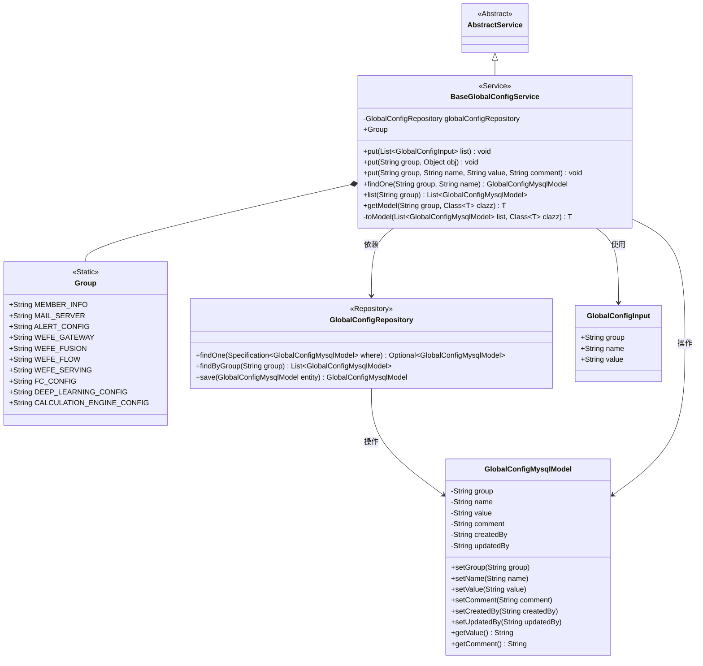
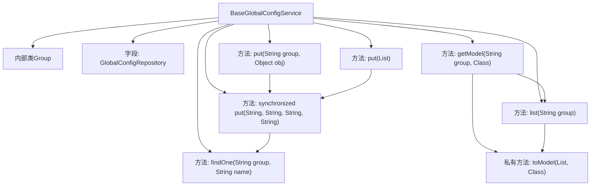

# 基础信息

|      |      |
|------|------|
| 名称 | BaseGlobalConfigService |
| 编码语言 | .java |
| 代码路径 | WeFe/fusion/fusion-service/src/main/java/com/welab/wefe/data/fusion/service/service/globalconfig/BaseGlobalConfigService.java |
| 包名 | com.welab.wefe.data.fusion.service.service.globalconfig |
| 依赖项 | ['com.alibaba.fastjson.JSON', 'com.alibaba.fastjson.JSONObject', 'com.alibaba.fastjson.PropertyNamingStrategy', 'com.alibaba.fastjson.serializer.SerializeConfig', 'com.alibaba.fastjson.serializer.SerializerFeature', 'com.welab.wefe.common.StatusCode', 'com.welab.wefe.common.data.mysql.Where', 'com.welab.wefe.common.exception.StatusCodeWithException', 'com.welab.wefe.common.web.util.CurrentAccountUtil', 'com.welab.wefe.data.fusion.service.database.entity.GlobalConfigMysqlModel', 'com.welab.wefe.data.fusion.service.database.repository.GlobalConfigRepository', 'com.welab.wefe.data.fusion.service.dto.entity.globalconfig.GlobalConfigInput', 'com.welab.wefe.data.fusion.service.service.AbstractService', 'org.springframework.beans.factory.annotation.Autowired', 'org.springframework.data.jpa.domain.Specification', 'java.util.List', 'java.util.Objects'] |
| 概述说明 | BaseGlobalConfigService类提供全局配置管理，支持增删改查操作，包含多个预定义配置组，如member_info、mail_server等。方法包括批量更新、对象序列化存储及按组查询配置项。 |

# 说明

BaseGlobalConfigService是一个继承自AbstractService的全局配置服务类，主要用于管理不同分组的配置项。其内部类Group定义了多个静态字符串常量，表示不同的配置分组，如成员信息、邮件服务器、告警配置等。该类通过GlobalConfigRepository与数据库交互，提供了一系列方法：put方法用于添加或更新单条或多条配置记录，支持批量操作和对象序列化；findOne和list方法分别用于按条件查询单条配置或分组下的所有配置；getModel和toModel方法将配置列表转换为指定类型的实体对象。该类还处理了字段命名策略（转为下划线格式）和空值序列化问题，确保数据一致性。

# 类列表 Class Summary

| 名称   | 类型  | 说明 |
|-------|------|-------------|
| BaseGlobalConfigService | class | BaseGlobalConfigService类提供全局配置管理功能，支持增删改查操作，包含多个预定义配置组，可将配置项转换为实体对象。 |

## 类 BaseGlobalConfigService

|      |      |
|------|------|
| 访问范围 | public |
| 类型 | class |
| 名称 | BaseGlobalConfigService |
| 说明 | BaseGlobalConfigService类提供全局配置管理功能，支持增删改查操作，包含多个预定义配置组，可将配置项转换为实体对象。 |

### UML类图

该代码实现了一个全局配置服务，主要功能包括配置项的增删改查和对象映射。BaseGlobalConfigService继承自AbstractService，通过Group静态类定义配置分组常量，使用GlobalConfigRepository进行数据库操作。核心方法put支持单条/批量更新配置，getModel可将配置项映射为指定类型对象。类图展示了服务层与持久层的关系，以及配置模型的数据结构，体现了配置管理的完整业务流程。

### 内部方法调用关系图

流程图描述：该流程图展示了BaseGlobalConfigService类的结构，包含内部类Group和主要方法调用关系。核心方法put有3个重载版本，最终都调用同步的4参数版本进行数据库操作。查询方法findOne/list/getModel形成调用链，其中getModel依赖list和私有方法toModel完成数据转换。所有数据库操作通过globalConfigRepository实现。

### 字段列表 Field List

| 名称  | 类型  | 说明 |
|-------|-------|------|
| globalConfigRepository | GlobalConfigRepository | 自动注入全局配置仓库实例。 |

### 方法列表

| 名称  | 类型  | 说明 |
|-------|-------|------|
| put | void | 该方法将对象转为JSON字符串，使用下划线命名策略并保留null值字段，然后逐个存储键值对到指定分组。 |
| findOne | GlobalConfigMysqlModel | 该方法通过条件查询从数据库获取指定分组和名称的全局配置项，若无结果则返回null。 |
| put | void | Java方法：遍历配置列表，逐个调用put方法存储配置项，组名、名称、值为必填参数。异常时抛出StatusCodeWithException。 |
| put | void | 同步方法put用于更新或创建配置项，检查null值冲突，若无变化则跳过保存，最后更新值、注释并保存。 |
| list | List<GlobalConfigMysqlModel> | 查询指定分组的全局配置列表。 |
| getModel | T | 从指定分组获取配置并转换为指定类型模型。 |
| toModel | T | 将MySQL配置列表转换为指定类型的对象。若列表为空返回null，否则将键值对存入JSON对象并转换为目标类实例。 |

