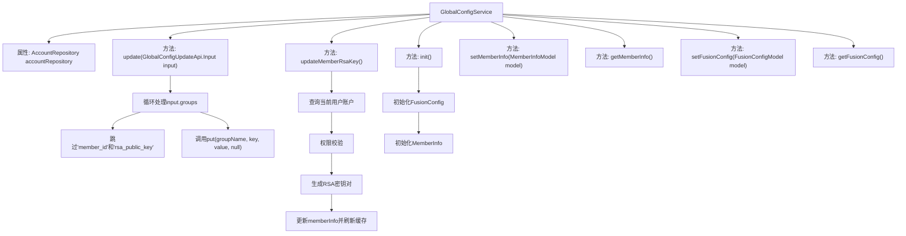

# 基础信息

|      |      |
|------|------|
| 名称 | GlobalConfigService |
| 编码语言 | .java |
| 代码路径 | WeFe/fusion/fusion-service/src/main/java/com/welab/wefe/data/fusion/service/service/globalconfig/GlobalConfigService.java |
| 包名 | com.welab.wefe.data.fusion.service.service.globalconfig |
| 依赖项 | ['com.welab.wefe.common.StatusCode', 'com.welab.wefe.common.constant.SecretKeyType', 'com.welab.wefe.common.exception.StatusCodeWithException', 'com.welab.wefe.common.util.SignUtil', 'com.welab.wefe.common.web.util.CurrentAccountUtil', 'com.welab.wefe.common.web.util.DatabaseEncryptUtil', 'com.welab.wefe.data.fusion.service.api.system.GlobalConfigUpdateApi', 'com.welab.wefe.data.fusion.service.database.entity.AccountMysqlModel', 'com.welab.wefe.data.fusion.service.database.repository.AccountRepository', 'com.welab.wefe.data.fusion.service.dto.entity.globalconfig.FusionConfigModel', 'com.welab.wefe.data.fusion.service.dto.entity.globalconfig.MemberInfoModel', 'com.welab.wefe.data.fusion.service.service.CacheObjects', 'org.springframework.beans.factory.annotation.Autowired', 'org.springframework.stereotype.Service', 'org.springframework.transaction.annotation.Transactional', 'java.security.NoSuchAlgorithmException', 'java.util.Map'] |
| 概述说明 | GlobalConfigService提供全局配置管理，包括更新配置项、初始化配置、设置和获取成员信息及融合配置。支持事务性更新成员RSA密钥，需超级管理员权限。 |

# 说明

GlobalConfigService是一个服务类，继承自BaseGlobalConfigService，提供全局配置管理功能。主要方法包括：update方法用于更新配置项，跳过member_id和rsa_public_key字段；updateMemberRsaKey方法用于更新成员RSA密钥，仅超级管理员可操作；init方法初始化全局配置项；setMemberInfo和getMemberInfo方法用于设置和获取成员信息；setFusionConfig和getFusionConfig方法用于设置和获取融合配置。注释中还提到了未实现的AlertConfig相关方法。

# 类列表 Class Summary

| 名称   | 类型  | 说明 |
|-------|------|-------------|
| GlobalConfigService | class | GlobalConfigService提供全局配置管理功能，包括更新配置项、初始化配置、设置/获取成员信息和融合配置。其中update方法处理配置更新，跳过特定字段；updateMemberRsaKey方法生成并更新RSA密钥对，仅限超级管理员操作；init方法初始化全局配置。 |


## 类 GlobalConfigService

|      |      |
|------|------|
| 访问范围 | @Service;public |
| 类型 | class |
| 名称 | GlobalConfigService |
| 说明 | GlobalConfigService提供全局配置管理功能，包括更新配置项、初始化配置、设置/获取成员信息和融合配置。其中update方法处理配置更新，跳过特定字段；updateMemberRsaKey方法生成并更新RSA密钥对，仅限超级管理员操作；init方法初始化全局配置。 |


### UML类图

```mermaid
classDiagram
    class BaseGlobalConfigService {
        <<abstract>>
    }
    
    class GlobalConfigService {
        -AccountRepository accountRepository
        +update(GlobalConfigUpdateApi$Input input) void
        +updateMemberRsaKey() void
        +init() void
        +setMemberInfo(MemberInfoModel model) void
        +getMemberInfo() MemberInfoModel
        +setFusionConfig(FusionConfigModel model) void
        +getFusionConfig() FusionConfigModel
    }
    
    class AccountRepository {
        <<Interface>>
        +findByPhoneNumber(String phoneNumber) AccountMysqlModel
    }
    
    class GlobalConfigUpdateApi$Input {
        -Map~String, Map~String, String~~ groups
    }
    
    class MemberInfoModel {
        -String rsaPrivateKey
        -String rsaPublicKey
        +setRsaPrivateKey(String key) void
        +setRsaPublicKey(String key) void
    }
    
    class FusionConfigModel {
    }
    
    class SignUtil {
        <<utility>>
        +generateKeyPair(SecretKeyType type) KeyPair
    }
    
    class StatusCodeWithException {
        <<Exception>>
    }
    
    BaseGlobalConfigService <|-- GlobalConfigService
    GlobalConfigService --> AccountRepository : 依赖
    GlobalConfigService --> GlobalConfigUpdateApi$Input : 使用
    GlobalConfigService --> MemberInfoModel : 管理
    GlobalConfigService --> FusionConfigModel : 管理
    GlobalConfigService ..> SignUtil : 调用
    GlobalConfigService ..> StatusCodeWithException : 抛出
```

该类图展示了GlobalConfigService继承自BaseGlobalConfigService，并依赖AccountRepository接口进行数据访问。主要功能包括更新全局配置、管理成员RSA密钥、初始化配置项等。通过MemberInfoModel和FusionConfigModel管理不同类型配置数据，使用SignUtil生成密钥对，可能抛出StatusCodeWithException异常。类中省略了注释掉的AlertConfig相关方法，体现了配置管理的核心功能。


### 内部方法调用关系图



这段代码是GlobalConfigService类的实现，主要提供全局配置管理功能。包含核心方法update()用于批量更新配置项，updateMemberRsaKey()用于管理员更新RSA密钥对，init()用于初始化配置。类继承自BaseGlobalConfigService，通过AccountRepository进行数据访问，使用@Transactional保证事务性。流程图展示了类结构与主要方法调用关系，其中update()包含嵌套循环处理，updateMemberRsaKey()包含权限校验和密钥生成流程，init()实现配置项的初始化检查。

### 字段列表 Field List

| 名称  | 类型  | 说明 |
|-------|-------|------|
| accountRepository | AccountRepository | 使用@Autowired自动注入AccountRepository实例。 |

### 方法列表

| 名称  | 类型  | 说明 |
|-------|-------|------|
| update | void | 更新全局配置，遍历输入分组和条目，跳过member_id和rsa_public_key，调用put方法保存其余键值对。 |
| init | void | 初始化全局配置：检查并设置FusionConfig和MemberInfo，若为空则创建新实例，记录成功日志。 |
| updateMemberRsaKey | void | 方法updateMemberRsaKey用于更新成员RSA密钥。仅超级管理员可操作，生成新密钥对并更新模型，失败时回滚事务。完成后刷新缓存。 |
| setMemberInfo | void | 设置成员信息方法，接收MemberInfoModel参数，可能抛出StatusCodeWithException异常。 |
| getMemberInfo | MemberInfoModel | 获取成员信息，返回MemberInfoModel类型对象。 |
| setFusionConfig | void | 设置融合配置方法，接收FusionConfigModel参数，可能抛出StatusCodeWithException异常。 |
| getFusionConfig | FusionConfigModel | 获取融合配置方法：返回Group.WEFE_FUSION下的FusionConfigModel类实例。 |


