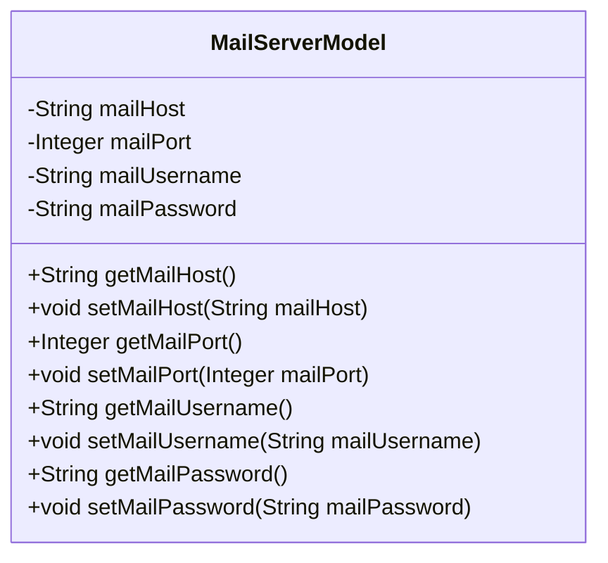

# 基础信息

|      |      |
|------|------|
| 名称 | MailServerModel |
| 编码语言 | .java |
| 代码路径 | WeFe/fusion/fusion-service/src/main/java/com/welab/wefe/data/fusion/service/service/globalconfig/MailServerModel.java |
| 包名 | com.welab.wefe.data.fusion.service.service.globalconfig |
| 依赖项 | ['com.welab.wefe.common.fieldvalidate.annotation.Check'] |
| 概述说明 | 邮件服务器模型类，包含主机、端口、用户名和密码字段及对应getter/setter方法。 |

# 说明

这是一个邮件服务器配置模型类，包含四个关键字段：邮件服务器地址、端口、用户名和密码。每个字段都带有检查注解标注其名称。类中为每个字段提供了标准的getter和setter方法，用于获取和设置对应的属性值。整个类结构清晰，封装了邮件服务器连接所需的基本配置信息。

# 类列表 Class Summary

| 名称   | 类型  | 说明 |
|-------|------|-------------|
| MailServerModel | class | 邮件服务器模型类，包含地址、端口、用户名和密码字段及对应getter/setter方法。 |

## 类 MailServerModel

|      |      |
|------|------|
| 访问范围 | public |
| 类型 | class |
| 名称 | MailServerModel |
| 说明 | 邮件服务器模型类，包含地址、端口、用户名和密码字段及对应getter/setter方法。 |

### UML类图

这段代码定义了一个`MailServerModel`类，用于表示邮件服务器的配置信息。类中包含四个私有属性：`mailHost`（邮件服务器地址）、`mailPort`（邮件服务器端口）、`mailUsername`（邮件用户名）和`mailPassword`（邮件密码），每个属性都带有`@Check`注解用于校验。类中为每个属性提供了对应的getter和setter方法，用于获取和设置属性值。这个类主要用于封装邮件服务器的配置数据，便于在系统中传递和使用。

### 内部方法调用关系图

```mermaid
graph TD
    A["类MailServerModel"]
    B["属性: @Check String mailHost"]
    C["属性: @Check Integer mailPort"]
    D["属性: @Check String mailUsername"]
    E["属性: @Check String mailPassword"]
    F["方法: getMailHost()"]
    G["方法: setMailHost(String)"]
    H["方法: getMailPort()"]
    I["方法: setMailPort(Integer)"]
    J["方法: getMailUsername()"]
    K["方法: setMailUsername(String)"]
    L["方法: getMailPassword()"]
    M["方法: setMailPassword(String)"]

    A --> B
    A --> C
    A --> D
    A --> E
    A --> F
    A --> G
    A --> H
    A --> I
    A --> J
    A --> K
    A --> L
    A --> M
```

该流程图展示了MailServerModel类的结构，包含4个带有@Check注解的私有属性和对应的getter/setter方法。每个属性都通过注解标注了中文描述，如"邮件服务器地址"、"邮件服务器端口"等。类通过8个方法实现对属性的封装访问，形成标准JavaBean结构。箭头表示类与成员之间的从属关系，清晰地呈现了数据模型的组成要素。

### 字段列表 Field List

| 名称  | 类型  | 说明 |
|-------|-------|------|
| mailUsername | String | 邮件用户名校验字段。 |
| mailPassword | String | 邮件密码校验字段。 |
| mailHost | String | 代码定义私有字符串变量mailHost，并用注解检查邮件服务器地址。 |
| mailPort | Integer | 邮件服务器端口配置项 |

### 方法列表

| 名称  | 类型  | 说明 |
|-------|-------|------|
| setMailUsername | void | 这是一个Java方法，用于设置邮件用户名属性。方法名为setMailUsername，接受一个String类型参数mailUsername，并将其赋值给类的同名成员变量。 |
| getMailPassword | String | 获取邮件密码的方法，返回字符串类型变量mailPassword。 |
| setMailPassword | void | 设置邮件密码的方法，将输入参数赋值给类成员变量mailPassword。 |
| getMailUsername | String | 获取邮件用户名的方法，返回mailUsername变量值。 |
| setMailHost | void | 设置邮件主机地址的方法，将参数mailHost赋值给类变量this.mailHost。 |
| getMailHost | String | 获取邮件主机地址的方法。 |
| setMailPort | void | 设置邮件端口的方法，参数为整型mailPort，赋值给类变量mailPort。 |
| getMailPort | Integer | 获取邮件端口的方法，返回整型数值mailPort。 |

