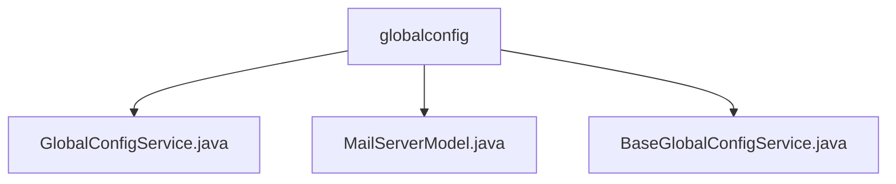

# 基础信息

|      |      |
|------|------|
| 名称 | globalconfig |
| 编码语言 | .java |
| 代码路径 | WeFe/fusion/fusion-service/src/main/java/com/welab/wefe/data/fusion/service/service/globalconfig |
| 包名 | docs.fusion.fusion-service.src.main.java.com.welab.wefe.data.fusion.service.service.globalconfig |
| 概述说明 | GlobalConfigService继承BaseGlobalConfigService，提供配置管理功能，包括更新配置、RSA密钥、成员信息等。MailServerModel封装邮件服务器配置信息。BaseGlobalConfigService管理分组配置，支持增删改查及序列化操作。 |

# 说明

## 概述  
该模块核心职责是提供全局配置管理能力，包括成员信息、邮件服务器设置等分组配置的CRUD操作。接口规范遵循分层设计，GlobalConfigService实现业务逻辑，BaseGlobalConfigService提供基础数据访问能力，类似配置中心模式。  

关键数据结构包括MailServerModel（封装SMTP连接参数）和Group内部类（定义配置分组常量）。外部依赖涉及JPA（GlobalConfigRepository）和RSA加密机制。例如updateMemberRsaKey方法需超级管理员权限，而MailServerModel通过注解实现字段校验。  

## 主要业务场景  
典型应用模式为多租户系统配置管理，支持分组操作（如邮件服务器配置更新）和细粒度控制（如RSA密钥更新权限隔离）。交互模式采用服务层聚合方式，例如init方法初始化配置时自动加载分组数据。  

API类型包含配置项操作（put/findOne）、模型转换（toModel）和业务扩展（AlertConfig占位）。集成案例表现为：成员信息通过setMemberInfo存储，邮件配置通过MailServerModel序列化，类似配置总线设计。

### 包内部结构视图

该流程图展示了globalconfig目录下的三个文件层级关系。GlobalConfigService.java、MailServerModel.java和BaseGlobalConfigService.java均直接隶属于globalconfig目录，没有更深层级的嵌套结构。所有节点名称均采用路径最后一级元素，符合Mermaid格式规范，清晰呈现了服务模块中全局配置相关的核心文件组织方式。

# 文件列表

| 名称   | 类型  | 说明 |
|-------|------|-------------|
| [GlobalConfigService.java](GlobalConfigService.md) | file | GlobalConfigService提供全局配置管理，包括更新配置项、初始化配置、设置和获取成员信息及融合配置。支持事务性更新成员RSA密钥，需超级管理员权限。 |
| [MailServerModel.java](MailServerModel.md) | file | 邮件服务器模型类，包含主机、端口、用户名和密码字段及对应getter/setter方法。 |
| [BaseGlobalConfigService.java](BaseGlobalConfigService.md) | file | BaseGlobalConfigService类提供全局配置管理，支持增删改查操作，包含多个预定义配置组，如member_info、mail_server等。方法包括批量更新、对象序列化存储及按组查询配置项。 |

