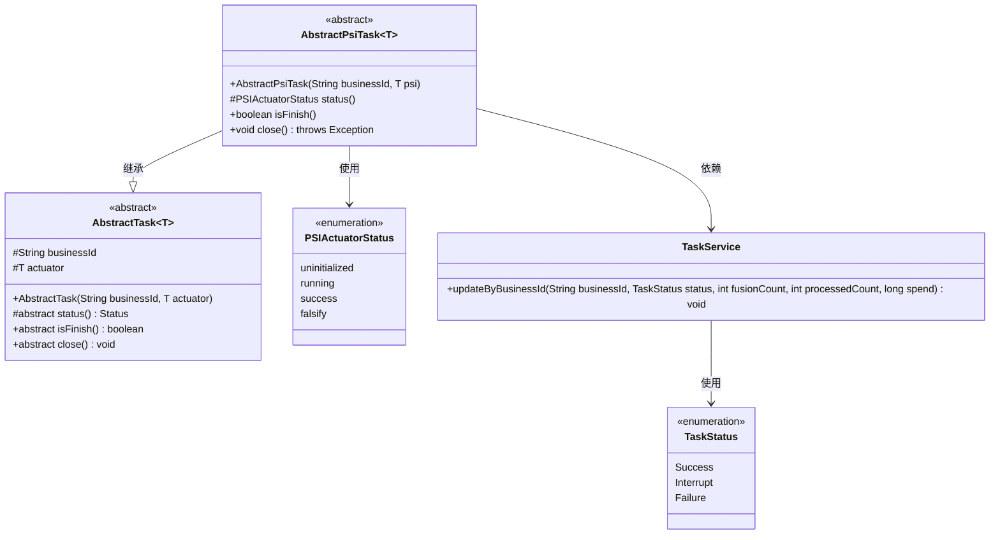
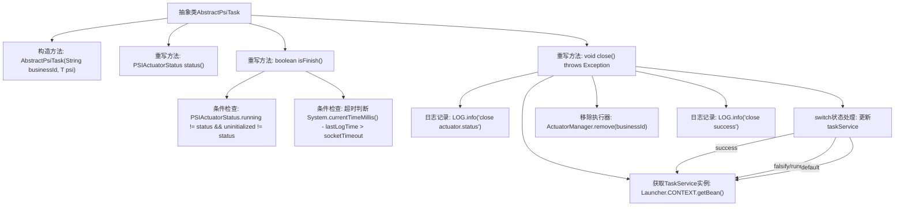

# 基础信息

|      |      |
|------|------|
| 名称 | AbstractPsiTask |
| 编码语言 | .java |
| 代码路径 | WeFe/fusion/fusion-service/src/main/java/com/welab/wefe/data/fusion/service/task/AbstractPsiTask.java |
| 包名 | com.welab.wefe.data.fusion.service.task |
| 依赖项 | ['com.welab.wefe.common.web.Launcher', 'com.welab.wefe.data.fusion.service.actuator.rsapsi.AbstractPsiActuator', 'com.welab.wefe.data.fusion.service.enums.PSIActuatorStatus', 'com.welab.wefe.data.fusion.service.enums.TaskStatus', 'com.welab.wefe.data.fusion.service.manager.ActuatorManager', 'com.welab.wefe.data.fusion.service.service.TaskService'] |
| 概述说明 | 抽象类AbstractPsiTask继承AbstractTask，通过状态判断任务是否完成，关闭时根据状态更新任务结果并清理资源。 |

# 说明

这是一个抽象类AbstractPsiTask，继承自AbstractTask，用于处理与PSI执行器相关的任务。类中包含构造方法，接收业务ID和PSI执行器实例。提供了status方法返回执行器状态，isFinish方法判断任务是否完成（根据状态或超时）。close方法负责任务关闭逻辑，根据执行器状态更新任务状态（成功、中断或失败），并移除执行器实例。整个过程会记录日志。

# 类列表 Class Summary

| 名称   | 类型  | 说明 |
|-------|------|-------------|
| AbstractPsiTask | class | 抽象类AbstractPsiTask继承AbstractTask，实现任务状态检查、完成判断及关闭逻辑，根据状态更新任务结果并清理资源。 |

## 类 AbstractPsiTask

|      |      |
|------|------|
| 访问范围 | public abstract |
| 类型 | class |
| 名称 | AbstractPsiTask |
| 说明 | 抽象类AbstractPsiTask继承AbstractTask，实现任务状态检查、完成判断及关闭逻辑，根据状态更新任务结果并清理资源。 |

### UML类图

这段代码展示了一个抽象类`AbstractPsiTask`继承自泛型类`AbstractTask`，主要用于处理与PSI执行器相关的任务状态管理。类中包含状态检查方法`isFinish()`和资源清理方法`close()`，通过`TaskService`更新任务状态，并涉及`PSIActuatorStatus`和`TaskStatus`两个枚举类型。该设计实现了任务状态监控、超时处理和不同状态下的资源清理逻辑，体现了面向对象设计中模板方法模式的应用。

### 内部方法调用关系图

这段代码流程图展示了AbstractPsiTask抽象类的核心结构，重点描述了任务状态判断(isFinish)和关闭流程(close)的逻辑。isFinish方法通过检查执行器状态和超时条件确定任务是否完成；close方法则通过获取TaskService实例，根据执行器状态更新任务状态，最后移除执行器并记录日志。整个流程体现了任务生命周期的状态管理和资源清理机制。

### 字段列表 Field List

| 名称  | 类型  | 说明 |
|-------|-------|------|

### 方法列表

| 名称  | 类型  | 说明 |
|-------|-------|------|
| isFinish | boolean | 检查执行器状态或超时则返回完成。 |
| status | PSIActuatorStatus | 获取执行器状态的方法，直接返回执行器的当前状态值。 |
| close | void | 该方法在关闭时根据执行器状态更新任务状态：成功则标记为成功，伪造或运行中则标记为中断，其他情况标记为失败，并记录日志后移除执行器。 |

