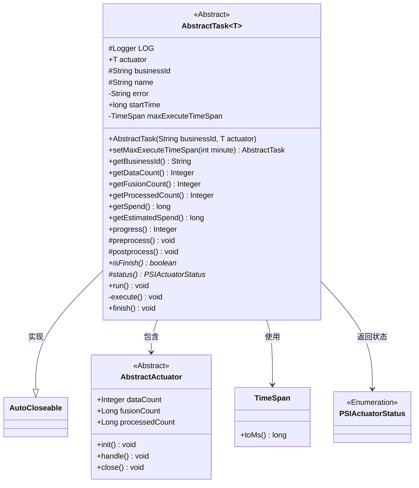
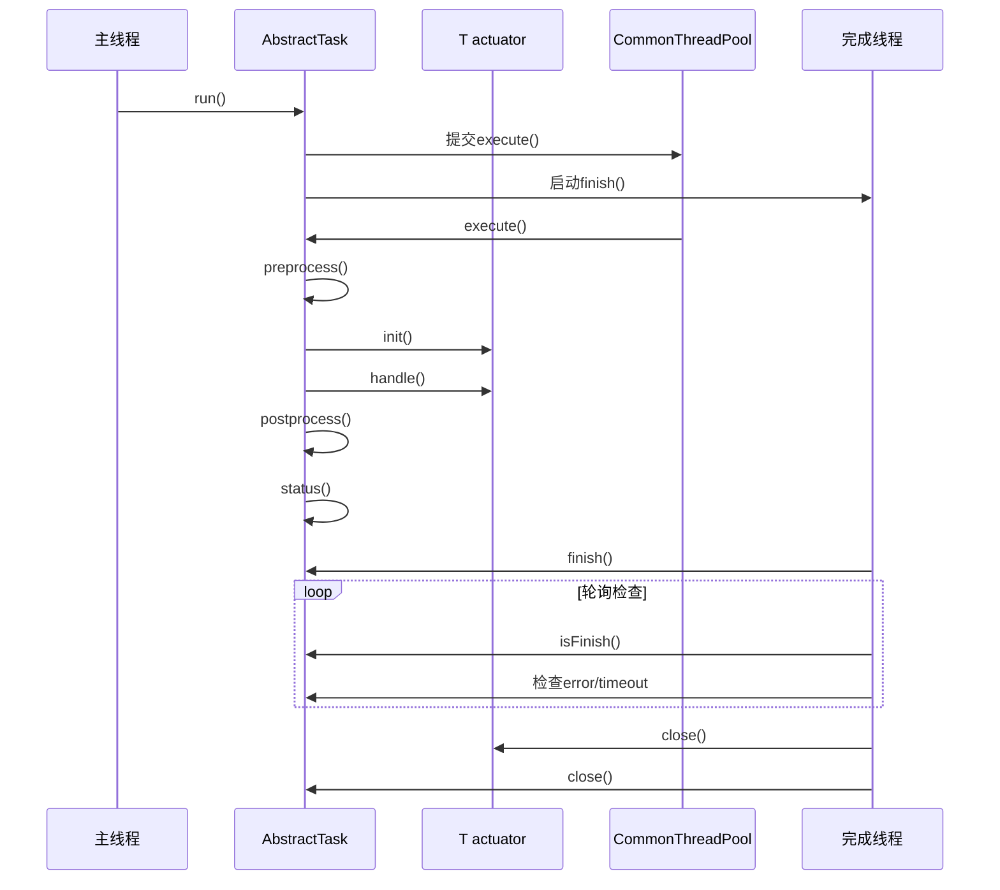

# 基础信息

|      |      |
|------|------|
| 名称 | AbstractTask |
| 编码语言 | .java |
| 代码路径 | WeFe/fusion/fusion-service/src/main/java/com/welab/wefe/data/fusion/service/task/AbstractTask.java |
| 包名 | com.welab.wefe.data.fusion.service.task |
| 依赖项 | ['com.welab.wefe.common.util.ThreadUtil.sleep', 'org.slf4j.Logger', 'org.slf4j.LoggerFactory', 'com.welab.wefe.common.CommonThreadPool', 'com.welab.wefe.common.TimeSpan', 'com.welab.wefe.common.util.StringUtil', 'com.welab.wefe.data.fusion.service.actuator.AbstractActuator', 'com.welab.wefe.data.fusion.service.actuator.rsapsi.AbstractPsiActuator', 'com.welab.wefe.data.fusion.service.enums.PSIActuatorStatus'] |
| 概述说明 | 抽象任务类AbstractTask，包含执行器、业务ID、任务名等属性，提供任务执行、进度计算、耗时预估等功能，支持预处理、后处理和状态检查，实现自动关闭接口。 |

# 说明

AbstractTask是一个抽象类，实现了AutoCloseable接口，用于管理任务执行流程。它包含业务ID、执行器、任务名称、错误信息等属性，记录任务开始时间和最大执行时间。提供设置最大执行时间、获取业务数据量、处理进度、耗时估算等方法。任务执行分为预处理、初始化、处理和后续处理阶段，通过多线程监控任务状态，在完成或超时后关闭执行器和任务。日志记录各阶段状态，异常时捕获错误信息。

# 类列表 Class Summary

| 名称   | 类型  | 说明 |
|-------|------|-------------|
| AbstractTask | class | 抽象任务类AbstractTask，包含执行器、业务ID、错误信息等属性，提供任务执行、进度计算、超时控制等功能，支持预处理和后处理，通过多线程实现异步执行与完成检查。 |

## 类 AbstractTask

|      |      |
|------|------|
| 访问范围 | public abstract |
| 类型 | class |
| 名称 | AbstractTask |
| 说明 | 抽象任务类AbstractTask，包含执行器、业务ID、错误信息等属性，提供任务执行、进度计算、超时控制等功能，支持预处理和后处理，通过多线程实现异步执行与完成检查。 |

### UML类图

类图描述：该图展示了一个抽象任务类`AbstractTask`及其相关组件的关系。`AbstractTask`是一个泛型类，要求类型参数继承自`AbstractActuator`，并实现了`AutoCloseable`接口。主要功能包括任务执行时间管理、进度计算和状态监控。通过组合方式持有执行器(`actuator`)，并使用`TimeSpan`进行超时控制。核心方法`execute()`和`finish()`实现了任务的异步执行和状态检查逻辑，通过模板方法模式要求子类实现`isFinish()`和`status()`方法。

### 内部方法调用关系图

```mermaid
graph TD
    A["抽象类AbstractTask<T>"]
    B["属性: Logger LOG"]
    C["属性: T actuator"]
    D["属性: String businessId"]
    E["属性: String name"]
    F["属性: String error"]
    G["属性: long startTime"]
    H["属性: TimeSpan maxExecuteTimeSpan"]
    I["构造方法: AbstractTask(String, T)"]
    J["方法: setMaxExecuteTimeSpan(int)"]
    K["方法: getBusinessId()"]
    L["方法: getDataCount()"]
    M["方法: getFusionCount()"]
    N["方法: getProcessedCount()"]
    O["方法: getSpend()"]
    P["方法: getEstimatedSpend()"]
    Q["方法: progress()"]
    R["抽象方法: isFinish()"]
    S["抽象方法: status()"]
    T["方法: run()"]
    U["方法: execute()"]
    V["方法: finish()"]
    W["受保护方法: preprocess()"]
    X["受保护方法: postprocess()"]

    A --> B
    A --> C
    A --> D
    A --> E
    A --> F
    A --> G
    A --> H
    A --> I
    A --> J
    A --> K
    A --> L
    A --> M
    A --> N
    A --> O
    A --> P
    A --> Q
    A --> R
    A --> S
    A --> T
    T --> U
    T --> V
    U --> W
    U --> X
```

该流程图展示了AbstractTask抽象类的结构，包含核心属性、构造方法和主要行为方法。时序图描述了任务执行的完整生命周期：主线程启动任务后，线程池异步执行处理逻辑，同时独立线程监控任务完成状态。关键流程包括预处理、执行器初始化、业务处理、后处理，以及超时/错误检测和资源释放。类设计采用模板方法模式，通过抽象方法isFinish()和status()实现具体业务逻辑的扩展。

### 字段列表 Field List

| 名称  | 类型  | 说明 |
|-------|-------|------|
| error | String | 声明一个私有易变的字符串变量error，用于多线程环境下共享错误信息。 |
| actuator | T | 类中的公共成员变量actuator，类型为泛型T。 |
| businessId | String | 声明一个受保护的字符串类型变量businessId。 |
| name | String | 声明一个受保护的字符串类型变量name。 |
| maxExecuteTimeSpan = new TimeSpan(100 * 60 * 1000) | TimeSpan | 定义最大执行时间跨度为100分钟。 |
| startTime = System.currentTimeMillis() | long | 定义长整型变量startTime，初始值为当前系统时间的毫秒值。 |
| LOG = LoggerFactory.getLogger(getClass()) | Logger | 声明一个受保护的final日志对象，使用当前类名初始化。 |

### 方法列表

| 名称  | 类型  | 说明 |
|-------|-------|------|
| run | void | 方法run启动两个线程：一个通过CommonThreadPool执行execute方法，另一个新线程执行finish方法。 |
| getEstimatedSpend | long | 计算预估花费：若已处理数为0，返回总数据量乘以单次花费；否则返回剩余数据量乘以平均单次花费。 |
| getBusinessId | String | 该方法返回当前对象的businessId属性值。 |
| progress | Integer | 该方法计算并返回处理进度百分比，通过已处理数量除以总数乘以100取整。 |
| getDataCount | Integer | 获取数据计数的方法，返回执行器中的数据计数值。 |
| status | PSIActuatorStatus | 抽象方法，返回受保护的状态对象PSIActuatorStatus。 |
| postprocess | void | 空方法，未实现任何功能。 |
| getProcessedCount | Integer | 该方法返回执行器处理的计数整数值。 |
| getFusionCount | Integer | 获取执行器融合计数的整数值。 |
| setMaxExecuteTimeSpan | AbstractTask | 设置任务最大执行时间，参数为分钟，转换为毫秒后存储并返回当前对象。 |
| getSpend | long | 该方法返回当前时间与startTime的差值，表示从startTime开始经过的毫秒数。 |
| isFinish | boolean | 抽象方法isFinish，返回布尔值表示是否完成。 |
| execute | void | 方法execute执行任务流程：预处理、初始化、处理、后处理，记录各阶段日志，捕获异常并记录错误信息。 |
| finish | void | 方法finish()循环检查任务状态，超时或完成时关闭执行器和任务，记录日志和异常。 |
| preprocess | void | 空方法preprocess，无实现，可能抛出异常。 |

