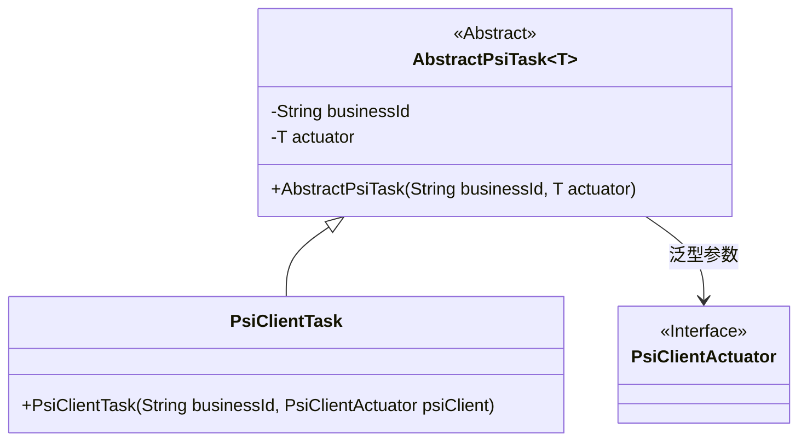
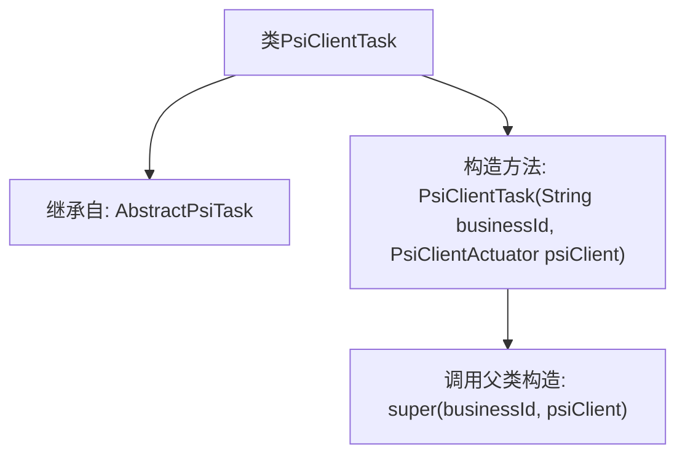

# 基础信息

|      |      |
|------|------|
| 名称 | PsiClientTask |
| 编码语言 | .java |
| 代码路径 | WeFe/fusion/fusion-service/src/main/java/com/welab/wefe/data/fusion/service/task/PsiClientTask.java |
| 包名 | com.welab.wefe.data.fusion.service.task |
| 依赖项 | ['com.welab.wefe.data.fusion.service.actuator.rsapsi.PsiClientActuator'] |
| 概述说明 | PsiClientTask类继承AbstractPsiTask，通过构造方法接收业务ID和PsiClientActuator参数。 |

# 说明

这是一个名为PsiClientTask的Java类，继承自AbstractPsiTask泛型类，泛型类型为PsiClientActuator。该类包含一个构造函数，接收两个参数：businessId字符串和psiClient对象，并将它们传递给父类构造函数。该类主要用于处理与PSI客户端相关的任务。

# 类列表 Class Summary

| 名称   | 类型  | 说明 |
|-------|------|-------------|
| PsiClientTask | class | PsiClientTask类继承AbstractPsiTask，通过构造函数传入业务ID和PsiClientActuator实例。 |

## 类 PsiClientTask

|      |      |
|------|------|
| 访问范围 | public |
| 类型 | class |
| 名称 | PsiClientTask |
| 说明 | PsiClientTask类继承AbstractPsiTask，通过构造函数传入业务ID和PsiClientActuator实例。 |

### UML类图

该类图展示了PSI客户端任务的继承与依赖关系。`PsiClientTask`继承自泛型抽象类`AbstractPsiTask<PsiClientActuator>`，其中泛型参数指定为接口类型`PsiClientActuator`。抽象基类封装了业务ID和执行器对象，子类通过构造函数传递具体参数。整体结构体现了模板方法模式的应用，通过泛型约束确保类型安全。

### 内部方法调用关系图

这段流程图描述了PsiClientTask类的结构，该类继承自泛型类AbstractPsiTask<PsiClientActuator>。核心是构造方法的调用链：当新建PsiClientTask实例时，会通过构造方法接收业务ID和客户端执行器参数，并直接调用父类的构造方法完成初始化。该设计体现了模板方法模式，将具体实现委托给父类处理，同时保持了类型安全（通过泛型指定PsiClientActuator类型）。

### 字段列表 Field List

| 名称  | 类型  | 说明 |
|-------|-------|------|

### 方法列表

| 名称  | 类型  | 说明 |
|-------|-------|------|

