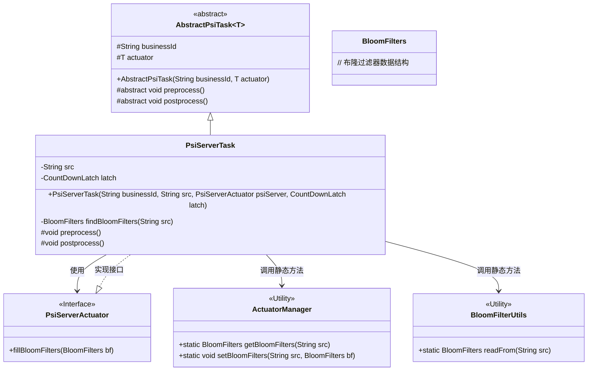
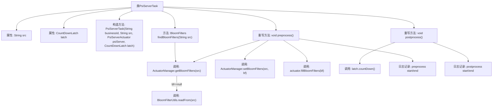

# 基础信息

|      |      |
|------|------|
| 名称 | PsiServerTask |
| 编码语言 | .java |
| 代码路径 | WeFe/fusion/fusion-service/src/main/java/com/welab/wefe/data/fusion/service/task/PsiServerTask.java |
| 包名 | com.welab.wefe.data.fusion.service.task |
| 依赖项 | ['java.util.concurrent.CountDownLatch', 'com.welab.wefe.data.fusion.service.actuator.rsapsi.PsiServerActuator', 'com.welab.wefe.data.fusion.service.manager.ActuatorManager', 'com.welab.wefe.data.fusion.service.utils.bf.BloomFilterUtils', 'com.welab.wefe.data.fusion.service.utils.bf.BloomFilters'] |
| 概述说明 | PsiServerTask类继承AbstractPsiTask，包含src和latch属性，提供findBloomFilters方法读取布隆过滤器，preprocess方法预处理数据，postprocess方法释放锁存器。 |

# 说明

PsiServerTask是一个继承自AbstractPsiTask的类，用于处理PSI服务器任务。它包含src和latch两个私有成员变量，通过构造函数初始化。类中定义了findBloomFilters方法，用于从指定源获取布隆过滤器数据。preprocess方法负责预处理，包括读取布隆过滤器数据并填充到执行器中；postprocess方法进行后处理，主要是减少计数闩的值。整个过程通过日志记录执行时间。

# 类列表 Class Summary

| 名称   | 类型  | 说明 |
|-------|------|-------------|
| PsiServerTask | class | PsiServerTask类继承AbstractPsiTask，包含src和latch属性。构造函数初始化业务ID、src和执行器。preprocess方法读取并设置布隆过滤器，postprocess方法减少计数锁存器。 |

## 类 PsiServerTask

|      |      |
|------|------|
| 访问范围 | public |
| 类型 | class |
| 名称 | PsiServerTask |
| 说明 | PsiServerTask类继承AbstractPsiTask，包含src和latch属性。构造函数初始化业务ID、src和执行器。preprocess方法读取并设置布隆过滤器，postprocess方法减少计数锁存器。 |

### UML类图

类图描述：该图展示了PSI（隐私保护集合求交）服务任务的类结构。PsiServerTask继承自泛型抽象类AbstractPsiTask，实现了预处理和后处理逻辑。它依赖PsiServerActuator接口执行核心操作，并通过ActuatorManager和BloomFilterUtils工具类管理布隆过滤器。整体结构体现了模板方法模式，通过抽象基类定义算法骨架，具体子类实现特定步骤。

### 内部方法调用关系图

这段代码描述了一个PSI（Private Set Intersection）服务器任务类，主要处理布隆过滤器的查找、存储和填充流程。流程图展示了类结构、属性、构造方法以及关键方法调用链，包括预处理阶段从源路径读取布隆过滤器、存入管理器并填充执行器，后处理阶段通过倒计时锁存器通知完成。所有操作都带有详细的日志记录，时间统计功能完整覆盖了任务生命周期。

### 字段列表 Field List

| 名称  | 类型  | 说明 |
|-------|-------|------|
| src | String | 私有字符串变量src |
| latch | CountDownLatch | 私有倒计时锁存器变量latch。 |

### 方法列表

| 名称  | 类型  | 说明 |
|-------|-------|------|
| preprocess | void | 预处理方法：读取源数据构建布隆过滤器，设置并填充至执行器，记录耗时。 |
| findBloomFilters | BloomFilters | 该方法通过ActuatorManager获取指定源的BloomFilters，若不存在则从源读取并返回。 |
| postprocess | void | 方法postprocess执行时记录开始日志，调用latch.countDown()，最后记录结束日志。 |

