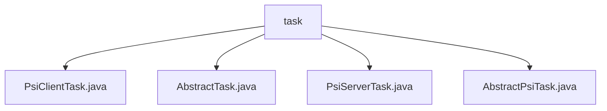

# 基础信息

|      |      |
|------|------|
| 名称 | task |
| 编码语言 | .java |
| 代码路径 | WeFe/fusion/fusion-service/src/main/java/com/welab/wefe/data/fusion/service/task |
| 包名 | docs.fusion.fusion-service.src.main.java.com.welab.wefe.data.fusion.service.task |
| 概述说明 | PsiClientTask继承AbstractPsiTask，处理PSI客户端任务。AbstractTask是管理任务流程的抽象类。PsiServerTask继承AbstractPsiTask，处理PSI服务器任务。AbstractPsiTask是处理PSI执行器任务的抽象基类。 |

# 说明

## 概述  
该模块核心职责是管理PSI（Private Set Intersection）任务的生命周期，包括客户端和服务器端任务执行流程控制。接口规范遵循任务预处理-初始化-处理-后处理的四阶段模型，通过AbstractTask基类提供超时监控、状态管理和资源释放能力。关键数据结构包含业务ID、执行器实例、任务状态标志和布隆过滤器数据。外部依赖仅涉及Java标准库的AutoCloseable和多线程工具类。例如PsiClientTask处理客户端逻辑，PsiServerTask则操作布隆过滤器数据。

## 主要业务场景  
典型流程类似工厂流水线模式：客户端任务通过PsiClientActuator执行交集计算，服务器任务使用PsiServerTask加载布隆过滤器并同步处理状态。所有任务共享基类的线程监控机制，超时或异常时自动触发资源回收。例如findBloomFilters方法实现数据获取，preprocess/postprocess构成处理闭环。API类型包含状态查询（status/isFinish）和流程控制（close），集成案例表现为客户端-服务器协同完成隐私集合求交。

### 包内部结构视图

该流程图展示了WeFe数据融合服务中任务模块的类结构关系。根节点"task"包含四个具体实现类，其中包含两个PSI任务实现类(PsiClientTask和PsiServerTask)以及两个抽象基类(AbstractTask和AbstractPsiTask)，体现了任务处理模块的继承体系设计。

# 文件列表

| 名称   | 类型  | 说明 |
|-------|------|-------------|
| [PsiClientTask.java](PsiClientTask.md) | file | PsiClientTask类继承AbstractPsiTask，通过构造方法接收业务ID和PsiClientActuator参数。 |
| [AbstractTask.java](AbstractTask.md) | file | 抽象任务类AbstractTask，包含执行器、业务ID、任务名等属性，提供任务执行、进度计算、耗时预估等功能，支持预处理、后处理和状态检查，实现自动关闭接口。 |
| [PsiServerTask.java](PsiServerTask.md) | file | PsiServerTask类继承AbstractPsiTask，包含src和latch属性，提供findBloomFilters方法读取布隆过滤器，preprocess方法预处理数据，postprocess方法释放锁存器。 |
| [AbstractPsiTask.java](AbstractPsiTask.md) | file | 抽象类AbstractPsiTask继承AbstractTask，通过状态判断任务是否完成，关闭时根据状态更新任务结果并清理资源。 |

