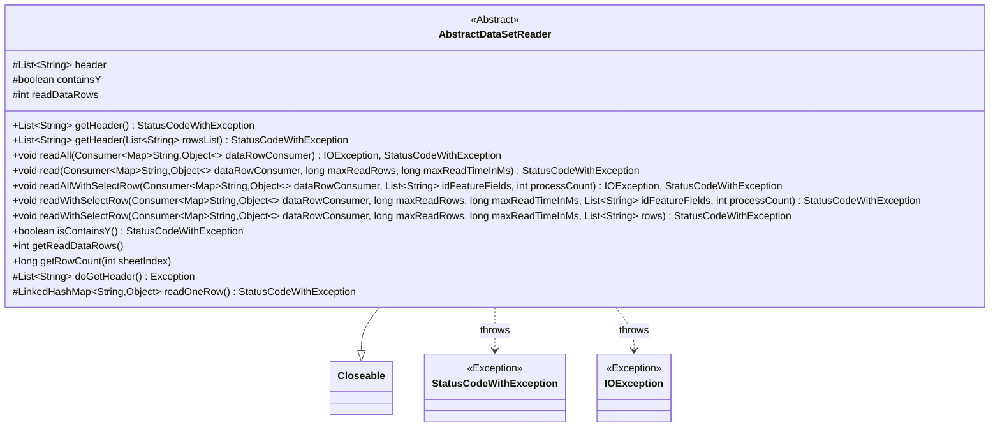

# 基础信息

|      |      |
|------|------|
| 名称 | AbstractDataSetReader |
| 编码语言 | .java |
| 代码路径 | WeFe/fusion/fusion-service/src/main/java/com/welab/wefe/data/fusion/service/utils/AbstractDataSetReader.java |
| 包名 | com.welab.wefe.data.fusion.service.utils |
| 依赖项 | ['com.welab.wefe.common.CommonThreadPool', 'com.welab.wefe.common.StatusCode', 'com.welab.wefe.common.exception.StatusCodeWithException', 'java.io.Closeable', 'java.io.IOException', 'java.util.ArrayList', 'java.util.LinkedHashMap', 'java.util.List', 'java.util.Map', 'java.util.function.Consumer', 'java.util.stream.Collectors'] |
| 概述说明 | AbstractDataSetReader是抽象类，实现Closeable接口，提供读取数据集功能。包含获取表头、读取数据行、统计行数等方法，支持按条件筛选字段和限制读取时间或行数。 |

# 说明

AbstractDataSetReader是一个抽象类，实现了Closeable接口，用于读取数据集。它包含获取表头信息的方法getHeader，检查表头是否包含"y"字段，并确保字段不重复。提供了多种读取数据行的方法，支持按行数或时间限制读取，可选择特定字段或跳过指定行数。类中维护了已读取行数readDataRows，包含抽象方法doGetHeader和readOneRow需子类实现。还提供了获取总行数和检查是否包含Y字段的功能。

# 类列表 Class Summary

| 名称   | 类型  | 说明 |
|-------|------|-------------|
| AbstractDataSetReader | class | AbstractDataSetReader是一个抽象类，用于读取数据集。提供获取表头、读取数据行、检查是否包含Y字段等功能，支持行数限制和读取时间限制。 |

## 类 AbstractDataSetReader

|      |      |
|------|------|
| 访问范围 | public abstract |
| 类型 | class |
| 名称 | AbstractDataSetReader |
| 说明 | AbstractDataSetReader是一个抽象类，用于读取数据集。提供获取表头、读取数据行、检查是否包含Y字段等功能，支持行数限制和读取时间限制。 |

### UML类图

该代码展示了一个抽象类 `AbstractDataSetReader`，它实现了 `Closeable` 接口，主要用于读取数据集。类中包含多个方法用于获取表头、读取数据行以及处理数据行，支持限制读取行数和时间。类中有两个抽象方法 `doGetHeader` 和 `readOneRow`，需要子类实现。异常处理通过 `StatusCodeWithException` 和 `IOException` 进行管理。

### 内部方法调用关系图

```mermaid
graph TD
    A["抽象类AbstractDataSetReader"]
    B["属性: List<String> header"]
    C["属性: boolean containsY"]
    D["属性: int readDataRows"]
    E["方法: getHeader()"]
    F["方法: getHeader(List<String> rowsList)"]
    G["方法: readAll(Consumer<Map<String, Object>>)"]
    H["方法: read(Consumer<Map<String, Object>>, long, long)"]
    I["方法: readAllWithSelectRow(Consumer<Map<String, Object>>, List<String>, int)"]
    J["方法: readWithSelectRow(Consumer<Map<String, Object>>, long, long, List<String>, int)"]
    K["方法: readWithSelectRow(Consumer<Map<String, Object>>, long, long, List<String>)"]
    L["方法: isContainsY()"]
    M["方法: getReadDataRows()"]
    N["抽象方法: doGetHeader()"]
    O["抽象方法: readOneRow()"]
    P["抽象方法: getRowCount(int)"]

    A --> B
    A --> C
    A --> D
    A --> E
    A --> F
    A --> G
    A --> H
    A --> I
    A --> J
    A --> K
    A --> L
    A --> M
    A -.-> N
    A -.-> O
    A -.-> P
```

该流程图展示了AbstractDataSetReader抽象类的完整结构，包含3个保护属性和12个方法（其中3个为抽象方法）。核心功能围绕数据集读取操作展开，包括获取表头(getHeader)、读取数据行(read/readAll)及其变体方法。特别值得注意的是两个重载的readWithSelectRow方法，它们实现了带条件筛选的数据读取功能。所有具体的数据获取操作(doGetHeader/readOneRow)都留给子类实现，体现了模板方法设计模式的思想。

### 字段列表 Field List

| 名称  | 类型  | 说明 |
|-------|-------|------|
| containsY | boolean | 布尔变量containsY，用于保护性检查是否包含Y。 |
| readDataRows = 0 | int | 保护变量readDataRows记录已读取数据行数，初始值为0。 |
| header | List<String> | 保护类型的字符串列表变量header。 |

### 方法列表

| 名称  | 类型  | 说明 |
|-------|-------|------|
| readOneRow | LinkedHashMap<String, Object> | 抽象方法readOneRow返回LinkedHashMap，可能抛出StatusCodeWithException异常。 |
| readWithSelectRow | void | 方法readWithSelectRow按条件读取行数据，筛选指定列，通过回调处理数据，支持最大行数和时间限制。 |
| readAll | void | 该方法读取所有数据行并通过回调函数处理，可抛出IO异常和状态码异常。参数为数据行消费者，无限制读取范围。 |
| isContainsY | boolean | 检查是否包含Y，若header为空则获取header，返回containsY状态。 |
| read | void | 该方法逐行读取数据，每行传递给消费者处理。支持限制读取行数和时间，超限时终止读取。 |
| doGetHeader | List<String> | 抽象方法，返回字符串列表，可能抛出异常。 |
| readAllWithSelectRow | void | 该方法通过`readWithSelectRow`读取数据，处理指定ID字段，支持批量处理。参数包括数据处理回调、ID字段列表和并发数。可能抛出IO异常和自定义异常。 |
| readWithSelectRow | void | 方法readWithSelectRow读取数据行，筛选指定字段，通过回调处理数据。支持最大行数和时间限制，跳过指定行数。统计读取行数并在达到限制时终止。 |
| getReadDataRows | int | 这是一个Java方法，返回整型变量readDataRows的值。 |
| getHeader | List<String> | 获取数据集header信息。若header存在直接返回，否则读取并检查重复字段，转换"Y"为"y"，更新header缓存后返回。异常时抛出错误提示。 |
| getHeader | List<String> | 方法获取数据集表头，若已缓存直接返回。否则读取并检查重复字段，无重复则缓存并返回表头，否则抛出异常。 |
| getRowCount | long | 获取指定工作表的总行数抽象方法。 |

