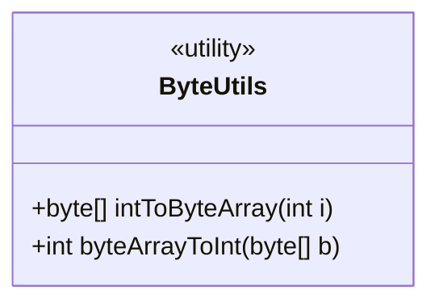
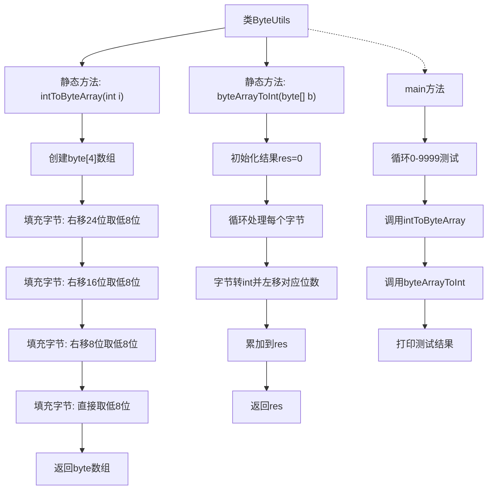

# 基础信息

|      |      |
|------|------|
| 名称 | ByteUtils |
| 编码语言 | .java |
| 代码路径 | WeFe/fusion/fusion-service/src/main/java/com/welab/wefe/data/fusion/service/utils/ByteUtils.java |
| 包名 | com.welab.wefe.data.fusion.service.utils |
| 依赖项 | [] |
| 概述说明 | ByteUtils类提供int与byte数组互转方法，intToByteArray将整数转为4字节数组，byteArrayToInt将字节数组转回整数，并通过main方法验证转换正确性。 |

# 说明

ByteUtils类提供两个静态方法实现整数与字节数组的相互转换。intToByteArray方法将32位整数转换为4字节数组，通过位移和掩码操作按大端序存储。byteArrayToInt方法将字节数组还原为整数，同样遵循大端序读取。main方法测试了0-9999范围内转换的正确性，验证双向转换的准确性。

# 类列表 Class Summary

| 名称   | 类型  | 说明 |
|-------|------|-------------|
| ByteUtils | class | ByteUtils类提供int与byte数组互转功能，包含intToByteArray和byteArrayToInt方法，并通过main方法测试转换正确性。 |

## 类 ByteUtils

|      |      |
|------|------|
| 访问范围 | public |
| 类型 | class |
| 名称 | ByteUtils |
| 说明 | ByteUtils类提供int与byte数组互转功能，包含intToByteArray和byteArrayToInt方法，并通过main方法测试转换正确性。 |

### UML类图

该代码展示了一个`ByteUtils`工具类，包含两个核心静态方法：`intToByteArray`将整数转换为4字节数组（大端序），`byteArrayToInt`则将字节数组还原为整数。类图标记为<<utility>>表示其工具类性质，所有方法均为公有静态方法。主方法通过循环测试验证了两种转换的互逆性，确保数据在转换过程中无精度丢失。这种字节级操作常用于网络协议、文件格式等需要精确控制二进制数据的场景。

### 内部方法调用关系图

这段代码实现了整数与字节数组之间的相互转换功能。流程图展示了ByteUtils类的完整结构，包含两个核心静态方法：intToByteArray将32位整数分解为4字节数组，通过右移和位掩码操作；byteArrayToInt则将字节数组重新组合为整数，通过左移和累加操作。main方法包含测试逻辑，循环验证10000次转换的正确性，确保双向转换的准确性。整个流程体现了大端序字节处理方式，每个转换步骤都严格遵循位运算规则。

### 字段列表 Field List

| 名称  | 类型  | 说明 |
|-------|-------|------|

### 方法列表

| 名称  | 类型  | 说明 |
|-------|-------|------|
| byteArrayToInt | int | 将字节数组转换为整数，通过位运算拼接每个字节，高位在前。 |
| intToByteArray | byte[] | 将整数转换为4字节数组，按大端序存储，每个字节通过移位和掩码操作获取。 |
| main | void | Java主方法循环测试0到9999的整型与字节数组转换功能，并打印转换结果。 |

