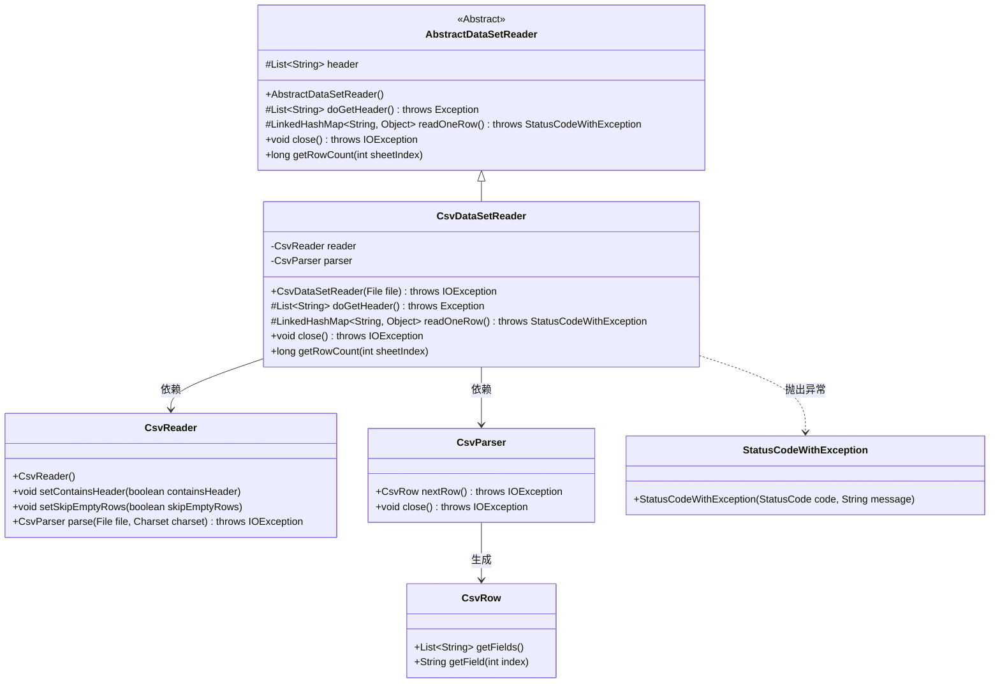
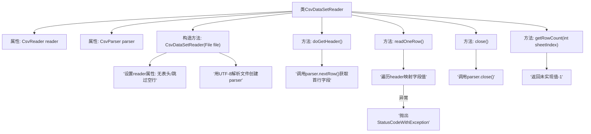

# 基础信息

|      |      |
|------|------|
| 名称 | CsvDataSetReader |
| 编码语言 | .java |
| 代码路径 | WeFe/fusion/fusion-service/src/main/java/com/welab/wefe/data/fusion/service/utils/CsvDataSetReader.java |
| 包名 | com.welab.wefe.data.fusion.service.utils |
| 依赖项 | ['com.welab.wefe.common.StatusCode', 'com.welab.wefe.common.exception.StatusCodeWithException', 'de.siegmar.fastcsv.reader.CsvParser', 'de.siegmar.fastcsv.reader.CsvReader', 'de.siegmar.fastcsv.reader.CsvRow', 'java.io.File', 'java.io.IOException', 'java.nio.charset.StandardCharsets', 'java.util.LinkedHashMap', 'java.util.List'] |
| 概述说明 | CsvDataSetReader类继承AbstractDataSetReader，用于读取CSV文件。构造函数初始化CsvReader和CsvParser，设置无表头且跳过空行。doGetHeader获取表头，readOneRow读取单行数据并转为LinkedHashMap，close关闭解析器。getRowCount已弃用。 |

# 说明

CsvDataSetReader类继承自AbstractDataSetReader，用于读取CSV文件数据。构造函数接收文件对象并初始化CsvReader和CsvParser，设置不包含表头且跳过空行。doGetHeader方法获取CSV首行作为表头。readOneRow方法逐行读取数据，将每行内容映射到表头对应的键值对中，若读取失败抛出异常。close方法关闭解析器。getRowCount方法被标记为过时且不实现具体功能。

# 类列表 Class Summary

| 名称   | 类型  | 说明 |
|-------|------|-------------|
| CsvDataSetReader | class | CsvDataSetReader类继承AbstractDataSetReader，用于读取CSV文件。构造函数初始化解析器，doGetHeader获取表头，readOneRow逐行读取数据并映射为键值对，close关闭解析器。 |

## 类 CsvDataSetReader

|      |      |
|------|------|
| 访问范围 | public |
| 类型 | class |
| 名称 | CsvDataSetReader |
| 说明 | CsvDataSetReader类继承AbstractDataSetReader，用于读取CSV文件。构造函数初始化解析器，doGetHeader获取表头，readOneRow逐行读取数据并映射为键值对，close关闭解析器。 |

### UML类图

该类图展示了CSV数据集读取器的继承结构和组件关系。CsvDataSetReader继承自抽象类AbstractDataSetReader，通过组合方式使用CsvReader和CsvParser来解析CSV文件。核心功能包括读取表头(doGetHeader)、逐行读取数据(readOneRow)和资源关闭(close)。异常处理通过StatusCodeWithException实现，解析过程中产生的CsvRow对象用于获取字段数据。整体设计遵循了模板方法模式，将具体实现留给子类完成。

### 内部方法调用关系图

该流程图展示了CsvDataSetReader类的完整处理流程，从初始化配置、文件解析到数据读取和资源释放。类通过CsvReader和CsvParser协作实现CSV文件处理，包含表头获取、数据行转换等核心功能，同时处理IO异常情况并标注过时方法。流程重点呈现了文件解析初始化、表头提取、数据行映射三个关键阶段，以及异常处理和资源释放机制。

### 字段列表 Field List

| 名称  | 类型  | 说明 |
|-------|-------|------|
| reader = new CsvReader() | CsvReader | 声明一个私有变量reader，初始化为CsvReader类的实例。 |
| parser | CsvParser | 私有成员变量，类型为CsvParser的解析器实例。 |

### 方法列表

| 名称  | 类型  | 说明 |
|-------|-------|------|
| readOneRow | LinkedHashMap<String, Object> | 该方法读取CSV文件的一行数据，转换为LinkedHashMap，键为表头，值为对应字段。若读取失败抛出异常，无数据返回null。 |
| doGetHeader | List<String> | 重写doGetHeader方法，解析CSV下一行并返回字段列表。 |
| close | void | 该方法重写close()，调用parser.close()并可能抛出IOException。 |
| getRowCount | long | 废弃方法getRowCount，返回-1表示未实现该功能。 |

