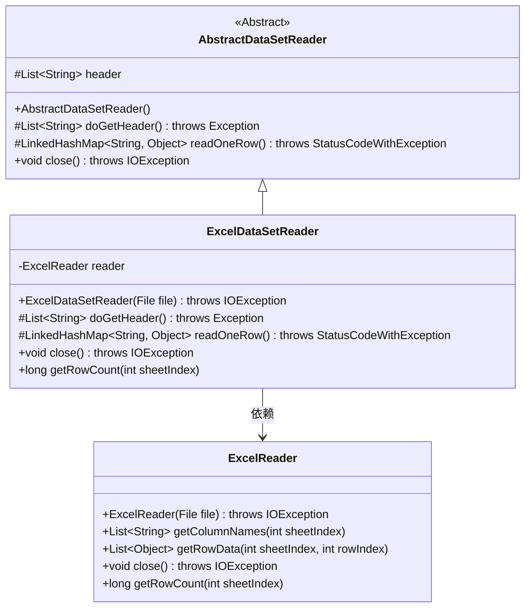
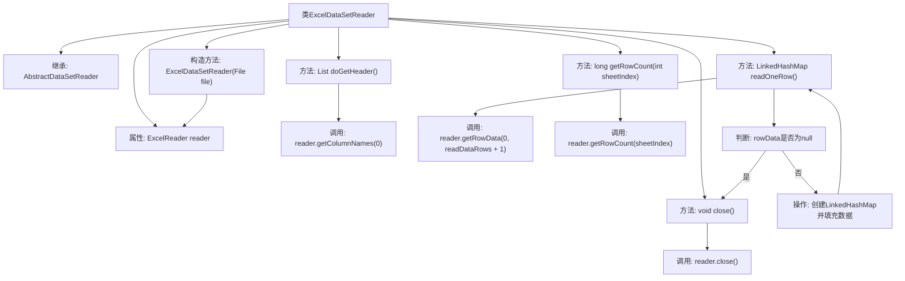

# 基础信息

|      |      |
|------|------|
| 名称 | ExcelDataSetReader |
| 编码语言 | .java |
| 代码路径 | WeFe/fusion/fusion-service/src/main/java/com/welab/wefe/data/fusion/service/utils/ExcelDataSetReader.java |
| 包名 | com.welab.wefe.data.fusion.service.utils |
| 依赖项 | ['com.welab.wefe.common.exception.StatusCodeWithException', 'com.welab.wefe.common.io.excel.ExcelReader', 'java.io.File', 'java.io.IOException', 'java.util.LinkedHashMap', 'java.util.List'] |
| 概述说明 | Excel数据集读取类，继承抽象类，通过ExcelReader读取文件，提供获取表头、逐行读取数据、关闭资源和获取行数功能。 |

# 说明

ExcelDataSetReader是一个继承自AbstractDataSetReader的类，用于读取Excel文件数据。它通过ExcelReader实例处理文件输入，提供获取表头、逐行读取数据及关闭资源的功能。doGetHeader方法从Excel首行获取列名作为表头，readOneRow方法读取指定行数据并以LinkedHashMap形式返回，键为表头列名，值为对应单元格数据，空值处理为NULL。此外，还支持获取指定工作表的行数和关闭文件资源。

# 类列表 Class Summary

| 名称   | 类型  | 说明 |
|-------|------|-------------|
| ExcelDataSetReader | class | ExcelDataSetReader类继承AbstractDataSetReader，通过ExcelReader读取文件数据，提供获取表头、逐行读取数据及关闭资源功能。 |

## 类 ExcelDataSetReader

|      |      |
|------|------|
| 访问范围 | public |
| 类型 | class |
| 名称 | ExcelDataSetReader |
| 说明 | ExcelDataSetReader类继承AbstractDataSetReader，通过ExcelReader读取文件数据，提供获取表头、逐行读取数据及关闭资源功能。 |

### UML类图

类图描述：
ExcelDataSetReader继承自抽象类AbstractDataSetReader，实现了读取Excel数据的功能。它包含一个ExcelReader私有成员，通过该成员获取列名、行数据和行数等操作。AbstractDataSetReader定义了获取表头和读取单行数据的抽象方法，ExcelDataSetReader实现了这些方法，并添加了获取行数的功能。ExcelReader负责底层Excel文件操作，包括读取数据和关闭资源。

### 内部方法调用关系图

这段代码展示了一个Excel数据集读取器类，继承自抽象数据集读取器。核心功能包括：通过构造方法初始化Excel读取器，获取表头信息，逐行读取数据并转换为键值对映射，关闭资源以及获取行数。流程图清晰呈现了类结构、方法调用关系和关键逻辑分支，特别是数据读取时的空值判断和映射构建过程。所有方法都委托给内部的ExcelReader对象实现具体操作，体现了良好的职责分离。

### 字段列表 Field List

| 名称  | 类型  | 说明 |
|-------|-------|------|
| reader | ExcelReader | 私有Excel读取器实例。 |

### 方法列表

| 名称  | 类型  | 说明 |
|-------|-------|------|
| close | void | Java方法重写，关闭reader资源，可能抛出IOException异常。 |
| doGetHeader | List<String> | Java方法重写，返回读取器获取的第一行列名列表。 |
| readOneRow | LinkedHashMap<String, Object> | 方法readOneRow读取一行数据，若为空返回null，否则将数据与表头映射为键值对返回，不足字段补null。 |
| getRowCount | long | 获取指定sheet的行数，调用reader的getRowCount方法实现。 |

