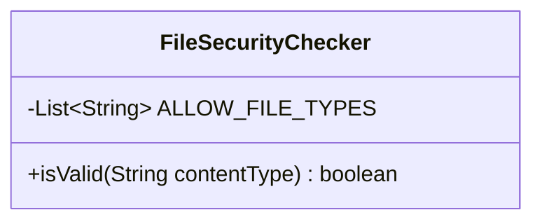
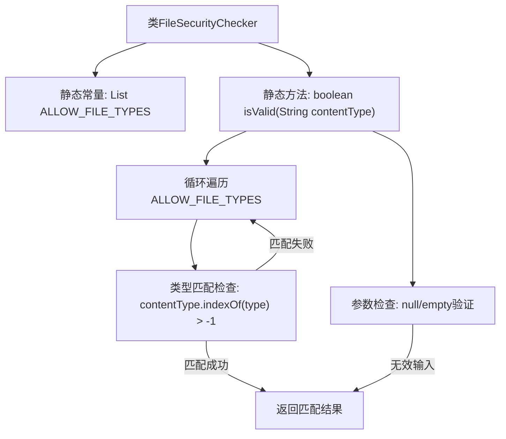

# 基础信息

|      |      |
|------|------|
| 名称 | FileSecurityChecker |
| 编码语言 | .java |
| 代码路径 | WeFe/fusion/fusion-service/src/main/java/com/welab/wefe/data/fusion/service/utils/FileSecurityChecker.java |
| 包名 | com.welab.wefe.data.fusion.service.utils |
| 依赖项 | ['java.util.Arrays', 'java.util.List'] |
| 概述说明 | FileSecurityChecker类检查文件类型是否在允许列表(xls,xlsx,csv)中，通过isValid方法验证contentType参数。 |

# 说明

FileSecurityChecker类用于检查文件类型安全性。它定义了一个允许的文件类型列表ALLOW_FILE_TYPES，包含xls、xlsx和csv三种格式。该类提供了一个静态方法isValid，接收contentType参数，检查是否为允许的文件类型。方法首先验证参数非空，然后遍历允许类型列表，若contentType包含任一允许类型则返回true，否则返回false。

# 类列表 Class Summary

| 名称   | 类型  | 说明 |
|-------|------|-------------|
| FileSecurityChecker | class | FileSecurityChecker类检查文件类型是否在允许列表（xls、xlsx、csv）中，通过contentType验证有效性。 |

## 类 FileSecurityChecker

|      |      |
|------|------|
| 访问范围 | public |
| 类型 | class |
| 名称 | FileSecurityChecker |
| 说明 | FileSecurityChecker类检查文件类型是否在允许列表（xls、xlsx、csv）中，通过contentType验证有效性。 |

### UML类图

这段代码定义了一个文件安全检查类`FileSecurityChecker`，包含一个私有静态常量`ALLOW_FILE_TYPES`用于存储允许的文件类型列表，以及一个公有静态方法`isValid`用于检查传入的contentType是否在允许列表中。该类通过检查文件类型后缀来确保只处理Excel和CSV格式文件，为空或非法类型会返回false。

### 内部方法调用关系图

流程图描述：该流程图展示了FileSecurityChecker类的结构和工作流程。首先检查输入参数contentType是否为空，若无效直接返回false。有效时遍历预定义的ALLOW_FILE_TYPES列表，通过indexOf检查类型匹配，找到匹配立即返回true，遍历完所有类型仍未匹配则返回false。整个流程实现了安全的文件类型校验机制。

### 字段列表 Field List

| 名称  | 类型  | 说明 |
|-------|-------|------|
| ALLOW_FILE_TYPES = Arrays.asList(            "xls", "xlsx", "csv"    ) | List<String> | 允许的文件类型为xls、xlsx和csv。 |

### 方法列表

| 名称  | 类型  | 说明 |
|-------|-------|------|
| isValid | boolean | 检查contentType是否有效：非空且在ALLOW_FILE_TYPES中存在则返回true，否则false。 |

