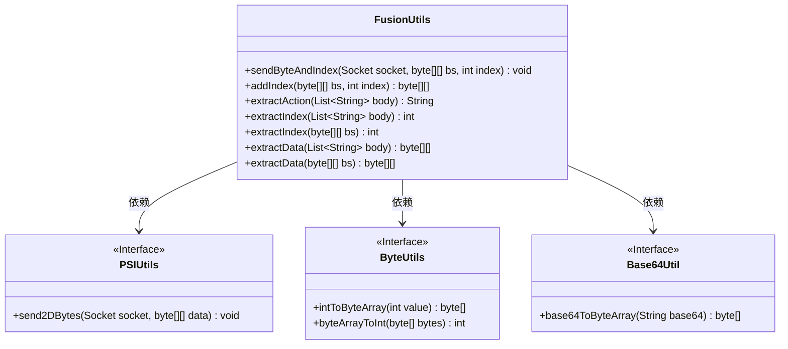
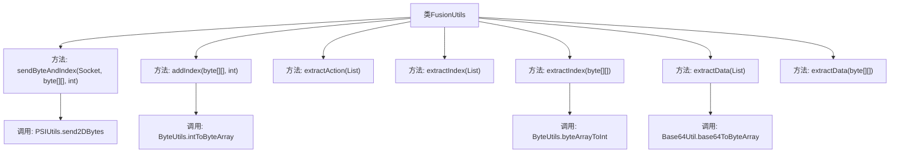

# 基础信息

|      |      |
|------|------|
| 名称 | FusionUtils |
| 编码语言 | .java |
| 代码路径 | WeFe/fusion/fusion-service/src/main/java/com/welab/wefe/data/fusion/service/utils/FusionUtils.java |
| 包名 | com.welab.wefe.data.fusion.service.utils |
| 依赖项 | ['com.welab.wefe.common.util.Base64Util', 'com.welab.wefe.fusion.core.utils.PSIUtils', 'java.net.Socket', 'java.util.List'] |
| 概述说明 | FusionUtils类提供数据处理工具：发送带索引的字节数组、添加/提取索引、提取动作和数据转换功能。 |

# 说明

FusionUtils类提供了一系列静态方法用于数据处理和索引操作。主要功能包括：通过sendByteAndIndex方法发送带索引的字节数组数据；使用addIndex方法在字节数组末尾添加索引；extractAction从字符串列表中提取并移除首元素作为动作；extractIndex方法支持从字符串列表或字节数组中提取索引；extractData方法实现从Base64字符串列表或字节数组中提取数据，并处理数据解密。所有方法均围绕字节数组和索引的添加、提取、发送等核心操作展开。

# 类列表 Class Summary

| 名称   | 类型  | 说明 |
|-------|------|-------------|
| FusionUtils | class | FusionUtils类提供数据操作功能：发送带索引的字节数组、添加/提取索引、提取动作和数据转换。 |

## 类 FusionUtils

|      |      |
|------|------|
| 访问范围 | public |
| 类型 | class |
| 名称 | FusionUtils |
| 说明 | FusionUtils类提供数据操作功能：发送带索引的字节数组、添加/提取索引、提取动作和数据转换。 |

### UML类图

这段代码展示了一个名为FusionUtils的工具类，主要用于处理字节数组和索引的操作。它提供了添加/提取索引、发送带索引的数据、从列表或字节数组中提取数据等功能。该类依赖三个接口：PSIUtils用于网络传输，ByteUtils用于字节转换，Base64Util用于Base64解码。所有方法均为静态方法，体现了工具类的设计特点，主要服务于数据处理和转换场景，特别是涉及网络传输时的索引管理需求。

### 内部方法调用关系图

这段代码流程图展示了FusionUtils工具类的核心方法调用关系。该类主要处理字节数组和索引的混合操作，包括发送带索引的数据(addIndex)、从不同类型数据中提取动作(extractAction)、索引(extractIndex)和原始数据(extractData)。关键依赖包括PSIUtils的字节发送功能、ByteUtils的类型转换以及Base64Util的编解码功能。所有方法均为静态工具方法，形成独立的功能单元。

### 字段列表 Field List

| 名称  | 类型  | 说明 |
|-------|-------|------|

### 方法列表

| 名称  | 类型  | 说明 |
|-------|-------|------|
| addIndex | byte[][] | 方法`addIndex`在二维字节数组`bs`末尾添加一个由整数`index`转换的字节数组，返回新数组。原数组内容不变，长度增加1。 |
| sendByteAndIndex | void | 方法sendByteAndIndex通过socket发送带索引的二维字节数组，调用PSIUtils.send2DBytes实现。 |
| extractIndex | int | 从字符串列表提取首元素转为整数并移除该元素，返回整数值。 |
| extractIndex | int | 静态方法extractIndex从二维字节数组bs中提取最后一个元素并转换为整数返回。 |
| extractAction | String | 从字符串列表提取并移除首元素作为返回值。 |
| extractData | byte[][] | 静态方法extractData接收字符串列表，将每个元素Base64解码为字节数组，返回二维字节数组。 |
| extractData | byte[][] | 方法extractData接收二维字节数组bs，返回新数组ret，其内容为bs除最后一行外的所有行。 |

