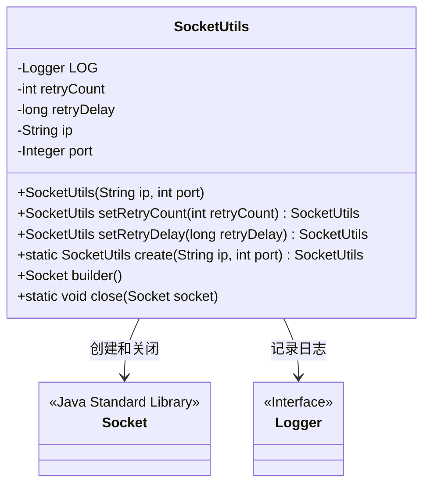
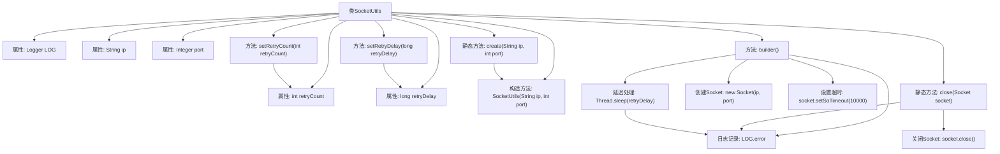

# 基础信息

|      |      |
|------|------|
| 名称 | SocketUtils |
| 编码语言 | .java |
| 代码路径 | WeFe/fusion/fusion-service/src/main/java/com/welab/wefe/data/fusion/service/utils/SocketUtils.java |
| 包名 | com.welab.wefe.data.fusion.service.utils |
| 依赖项 | ['org.slf4j.Logger', 'org.slf4j.LoggerFactory', 'java.io.IOException', 'java.net.InetAddress', 'java.net.Socket'] |
| 概述说明 | SocketUtils类用于创建和管理Socket连接，支持设置重试次数和间隔，提供创建、构建和关闭Socket的方法。 |

# 说明

SocketUtils是一个用于创建和管理Socket连接的实用工具类。它支持设置IP地址和端口号，并允许配置重试次数和重试间隔。默认重试次数为1次，重试间隔为0毫秒。创建Socket时会设置10秒超时，并在失败时按配置进行重试。还提供了静态方法用于安全关闭Socket连接。所有操作都包含错误处理并记录日志。

# 类列表 Class Summary

| 名称   | 类型  | 说明 |
|-------|------|-------------|
| SocketUtils | class | SocketUtils类用于创建和管理Socket连接，支持设置重试次数和间隔，默认重试1次无延迟，提供创建、构建和关闭Socket的方法。 |

## 类 SocketUtils

|      |      |
|------|------|
| 访问范围 | public |
| 类型 | class |
| 名称 | SocketUtils |
| 说明 | SocketUtils类用于创建和管理Socket连接，支持设置重试次数和间隔，默认重试1次无延迟，提供创建、构建和关闭Socket的方法。 |

### UML类图

类图描述：SocketUtils类封装了Socket连接的创建、重试和关闭功能，包含IP地址、端口号、重试次数和延迟等私有属性。通过builder()方法创建Socket连接并支持重试机制，使用静态方法close()关闭连接。该类依赖Java标准库的Socket类和Logger接口进行网络操作和日志记录。

### 内部方法调用关系图

该流程图展示了SocketUtils类的完整结构和工作流程。类包含5个私有属性和6个主要方法，其中builder()方法是核心功能，实现了带重试机制的Socket创建过程。通过retryCount和retryDelay参数控制重试次数和间隔，每次尝试都会创建新Socket并设置10秒超时。无论成功与否都会执行finally块中的延迟处理，最后返回建立的Socket或null。静态方法close()提供了安全的Socket关闭功能。所有异常情况都会通过Logger记录错误信息。整个设计采用了链式调用模式，支持方法级联操作。

### 字段列表 Field List

| 名称  | 类型  | 说明 |
|-------|-------|------|
| retryDelay = 0 | long | 私有长整型变量retryDelay初始值为0。 |
| LOG = LoggerFactory.getLogger(SocketUtils.class) | Logger | 类SocketUtils中定义了一个私有静态不可变日志对象LOG，用于记录日志信息。 |
| port | Integer | 声明一个私有整型变量port。 |
| ip | String | 声明一个私有字符串变量ip，用于存储IP地址。 |
| retryCount = 1 | int | 定义整型变量retryCount，初始值为1，用于记录重试次数。 |

### 方法列表

| 名称  | 类型  | 说明 |
|-------|-------|------|
| create | SocketUtils | 静态方法创建SocketUtils实例，传入IP和端口参数。 |
| setRetryCount | SocketUtils | 设置重试次数的方法，参数为retryCount，返回当前对象以支持链式调用。 |
| setRetryDelay | SocketUtils | 设置重试延迟时间并返回当前对象实例。 |
| builder | Socket | 创建Socket连接，支持重试和延迟，设置超时为10秒，失败时记录错误日志。 |
| close | void | 静态方法close用于安全关闭Socket，非空时执行关闭并捕获IOException，错误时记录日志。 |

