# 基础信息

|      |      |
|------|------|
| 名称 | utils |
| 编码语言 | .java |
| 代码路径 | WeFe/fusion/fusion-service/src/main/java/com/welab/wefe/data/fusion/service/utils |
| 包名 | docs.fusion.fusion-service.src.main.java.com.welab.wefe.data.fusion.service.utils |
| 概述说明 | 布隆过滤器实现高性能数据去重，主键生成模块支持多种哈希算法，数据解析工具处理CSV/Excel/DB数据源，去重模块提供布隆过滤器和内存集合两种策略，文件类型检查器限制xls/xlsx/csv格式，Socket工具管理连接重试，字节工具类实现整型与字节数组转换。 |

# 说明

## 概述  
该模块核心职责是提供数据融合处理的全套工具集，涵盖高性能布隆过滤器、主键生成、数据集解析和安全校验等功能。接口规范包括布隆过滤器的序列化读写（writeTo/readFrom）、主键生成的哈希算法处理（MD5/SHA1）以及数据集读取的抽象方法（doGetHeader/readOneRow）。关键数据结构包含位数组（BitArray）、字段元数据（FieldInfo）和数据集模型（DataSetPreviewOutputModel）。外部依赖涉及Java标准IO、序列化库和哈希算法实现。例如BloomFilterUtils实现文件持久化，PrimaryKeyUtils支持四种主键生成方式，DataResouceHelper提供CSV/Excel自动解析。

## 主要业务场景  
模块支持三大典型应用：1)数据去重场景，通过布隆过滤器（类似缓存穿透防护）或内存HashSet实现高效判重；2)数据融合主键生成，类似ETL流程的字段拼接与哈希转换；3)异构数据源处理，包括CSV/Excel文件解析和数据库查询。完整业务流程为：初始化工具→加载/解析数据→应用去重或主键生成→输出处理结果。例如DataSetBloomUniqueFilter处理亿级数据去重，ExcelDataSetReader实现多工作表读取，SocketUtils管理带重试机制的Socket连接。集成案例展示各组件在分布式环境下的协同工作，如FusionUtils实现的字节数组索引操作与数据解密。

### 包内部结构视图

```mermaid
graph TD
    utils --> bf
    utils --> primarykey
    utils --> dataresouce
    utils --> unique
    utils --> ByteUtils.java
    utils --> AbstractDataSetReader.java
    utils --> CsvDataSetReader.java
    utils --> ExcelDataSetReader.java
    utils --> FileSecurityChecker.java
    utils --> SocketUtils.java
    utils --> FusionUtils.java
    bf --> BloomFilterUtils.java
    bf --> BloomFilters.java
    bf --> BitArray.java
    primarykey --> PrimaryKeyUtils.java
    primarykey --> FieldInfo.java
    dataresouce --> DataResouceHelper.java
    unique --> DataSetBloomUniqueFilter.java
    unique --> AbstractDataSetUniqueFilter.java
    unique --> ContainResult.java
    unique --> DataSetMemoryUniqueFilter.java
```

该流程图展示了WeFe数据融合服务中utils工具类的层级结构。顶层为utils目录，下分bf、primarykey、dataresouce和unique四个子目录，每个子目录包含相应的工具类文件。同时utils目录下还直接包含多个独立工具类文件，如ByteUtils.java、FusionUtils.java等。整个结构清晰地展现了工具类的分类组织方式。

# 文件列表

| 名称   | 类型  | 说明 |
|-------|------|-------------|
| [ByteUtils.java](ByteUtils.md) | file | ByteUtils类提供int与byte数组互转方法，intToByteArray将整数转为4字节数组，byteArrayToInt将字节数组转回整数，并通过main方法验证转换正确性。 |
| [AbstractDataSetReader.java](AbstractDataSetReader.md) | file | AbstractDataSetReader是抽象类，实现Closeable接口，提供读取数据集功能。包含获取表头、读取数据行、统计行数等方法，支持按条件筛选字段和限制读取时间或行数。 |
| [CsvDataSetReader.java](CsvDataSetReader.md) | file | CsvDataSetReader类继承AbstractDataSetReader，用于读取CSV文件。构造函数初始化CsvReader和CsvParser，设置无表头且跳过空行。doGetHeader获取表头，readOneRow读取单行数据并转为LinkedHashMap，close关闭解析器。getRowCount已弃用。 |
| [ExcelDataSetReader.java](ExcelDataSetReader.md) | file | Excel数据集读取类，继承抽象类，通过ExcelReader读取文件，提供获取表头、逐行读取数据、关闭资源和获取行数功能。 |
| [FileSecurityChecker.java](FileSecurityChecker.md) | file | FileSecurityChecker类检查文件类型是否在允许列表(xls,xlsx,csv)中，通过isValid方法验证contentType参数。 |
| [SocketUtils.java](SocketUtils.md) | file | SocketUtils类用于创建和管理Socket连接，支持设置重试次数和间隔，提供创建、构建和关闭Socket的方法。 |
| [FusionUtils.java](FusionUtils.md) | file | FusionUtils类提供数据处理工具：发送带索引的字节数组、添加/提取索引、提取动作和数据转换功能。 |
| [primarykey](primarykey/_module.md) | package | PrimaryKeyUtils类提供主键生成功能，支持四种处理方式。FieldInfo类管理字段信息，包含列名、选项和索引等属性。两者协同处理数据生成主键。 |
| [unique](unique/_module.md) | package | DataSetBloomUniqueFilter基于布隆过滤器实现数据去重，默认容量1亿，支持UTF-8，错误率0.01。AbstractDataSetUniqueFilter是抽象基类，定义contains方法。ContainResult枚举包含In、NotIn、MaybeIn三种状态。DataSetMemoryUniqueFilter基于HashSet实现内存去重。 |
| [dataresouce](dataresouce/_module.md) | package | DataResouceHelper类提供读取文件和数据库数据的方法，支持CSV/Excel格式，推断数据类型并生成预览输出模型。 |
| [bf](bf/_module.md) | package | BloomFilterUtils类提供布隆过滤器文件读写方法，支持序列化和反序列化。BloomFilters类实现布隆过滤器核心功能，含位数组、哈希计算等。BitArray类封装位数组操作，支持初始化、复制和合并。 |

